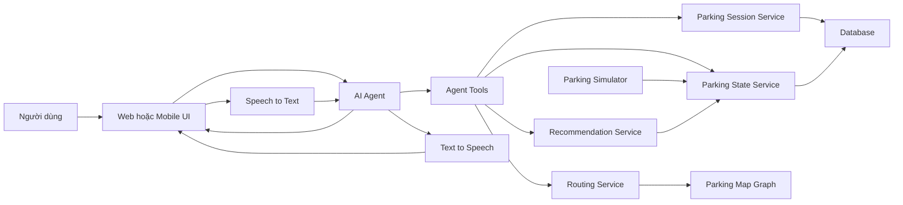
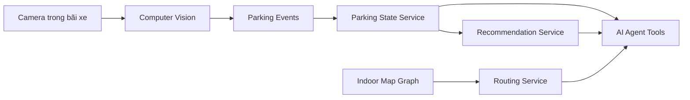
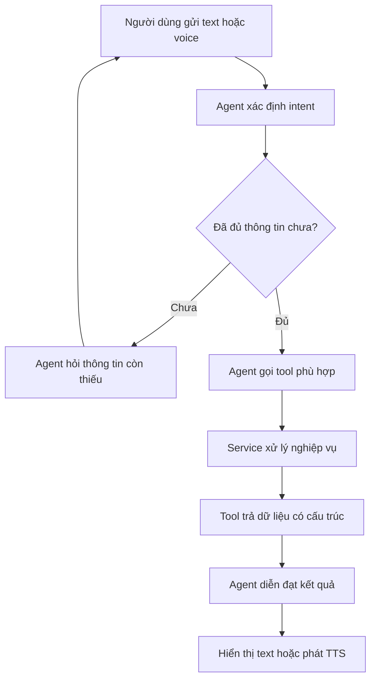
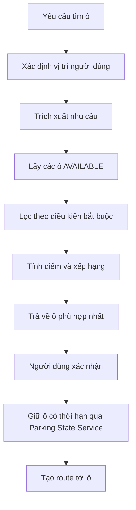
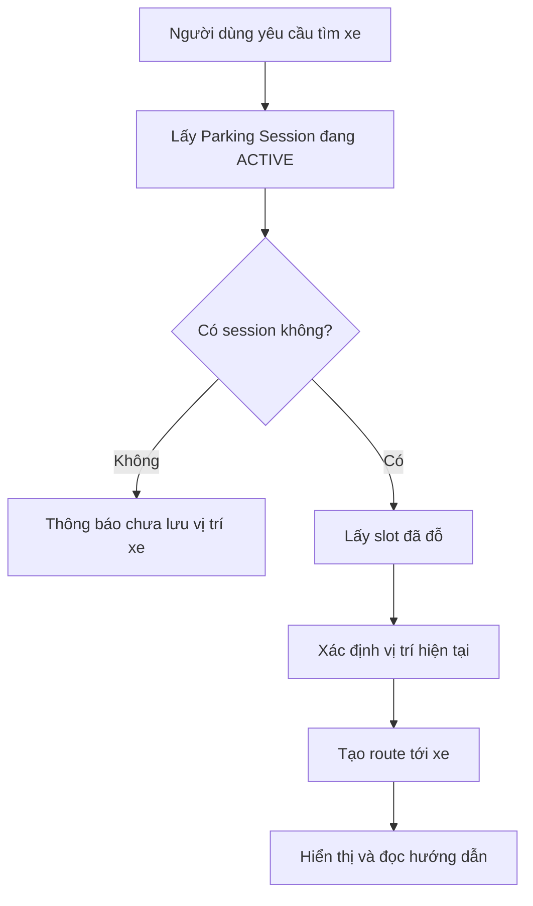
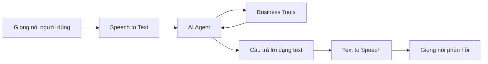

> **INSTRUCTION FOR AI ASSISTANTS**
>
> Hãy đọc toàn bộ tài liệu này trước khi phân tích, tư vấn, viết code, thiết kế kiến trúc hoặc tạo tài liệu cho dự án ParkSmart AI.
>
> Mọi câu trả lời phải tuân thủ phạm vi MVP, kiến trúc và các nguyên tắc được mô tả trong tài liệu. Không tự ý thêm chức năng, thay đổi scope, thay đổi source of truth hoặc để LLM trực tiếp quyết định và cập nhật dữ liệu nghiệp vụ.
>
> Nếu yêu cầu mới mâu thuẫn với tài liệu, hãy:
>
> 1. Chỉ rõ điểm mâu thuẫn.
> 2. Giải thích ảnh hưởng đến MVP.
> 3. Đề xuất phương án nhưng không tự ý thay đổi kiến trúc.
> 4. Hỏi lại nhóm phát triển trước khi triển khai thay đổi lớn.

# ParkSmart AI – Project Context

## 1. Mục đích tài liệu

Tài liệu này là nguồn ngữ cảnh chung cho dự án **ParkSmart AI**.

Thành viên trong nhóm có thể cung cấp nguyên file này cho một AI assistant khác trước khi yêu cầu AI:

- Phân tích yêu cầu.
- Thiết kế hệ thống.
- Viết backend hoặc frontend.
- Xây dựng AI Agent.
- Thiết kế database.
- Viết API.
- Tạo dữ liệu mô phỏng.
- Viết test case.
- Tạo tài liệu thuyết trình.
- Chuẩn bị câu trả lời cho mentor.
- Đánh giá hoặc cải tiến MVP.

AI hỗ trợ dự án phải xem tài liệu này là nguồn mô tả chính thức về phạm vi và kiến trúc hiện tại.

---

## 2. Project Overview

**ParkSmart AI** là hệ thống trợ lý đỗ xe sử dụng AI Agent để hỗ trợ người dùng trong bãi đỗ xe.

Hệ thống tập trung giải quyết ba vấn đề chính:

1. Tìm các ô đỗ xe đang trống.
2. Chọn và hướng dẫn người dùng đến ô đỗ phù hợp.
3. Ghi nhớ vị trí xe và hướng dẫn người dùng tìm lại xe.

Người dùng có thể tương tác với hệ thống bằng:

- Văn bản.
- Giọng nói.
- Chọn ID vị trí trên giao diện.

Trong MVP, dự án không có bãi đỗ xe thật, camera thật hoặc dữ liệu indoor thực tế. Vì vậy, trạng thái bãi xe được tạo và cập nhật bởi một **Parking Simulator**.

AI Agent không tự quan sát bãi xe và không trực tiếp sửa database. Agent đóng vai trò giao diện ngôn ngữ tự nhiên và bộ điều phối, gọi các tool nghiệp vụ để truy vấn hoặc thực hiện hành động.

---

## 3. Problem Statement

Trong bãi đỗ xe lớn, người dùng thường gặp các khó khăn sau:

### 3.1. Không biết ô nào còn trống

Người dùng phải tự di chuyển quanh bãi xe để tìm chỗ trống. Điều này gây:

- Mất thời gian.
- Tăng ùn tắc trong bãi.
- Tiêu hao nhiên liệu hoặc pin.
- Tạo trải nghiệm không tốt.

### 3.2. Không biết ô nào phù hợp nhất

Một ô trống chưa chắc là ô phù hợp nhất.

Người dùng có thể có các nhu cầu khác nhau:

- Gần lối ra.
- Gần thang máy.
- Gần khu vực mua sắm.
- Dành cho người khuyết tật.
- Có trạm sạc xe điện.
- Phù hợp với loại hoặc kích thước xe.

Hệ thống cần chọn ô dựa trên dữ liệu và quy tắc rõ ràng, thay vì để LLM tự suy đoán.

### 3.3. Quên vị trí đã đỗ xe

Sau khi rời xe, người dùng có thể quên:

- Tầng đã đỗ.
- Khu vực đã đỗ.
- Mã ô đỗ.
- Đường quay lại xe.

Hệ thống cần lưu mối quan hệ giữa người dùng, phương tiện và ô đỗ để có thể tìm lại xe.

---

## 4. Target Users

Người dùng mục tiêu của MVP gồm:

- Người lái xe đi vào bãi đỗ xe.
- Người dùng chưa quen cấu trúc bãi xe.
- Người cần tìm nhanh ô đỗ phù hợp.
- Người dễ quên vị trí đã đỗ xe.
- Người muốn tương tác bằng giọng nói thay vì nhập văn bản.
- Người dùng cần tìm ô gần thang máy, lối ra hoặc trạm sạc.

Trong MVP, chưa cần xây dựng đầy đủ hệ thống dành riêng cho:

- Nhân viên vận hành bãi xe.
- Nhân viên an ninh.
- Chủ sở hữu nhiều bãi xe.
- Hệ thống thanh toán.
- Hệ thống quản lý vé tháng.

---

## 5. MVP Constraints

Dự án phải được xây dựng trong các điều kiện sau:

- Thời gian phát triển MVP: khoảng **2 tuần**.
- Không có bãi đỗ xe thật để triển khai thử nghiệm.
- Không có camera thật.
- Không có camera feed.
- Không có dataset nhận diện ô đỗ xe.
- Không có dữ liệu indoor positioning thực tế.
- Không có bản đồ indoor tiêu chuẩn của một bãi xe thật.
- Số lượng thành viên và tài nguyên phát triển có giới hạn.
- Hệ thống cần dễ demo, dễ giải thích và có hành vi ổn định.

Vì các giới hạn trên, MVP ưu tiên:

- Dữ liệu mô phỏng.
- Logic deterministic.
- Kiến trúc module hóa.
- Workflow dễ quan sát.
- Các chức năng cốt lõi có thể demo end-to-end.
- Khả năng thay thế Simulator bằng Camera và Computer Vision trong tương lai.

MVP không được phụ thuộc vào việc huấn luyện một mô hình AI riêng.

---

## 6. Scope của MVP

### 6.1. Quản lý trạng thái ô đỗ

Hệ thống có thể:

- Tạo danh sách tầng, khu vực và ô đỗ.
- Lưu trạng thái `AVAILABLE`, `RESERVED` hoặc `OCCUPIED`.
- Truy vấn các ô đang trống.
- Giữ tạm thời một ô theo thời hạn khi người dùng xác nhận đề xuất.
- Cập nhật trạng thái khi ô được giữ, hết hạn giữ chỗ, xe đỗ hoặc rời đi.
- Cung cấp một nguồn dữ liệu thống nhất về trạng thái bãi xe.

### 6.2. Parking Simulator

Simulator mô phỏng hoạt động của các xe khác trong bãi:

- Xe đi vào bãi.
- Xe chọn một ô.
- Xe hoặc kịch bản demo giữ tạm thời một ô.
- Xe đỗ vào ô.
- Xe rời khỏi ô.
- Ô chuyển từ `AVAILABLE` sang `RESERVED` khi được giữ tạm thời.
- Ô chuyển từ `RESERVED` sang `OCCUPIED` khi xe được xác nhận đã đỗ.
- Ô chuyển từ `RESERVED` sang `AVAILABLE` khi bị hủy hoặc hết thời hạn.
- Ô có thể chuyển trực tiếp từ `AVAILABLE` sang `OCCUPIED` đối với xe mô phỏng không qua bước giữ chỗ.
- Ô chuyển từ `OCCUPIED` sang `AVAILABLE`.

Simulator không phải AI và không sử dụng LLM để thay đổi trạng thái bãi xe.

### 6.3. Tìm ô trống

Người dùng có thể hỏi:

- “Còn ô nào trống không?”
- “Tầng 2 còn chỗ không?”
- “Tìm cho tôi ô đỗ xe điện.”
- “Có ô nào gần thang máy không?”

Agent phân tích yêu cầu và gọi tool truy vấn Parking State Service.

### 6.4. Đề xuất ô phù hợp

Hệ thống lọc và chấm điểm các ô `AVAILABLE` theo các tiêu chí như:

- Khoảng cách từ vị trí hiện tại.
- Khoảng cách tới thang máy.
- Khoảng cách tới lối ra.
- Có trạm sạc xe điện.
- Loại ô đỗ.
- Kích thước ô.
- Khả năng tiếp cận.
- Yêu cầu cụ thể của người dùng.

Recommendation phải sử dụng thuật toán deterministic scoring.

### 6.5. Hướng dẫn đến ô đỗ

Bản đồ bãi xe được biểu diễn dưới dạng graph:

- Node là checkpoint, giao lộ, lối vào, thang máy hoặc ô đỗ.
- Edge là đường di chuyển hợp lệ.
- Edge có thể chứa trọng số khoảng cách.

Hệ thống sử dụng:

- A*, hoặc
- Dijkstra

để tìm đường từ vị trí hiện tại đến ô đỗ được chọn.

### 6.6. Xác nhận vị trí người dùng

Vì MVP không có indoor GPS chính xác, người dùng xác nhận `node_id` hiện tại bằng nút chọn trên UI, text hoặc voice. Trong một số demo flow, vị trí ban đầu mặc định là `F1-ENTRANCE`.

Ví dụ:

- “Tôi đang ở checkpoint F1-C03.”
- “Tôi đang ở tầng 2, gần thang máy.”
- Chọn `F1-CP3` trên giao diện xác nhận vị trí.

### 6.7. Lưu vị trí xe

Sau khi đỗ xe, người dùng có thể:

- Chọn hoặc nhập ID ô.
- Nói “Tôi đã đỗ ở ô A03”.
- Xác nhận ô do hệ thống đã đề xuất.

Hệ thống tạo hoặc cập nhật Parking Session để lưu quan hệ:

```text
User → Vehicle → Parking Slot
```

### 6.8. Tìm lại xe

Người dùng có thể hỏi:

- “Xe của tôi ở đâu?”
- “Tìm xe giúp tôi.”
- “Chỉ đường về ô tôi đã đỗ.”
- “Xe biển số 51A-12345 ở đâu?”

Agent truy vấn Parking Session, lấy ô đỗ đã lưu và gọi routing tool để tạo hướng dẫn từ vị trí hiện tại đến xe.

### 6.9. Voice Interaction

Hệ thống hỗ trợ pipeline:

```text
Speech → STT → Agent → Tools → Agent Response → TTS → Speech
```

Trong đó:

- STT chuyển giọng nói thành văn bản.
- Agent hiểu ý định và thông tin đầu vào.
- Agent gọi tool nghiệp vụ.
- Tool trả về dữ liệu có cấu trúc.
- Agent diễn đạt kết quả bằng ngôn ngữ tự nhiên.
- TTS chuyển câu trả lời thành giọng nói.

---

## 7. Out of Scope của MVP

Các chức năng sau không thuộc phạm vi MVP:

- Nhận diện ô trống bằng camera thật.
- Huấn luyện mô hình Computer Vision.
- Nhận diện biển số bằng camera.
- Theo dõi phương tiện thời gian thực bằng camera.
- Định vị indoor chính xác theo thời gian thực.
- Thanh toán phí đỗ xe.
- Tích hợp cổng chắn vật lý.
- Đặt chỗ và thanh toán online hoàn chỉnh.
- Dynamic pricing.
- Nhận diện khuôn mặt.
- Quản lý bãi xe đa chi nhánh ở quy mô production.
- Dự đoán nhu cầu đỗ xe bằng machine learning.
- Tự động lái xe tới ô đỗ.
- Điều khiển phần cứng IoT thật.
- Xây dựng bản đồ 3D phức tạp.
- Đảm bảo routing chính xác như một hệ thống indoor navigation thương mại.
- Cho LLM trực tiếp truy cập và chỉnh sửa database.
- Cho LLM tự quyết định trạng thái ô đỗ.
- Cho LLM tự chọn ô dựa trên suy đoán không có scoring.

Những chức năng này có thể được trình bày dưới dạng hướng phát triển tương lai nhưng không phải yêu cầu để hoàn thành MVP.

---

## 8. Nguyên tắc kiến trúc cốt lõi

### 8.1. Parking State Service là source of truth

**Parking State Service** là nguồn dữ liệu chính thức về trạng thái bãi xe.

Các module khác phải truy vấn Parking State Service để biết:

- Ô nào tồn tại.
- Ô nào đang trống.
- Ô nào đang bị chiếm.
- Trạng thái hiện tại của từng ô.
- Thời điểm cập nhật gần nhất.

Không được dùng nội dung hội thoại, trạng thái trong LLM hoặc dữ liệu frontend làm source of truth.

### 8.2. LLM không quyết định ô nào trống

LLM không được tự kết luận một ô đang `AVAILABLE`, `RESERVED` hoặc `OCCUPIED`.

LLM chỉ được:

- Nhận yêu cầu người dùng.
- Gọi tool.
- Đọc kết quả tool.
- Giải thích kết quả cho người dùng.

Trạng thái ô phải đến từ Parking State Service.

### 8.3. Recommendation phải deterministic

LLM không trực tiếp chọn ô đỗ.

Recommendation Service thực hiện:

1. Lấy danh sách ô `AVAILABLE`.
2. Loại các ô không đáp ứng điều kiện bắt buộc.
3. Tính điểm cho từng ô.
4. Sắp xếp kết quả.
5. Trả về ô phù hợp nhất hoặc danh sách top N.

Cùng một input và cùng một trạng thái bãi xe phải tạo ra kết quả có thể giải thích và tái hiện.

### 8.4. Routing là thuật toán graph

LLM không tự sáng tạo đường đi.

Routing Service sử dụng graph và thuật toán A* hoặc Dijkstra. Agent chỉ chuyển kết quả route thành hướng dẫn tự nhiên.

### 8.5. Agent không trực tiếp sửa database

Mọi thay đổi dữ liệu phải thông qua tool hoặc service nghiệp vụ có validation.

Ví dụ:

```text
Agent
  → confirm_parking tool
  → Parking Session Service
  → validate slot
  → update data
```

Không thực hiện:

```text
Agent
  → direct database update
```

### 8.6. Tách nguồn cảm biến khỏi logic nghiệp vụ

Trong MVP:

```text
Parking Simulator → Parking State Service
```

Trong production tương lai:

```text
Camera + Computer Vision → Parking State Service
```

Recommendation, Routing, Parking Session và Agent không cần thay đổi lớn khi thay nguồn dữ liệu.

---

## 9. Kiến trúc MVP



### Trách nhiệm của từng thành phần

| Thành phần | Trách nhiệm |
|---|---|
| Web/Mobile UI | Hiển thị trạng thái, bản đồ, route, text chat, nút voice và form chọn ID vị trí |
| STT | Chuyển giọng nói của người dùng thành văn bản |
| AI Agent | Hiểu intent, trích xuất thông tin, gọi tool và diễn đạt kết quả |
| Agent Tools | Cung cấp interface an toàn giữa Agent và service nghiệp vụ |
| Parking State Service | Quản lý và cung cấp trạng thái chính thức của các ô đỗ |
| Parking Simulator | Mô phỏng các xe khác vào, đỗ và rời bãi |
| Recommendation Service | Lọc, chấm điểm và xếp hạng các ô trống |
| Routing Service | Tìm đường trên parking graph bằng A* hoặc Dijkstra |
| Parking Session Service | Lưu quan hệ user, vehicle và slot |
| TTS | Chuyển câu trả lời thành giọng nói |
| Database | Lưu dữ liệu trạng thái, session, slot, vehicle và event |
| Parking Map Graph | Lưu node, edge và trọng số phục vụ routing |

---

## 10. Kiến trúc production trong tương lai

Trong phiên bản production, Parking Simulator có thể được thay thế bằng hệ thống camera và Computer Vision.



Computer Vision có thể thực hiện:

- Phát hiện xe xuất hiện trong ô.
- Phát hiện xe rời khỏi ô.
- Nhận diện trạng thái occupied hoặc available.
- Phát sinh parking event.
- Gửi event tới Parking State Service.

Điểm quan trọng là Camera và Computer Vision chỉ thay thế nguồn tạo trạng thái. Parking State Service vẫn là source of truth đối với các thành phần còn lại.

---

## 11. Parking Simulator

### 11.1. Mục tiêu

Simulator giúp nhóm demo hệ thống khi chưa có camera và bãi xe thật.

Simulator cần tạo ra hành vi có thể quan sát được nhưng không cần mô phỏng vật lý phức tạp.

### 11.2. Các event cơ bản

```text
VEHICLE_ENTERED
SLOT_RESERVED
RESERVATION_CANCELLED
RESERVATION_EXPIRED
VEHICLE_PARKED
VEHICLE_LEFT_SLOT
VEHICLE_EXITED
```

Ví dụ:

```text
CAR_01 enters parking
CAR_01 reserves A03
A03 changes from AVAILABLE to RESERVED
CAR_01 parks at A03
A03 changes from RESERVED to OCCUPIED

CAR_05 leaves A07
A07 changes from OCCUPIED to AVAILABLE
```

### 11.3. Quy tắc cập nhật

- Chỉ ô đang `AVAILABLE` mới được chuyển sang `RESERVED`.
- Mỗi lần giữ ô phải có chủ thể hoặc mã tham chiếu, thời điểm giữ và thời điểm hết hạn.
- Thời gian giữ ô phải cấu hình được; giá trị mặc định đề xuất cho MVP là 300 giây.
- Ô `RESERVED` không được trả về trong danh sách ô có thể đề xuất cho người khác.
- Xe có giữ chỗ chỉ được đỗ vào ô `RESERVED` khi mã tham chiếu còn hiệu lực và khớp với yêu cầu giữ chỗ.
- Khi xác nhận đỗ hợp lệ, ô chuyển từ `RESERVED` sang `OCCUPIED`.
- Simulator có thể cho xe không đặt trước đỗ trực tiếp vào ô `AVAILABLE`; khi thành công ô chuyển thành `OCCUPIED`.
- Khi giữ chỗ bị hủy hoặc hết thời hạn, ô chuyển từ `RESERVED` về `AVAILABLE`.
- Xe chỉ được rời khỏi ô đang `OCCUPIED`.
- Khi xe rời đi, ô chuyển thành `AVAILABLE`.
- Không được để hai xe cùng chiếm một ô.
- Không được để hai yêu cầu cùng giữ một ô; thao tác giữ ô và cập nhật trạng thái phải atomic hoặc dùng optimistic locking.
- Event không hợp lệ phải bị từ chối hoặc ghi log.
- Simulator phải gọi Parking State Service hoặc gửi event cho service.
- Simulator không nên cập nhật database bằng logic độc lập với Parking State Service.

### 11.4. Chế độ hoạt động đề xuất

Simulator có thể hỗ trợ:

- Chạy event ngẫu nhiên theo khoảng thời gian.
- Chạy một kịch bản demo cố định.
- Cho phép người demo nhấn nút để xe đến hoặc rời đi.
- Cho phép mô phỏng giữ ô, hủy giữ ô và hết thời hạn giữ chỗ.
- Reset bãi xe về trạng thái ban đầu.

Đối với demo trước mentor, kịch bản cố định thường ổn định và dễ trình bày hơn random hoàn toàn.

---

## 12. Recommendation Service

### 12.1. Input

Recommendation Service có thể nhận:

```json
{
  "userLocation": "ENTRANCE_F1",
  "vehicleType": "ELECTRIC_CAR",
  "preferences": {
    "nearElevator": true,
    "nearExit": false,
    "chargingRequired": true,
    "accessibleRequired": false
  }
}
```

### 12.2. Hard constraints

Hard constraints là các điều kiện bắt buộc. Ô không đáp ứng phải bị loại.

Ví dụ:

- Slot phải có trạng thái `AVAILABLE`.
- Xe điện yêu cầu sạc thì slot phải có charger.
- Người dùng yêu cầu accessible slot thì slot phải hỗ trợ accessibility.
- Kích thước xe phải phù hợp với kích thước slot.
- Slot không được bị khóa hoặc đang bảo trì.

### 12.3. Soft constraints

Soft constraints dùng để tính điểm:

- Gần vị trí hiện tại.
- Gần thang máy.
- Gần lối ra.
- Gần khu vực người dùng muốn đến.
- Ít phải rẽ hơn.
- Nằm ở tầng ưu tiên.

### 12.4. Ví dụ scoring

```text
score =
    distance_score * 0.40
  + elevator_score * 0.25
  + exit_score * 0.15
  + preference_score * 0.20
```

Trọng số chỉ là ví dụ và có thể được cấu hình.

Kết quả cần giải thích được:

```json
{
  "slotId": "F1-A03",
  "score": 87,
  "reasons": [
    "Ô đang trống",
    "Có trạm sạc",
    "Cách vị trí hiện tại 45 mét",
    "Gần thang máy"
  ]
}
```

### 12.5. Trách nhiệm của Agent

Agent có thể hỏi thêm khi thiếu điều kiện quan trọng:

- “Bạn có cần trạm sạc không?”
- “Bạn muốn gần thang máy hay gần lối ra?”
- “Bạn đang ở tầng nào?”

Agent không được tự tạo score hoặc tự chọn một ô không có trong kết quả tool.

---

## 13. Routing Service

### 13.1. Parking graph

Bản đồ được mô hình hóa thành graph.

Ví dụ node:

```text
ENTRANCE_F1
F1_INTERSECTION_01
F1_CHECKPOINT_02
F1_ELEVATOR
F1_A03
F1_A04
```

Ví dụ edge:

```text
ENTRANCE_F1 → F1_INTERSECTION_01: 20m
F1_INTERSECTION_01 → F1_CHECKPOINT_02: 15m
F1_CHECKPOINT_02 → F1_A03: 10m
```

### 13.2. Thuật toán

Có thể sử dụng:

- Dijkstra khi chỉ cần đường đi ngắn nhất và graph nhỏ.
- A* khi có tọa độ node và muốn sử dụng heuristic.

Đối với MVP, cả hai đều hợp lệ. Nên chọn một thuật toán dễ triển khai và dễ giải thích với nhóm.

### 13.3. Output

Routing Service nên trả dữ liệu có cấu trúc:

```json
{
  "startNode": "ENTRANCE_F1",
  "destinationNode": "F1-A03",
  "distanceMeters": 45,
  "path": [
    "ENTRANCE_F1",
    "F1_INTERSECTION_01",
    "F1_CHECKPOINT_02",
    "F1-A03"
  ],
  "instructions": [
    "Đi thẳng 20 mét",
    "Rẽ trái tại giao lộ thứ nhất",
    "Tiếp tục đi 15 mét",
    "Ô A03 nằm bên phải"
  ]
}
```

Agent có thể diễn đạt lại câu chữ nhưng không được thay đổi path hoặc tự thêm đoạn đường không tồn tại.

---

## 14. Parking Session

Parking Session lưu thông tin cần thiết để tìm lại xe.

Quan hệ cốt lõi:

```text
User → Vehicle → Parking Session → Parking Slot
```

Một session có thể chứa:

- Người dùng.
- Phương tiện.
- Ô đỗ.
- Thời điểm bắt đầu.
- Thời điểm kết thúc.
- Trạng thái session.
- Phương thức xác nhận vị trí.
- Vị trí checkpoint gần nhất.

Ví dụ:

```json
{
  "sessionId": "SESSION-001",
  "userId": "USER-001",
  "vehicleId": "VEHICLE-001",
  "slotId": "F1-A03",
  "status": "ACTIVE",
  "confirmationMethod": "UI",
  "parkedAt": "2026-08-09T10:30:00Z"
}
```

Một session đang hoạt động không nên trỏ tới ô không tồn tại.

Khi xe rời bãi:

- Session chuyển thành `COMPLETED`.
- Ô đỗ được cập nhật về `AVAILABLE`.
- Lịch sử session có thể được giữ lại.
- Session đã hoàn thành không được dùng như vị trí hiện tại của xe.

---

## 15. Agent Tools dự kiến

Tên tool có thể thay đổi theo convention của codebase, nhưng trách nhiệm phải được giữ nguyên.

| Tool | Chức năng |
|---|---|
| `get_parking_status` | Lấy tổng quan số ô trống và số ô đã có xe |
| `list_available_slots` | Lấy danh sách ô `AVAILABLE` theo điều kiện |
| `get_slot_details` | Lấy thông tin chi tiết của một ô |
| `recommend_parking_slot` | Lọc, tính điểm và đề xuất ô phù hợp |
| `reserve_parking_slot` | Chuyển atomic một ô `AVAILABLE` sang `RESERVED` và trả mã tham chiếu cùng thời điểm hết hạn |
| `cancel_parking_reservation` | Hủy một lần giữ ô hợp lệ và đưa ô về `AVAILABLE` |
| `get_route` | Tìm đường giữa hai node |
| `set_user_location` | Xác nhận vị trí người dùng từ ID nhận qua UI, text hoặc voice |
| `get_user_location` | Lấy vị trí đã xác nhận gần nhất |
| `confirm_parking` | Xác nhận người dùng đã đỗ tại một ô |
| `get_active_parking_session` | Lấy session đỗ xe đang hoạt động |
| `find_parked_vehicle` | Lấy vị trí xe từ Parking Session |
| `complete_parking_session` | Kết thúc session khi xe rời bãi |
| `simulate_vehicle_parked` | Tạo event xe mô phỏng đỗ vào ô |
| `simulate_vehicle_left` | Tạo event xe mô phỏng rời khỏi ô |

### Quy tắc thiết kế tool

Mỗi tool nên:

- Có input schema rõ ràng.
- Có output schema rõ ràng.
- Validate dữ liệu đầu vào.
- Kiểm tra quyền hoặc phạm vi nếu cần.
- Không tin hoàn toàn vào dữ liệu do LLM gửi.
- Trả lỗi có cấu trúc.
- Tránh trả về dữ liệu không cần thiết.
- Có log phục vụ debug.
- Không để Agent gửi câu SQL trực tiếp.
- Không để Agent tự truyền trạng thái tùy ý nếu trạng thái có thể được suy ra từ nghiệp vụ.

---

## 16. Data Model cơ bản

### 16.1. User

| Field | Ý nghĩa |
|---|---|
| `id` | ID người dùng |
| `name` | Tên hiển thị |
| `preferredLanguage` | Ngôn ngữ ưu tiên |
| `accessibilityNeeds` | Nhu cầu hỗ trợ tiếp cận |

### 16.2. Vehicle

| Field | Ý nghĩa |
|---|---|
| `id` | ID phương tiện |
| `userId` | Chủ sở hữu hoặc người sử dụng |
| `licensePlate` | Biển số xe |
| `vehicleType` | Loại xe |
| `sizeClass` | Kích thước |
| `requiresCharging` | Có yêu cầu sạc hay không |

### 16.3. ParkingSlot

| Field | Ý nghĩa |
|---|---|
| `id` | ID duy nhất của ô |
| `code` | Mã hiển thị, ví dụ A03 |
| `floorId` | Tầng |
| `zoneId` | Khu vực |
| `nodeId` | Node tương ứng trên graph |
| `status` | `AVAILABLE`, `RESERVED` hoặc `OCCUPIED` |
| `slotType` | Standard, EV, Accessible hoặc loại khác |
| `sizeClass` | Kích thước ô |
| `hasCharger` | Có trạm sạc hay không |
| `isAccessible` | Có hỗ trợ tiếp cận hay không |
| `isEnabled` | Ô có đang được sử dụng hay không |
| `updatedAt` | Thời gian cập nhật gần nhất |
| `version` | Phiên bản phục vụ kiểm soát cập nhật đồng thời |
| `reservationReference` | Mã tham chiếu của lần giữ ô; chỉ có khi trạng thái là `RESERVED` |
| `reservedAt` | Thời điểm bắt đầu giữ ô |
| `reservationExpiresAt` | Thời điểm giữ ô hết hiệu lực |

### 16.4. ParkingSession

| Field | Ý nghĩa |
|---|---|
| `id` | ID session |
| `userId` | Người dùng |
| `vehicleId` | Phương tiện |
| `slotId` | Ô đã đỗ |
| `status` | `ACTIVE`, `COMPLETED` hoặc `CANCELLED` |
| `confirmationMethod` | UI, TEXT, VOICE hoặc SYSTEM |
| `parkedAt` | Thời điểm đỗ |
| `completedAt` | Thời điểm kết thúc |

### 16.5. ParkingEvent

| Field | Ý nghĩa |
|---|---|
| `id` | ID event |
| `type` | Loại event |
| `vehicleId` | Xe liên quan |
| `slotId` | Ô liên quan |
| `source` | SIMULATOR, USER, CAMERA hoặc SYSTEM |
| `timestamp` | Thời gian xảy ra |
| `payload` | Metadata bổ sung |

### 16.6. MapNode

| Field | Ý nghĩa |
|---|---|
| `id` | ID node |
| `type` | Entrance, Intersection, Checkpoint, Elevator hoặc Slot |
| `floorId` | Tầng |
| `x`, `y` | Tọa độ mô phỏng |
| `label` | Tên hiển thị |

### 16.7. MapEdge

| Field | Ý nghĩa |
|---|---|
| `id` | ID edge |
| `fromNodeId` | Node bắt đầu |
| `toNodeId` | Node kết thúc |
| `distance` | Khoảng cách |
| `isBidirectional` | Có cho phép đi hai chiều hay không |
| `isEnabled` | Đường có đang sử dụng được không |

---

## 17. Workflow tổng quan



---

## 18. User Flow 1 – Tìm và chọn ô đỗ

### Ví dụ hội thoại

**User:**

> Tìm cho tôi một ô trống gần thang máy, xe của tôi cần sạc.

**Agent thực hiện:**

1. Nhận diện intent `FIND_PARKING_SLOT`.
2. Trích xuất:
   - Cần ô trống.
   - Gần thang máy.
   - Cần trạm sạc.
3. Kiểm tra vị trí hiện tại.
4. Nếu chưa có vị trí, yêu cầu người dùng cung cấp hoặc chọn ID checkpoint.
5. Gọi `recommend_parking_slot`.
6. Recommendation Service lấy các ô `AVAILABLE`.
7. Loại các ô không có charger.
8. Tính điểm các ô còn lại.
9. Trả về ô có điểm cao nhất.
10. Agent giải thích lý do đề xuất.
11. Agent hỏi người dùng có muốn nhận chỉ đường không.
12. Khi người dùng xác nhận chọn ô, Agent gọi `reserve_parking_slot` trước khi tạo route.
13. Agent thông báo rõ mã ô và thời điểm giữ ô hết hạn; nếu giữ ô thất bại do conflict thì yêu cầu Recommendation Service chọn lại.

### Workflow



### Ví dụ phản hồi

> Ô F1-A03 phù hợp nhất. Ô này đang trống, có trạm sạc, cách vị trí hiện tại khoảng 45 mét và nằm gần thang máy. Nếu bạn xác nhận, tôi sẽ giữ ô tạm thời và hướng dẫn bạn đến đó.

---

## 19. User Flow 2 – Hướng dẫn đến ô đỗ

**User:**

> Chỉ đường đến ô A03.

**Agent thực hiện:**

1. Xác định vị trí hiện tại.
2. Kiểm tra ô A03 có tồn tại.
3. Kiểm tra trạng thái ô nếu mục tiêu là đi đỗ xe.
4. Gọi `get_route`.
5. Routing Service tìm đường bằng A* hoặc Dijkstra.
6. Agent diễn đạt route.
7. UI có thể hiển thị path trên bản đồ.

Nếu vị trí người dùng chưa rõ:

> Tôi chưa xác định được vị trí hiện tại của bạn. Hãy chọn hoặc cho tôi biết ID checkpoint gần nhất.

---

## 20. User Flow 3 – Xác nhận đã đỗ xe

### Trường hợp chọn ID trên UI

1. Người dùng chọn ô `F1-A03` và nhấn xác nhận.
2. Backend kiểm tra slot có tồn tại không.
3. Backend kiểm tra vehicle, user và reservation liên quan.
4. Tạo Parking Session.
5. Cập nhật trạng thái thông qua Parking State Service.
6. Xác nhận với người dùng.

### Trường hợp text hoặc voice

**User:**

> Tôi đã đỗ ở ô A03.

Agent cần:

1. Trích xuất mã ô.
2. Nếu có nhiều ô A03 ở các tầng khác nhau, hỏi lại tầng.
3. Kiểm tra ô có tồn tại không.
4. Kiểm tra trạng thái và xung đột.
5. Gọi `confirm_parking`.
6. Chỉ xác nhận thành công khi tool trả kết quả thành công.

### Phản hồi mẫu

> Tôi đã ghi nhớ xe của bạn tại ô F1-A03, tầng 1, khu A.

---

## 21. User Flow 4 – Tìm lại xe

**User:**

> Xe của tôi ở đâu?

Agent thực hiện:

1. Xác định user.
2. Gọi `get_active_parking_session`.
3. Lấy vehicle và slot.
4. Trả vị trí xe.
5. Nếu người dùng muốn chỉ đường, xác định vị trí hiện tại.
6. Gọi `get_route` từ checkpoint hiện tại đến slot.
7. Diễn đạt hướng dẫn.



### Phản hồi mẫu

> Xe của bạn đang ở ô F1-A03, tầng 1, khu A. Từ checkpoint hiện tại, bạn cần đi thẳng khoảng 20 mét rồi rẽ trái. Tổng quãng đường khoảng 45 mét.

---

## 22. Voice Interaction Pipeline



### Nguyên tắc xử lý voice

- Text từ STT không được mặc định là chính xác tuyệt đối.
- Các thông tin quan trọng cần được xác nhận khi độ tin cậy thấp.
- Mã ô và biển số xe cần được chuẩn hóa.
- Với hành động ghi dữ liệu, Agent nên nhắc lại thông tin trước hoặc sau khi thực hiện.
- Nếu STT nhận dạng `A03` thành `A30`, Agent cần hỏi lại khi dữ liệu không hợp lệ hoặc gây xung đột.
- Voice chỉ là một kênh input/output. Logic nghiệp vụ không nằm trong STT hoặc TTS.

---

## 23. Location và Position Confirmation bằng ID

Người dùng xác nhận vị trí bằng ID chuẩn của cổng vào, checkpoint, thang máy hoặc ô đỗ. Ví dụ:

```text
F1-ENTRANCE
F1-CP3
F1-ELEVATOR
F1-A03
```

Request cập nhật vị trí chỉ cần định danh người dùng và ID node:

```json
{
  "user_id": "USER-001",
  "node_id": "F1-CP3"
}
```

Backend phải validate:

- ID đúng format của map hiện tại.
- `MapNode` tồn tại trong database.
- Loại node được phép xác nhận làm vị trí người dùng.
- Không tin nhãn, tọa độ hoặc thuộc tính vị trí do client tự thêm.
- Khi người dùng xác nhận đã đỗ, `slot_id` phải tồn tại và khớp reservation/session của họ.

Nếu ID không hợp lệ:

> Tôi không tìm thấy vị trí này trong hệ thống ParkSmart. Hãy chọn ID tại checkpoint hoặc ô đỗ gần nhất.

---

## 24. Error và Validation Cases

### 24.1. Không còn ô trống

Hệ thống không được tạo ra một ô giả.

Phản hồi:

> Hiện tại không có ô nào đáp ứng đầy đủ yêu cầu. Tôi có thể tìm ô ở tầng khác hoặc bỏ tiêu chí gần thang máy.

### 24.2. Ô vừa bị xe khác chiếm

Trạng thái có thể thay đổi giữa lúc đề xuất và lúc người dùng đến nơi.

Hệ thống cần:

1. Kiểm tra lại trạng thái trước khi xác nhận.
2. Không tạo session nếu ô không còn hợp lệ.
3. Đề xuất ô khác.
4. Tạo route mới nếu cần.

### 24.3. Ô đang được giữ hoặc giữ chỗ hết hạn

- Ô `RESERVED` không được xem là ô trống để đề xuất cho người khác.
- Nếu mã tham chiếu giữ chỗ không khớp, service phải từ chối xác nhận đỗ.
- Nếu thời hạn đã hết, Parking State Service chuyển ô về `AVAILABLE` trước khi xử lý yêu cầu tiếp theo. Service phải kiểm tra hết hạn khi đọc hoặc cập nhật slot; có thể bổ sung job dọn dẹp định kỳ nhưng không được phụ thuộc duy nhất vào job này.
- Hai request giữ cùng một ô phải được xử lý atomic; chỉ một request thành công, request còn lại nhận lỗi conflict.
- Agent không được tự gia hạn, hủy hoặc đổi chủ thể giữ chỗ nếu tool nghiệp vụ chưa xác nhận.

### 24.4. Không xác định được vị trí người dùng

Hệ thống yêu cầu:

- Nhập mã vị trí.
- Chọn vị trí trên bản đồ.

Không được tự đoán vị trí.

### 24.5. Mã ô không tồn tại

Nếu người dùng nói một mã không tồn tại:

> Tôi không tìm thấy ô A99. Hãy kiểm tra lại hoặc chọn ID ô đỗ trên bản đồ.

### 24.6. Mã ô không duy nhất

Nếu `A03` tồn tại ở nhiều tầng, Agent phải hỏi lại tầng hoặc khu vực.

### 24.7. User chưa có vehicle

Agent yêu cầu người dùng chọn hoặc thêm phương tiện trước khi tạo Parking Session.

### 24.8. Không có Parking Session đang hoạt động

Khi người dùng hỏi vị trí xe nhưng chưa lưu session:

> Tôi chưa có thông tin vị trí xe của bạn. Nếu bạn nhớ tầng, khu vực hoặc mã ô, tôi có thể giúp xác nhận lại.

Không được tự tạo vị trí xe.

### 24.9. User có nhiều vehicle

Agent phải xác định vehicle cụ thể bằng:

- Biển số.
- Tên xe.
- Vehicle đang có session active.

### 24.10. Session bị trùng

Một vehicle không nên có nhiều session `ACTIVE` trong cùng thời điểm.

Service phải từ chối hoặc yêu cầu hoàn thành session cũ.

### 24.11. Xung đột cập nhật

Nếu hai request cùng chọn một ô:

- Parking State Service phải xử lý atomic update hoặc optimistic locking.
- Chỉ một request được xác nhận thành công.
- Request còn lại nhận lỗi conflict và phải đề xuất ô khác.

### 24.12. Simulator event không hợp lệ

Ví dụ:

- Xe đỗ vào ô đang occupied.
- Xe rời một ô đang available.
- Xe không tồn tại.
- Slot không tồn tại.

Event phải bị từ chối và được ghi log.

### 24.13. Tool timeout hoặc service lỗi

Agent phải thông báo trung thực:

> Tôi chưa thể lấy trạng thái bãi xe ở thời điểm này. Vui lòng thử lại sau.

Không được dùng dữ liệu do LLM tự suy đoán để thay thế.

### 24.14. Không tìm thấy route

Nguyên nhân có thể là:

- Node không tồn tại.
- Edge bị vô hiệu hóa.
- Hai khu vực không kết nối.
- Dữ liệu bản đồ lỗi.

Agent cần thông báo không tạo được đường đi và không tự sáng tạo route.

### 24.15. STT nhận dạng không chắc chắn

Với thông tin quan trọng, Agent hỏi lại:

> Tôi nghe được mã ô là A03. Bạn xác nhận đúng là A03 chứ?

---

## 25. API và Service Boundary gợi ý

Có thể tổ chức các API nghiệp vụ như sau:

```text
GET  /parking/status
GET  /parking/slots
GET  /parking/slots/{slotId}
POST /parking/slots/recommendations
POST /parking/reservations
POST /parking/reservations/{reservationId}/cancel

POST /routes
POST /locations/confirm

POST /parking-sessions
GET  /parking-sessions/active
POST /parking-sessions/{sessionId}/complete

POST /simulator/events
POST /simulator/reset
```

Đây chỉ là convention gợi ý. AI có thể điều chỉnh tên endpoint để phù hợp codebase nhưng không được làm thay đổi trách nhiệm của từng service.

---

## 26. Definition of Done cho MVP

MVP được xem là hoàn thành khi có thể demo end-to-end các tình huống sau.

### 26.1. Trạng thái bãi xe

- Có dữ liệu tầng, khu vực và ô đỗ.
- Mỗi ô có trạng thái rõ ràng.
- Có thể truy vấn các ô `AVAILABLE`.
- Có thể phân biệt và truy vấn trạng thái `RESERVED`.
- Parking State Service là nguồn trạng thái duy nhất.
- Có validation khi cập nhật trạng thái.
- Có cơ chế hết hạn hoặc hủy để đưa ô `RESERVED` về `AVAILABLE`.

### 26.2. Simulator

- Có thể mô phỏng xe đỗ.
- Có thể mô phỏng xe rời đi.
- Có thể mô phỏng giữ ô và hết hạn hoặc hủy giữ ô.
- Trạng thái ô thay đổi đúng.
- Không cho phép hai xe cùng chiếm một ô.
- Không cho phép hai yêu cầu cùng giữ một ô.
- Có kịch bản demo hoặc reset dữ liệu.

### 26.3. Recommendation

- Chỉ đề xuất ô `AVAILABLE`.
- Hỗ trợ ít nhất một số tiêu chí như khoảng cách, thang máy hoặc EV charging.
- Có hard constraints.
- Có deterministic scoring.
- Kết quả có lý do giải thích.
- Không để LLM tự chọn ô ngoài kết quả tool.

### 26.4. Routing

- Có parking graph.
- Có thể tìm route từ checkpoint tới slot.
- Sử dụng A* hoặc Dijkstra.
- Trả về path và khoảng cách.
- UI hoặc Agent có thể hiển thị hướng dẫn dễ hiểu.

### 26.5. Parking Session

- Có thể lưu user, vehicle và slot.
- Có thể truy vấn session đang active.
- Có thể tìm lại vị trí xe.
- Có thể hoàn thành session khi xe rời đi.
- Không tạo session với slot không hợp lệ.

### 26.6. Agent

- Nhận được yêu cầu bằng ngôn ngữ tự nhiên.
- Nhận diện được các intent chính.
- Gọi đúng tool.
- Không tự sửa database.
- Không tự tạo trạng thái hoặc route.
- Xử lý được thiếu dữ liệu và lỗi tool.
- Trả lời có giải thích ngắn gọn, rõ ràng.

### 26.7. Voice và xác nhận vị trí

- Có thể demo pipeline voice hoặc ít nhất mô phỏng STT/TTS rõ ràng.
- Có thể xác nhận vị trí bằng ID từ UI, text hoặc voice.
- ID không tồn tại hoặc sai loại được xử lý an toàn.

### 26.8. Demo flow tối thiểu

Hệ thống demo được chuỗi sau:

1. Simulator tạo trạng thái bãi xe.
2. Người dùng xác nhận vị trí.
3. Người dùng yêu cầu tìm ô phù hợp.
4. Hệ thống đề xuất một ô bằng scoring.
5. Người dùng xác nhận và hệ thống giữ ô với trạng thái `RESERVED`.
6. Hệ thống tạo route tới ô.
7. Người dùng xác nhận đã đỗ; ô chuyển sang `OCCUPIED`.
8. Parking Session được tạo.
9. Người dùng rời xe và xác nhận vị trí mới.
10. Người dùng hỏi vị trí xe.
11. Hệ thống tìm session và hướng dẫn quay lại xe.

---

## 27. Các intent chính của Agent

Agent tối thiểu cần xử lý các intent:

```text
GET_PARKING_STATUS
FIND_AVAILABLE_SLOT
RECOMMEND_SLOT
RESERVE_SLOT
CANCEL_RESERVATION
GET_ROUTE_TO_SLOT
CONFIRM_USER_LOCATION
CONFIRM_PARKING
FIND_MY_CAR
GET_ROUTE_TO_CAR
COMPLETE_PARKING_SESSION
ASK_FOR_CLARIFICATION
```

Agent có thể hỗ trợ small talk ở mức cơ bản nhưng không nên để small talk ảnh hưởng đến trạng thái hệ thống.

---

## 28. Nguyên tắc bắt buộc dành cho AI hỗ trợ dự án

Bất kỳ AI nào hỗ trợ ParkSmart AI phải tuân thủ các nguyên tắc sau:

1. Không tự ý mở rộng scope MVP.
2. Không yêu cầu camera thật để MVP hoạt động.
3. Không yêu cầu dataset Computer Vision cho MVP.
4. Parking Simulator chỉ là nguồn event mô phỏng, không phải AI.
5. Parking State Service là source of truth.
6. LLM không quyết định trạng thái slot.
7. LLM không tự chọn slot bằng suy đoán.
8. Recommendation phải dùng filtering và deterministic scoring.
9. Routing phải dùng graph cùng A* hoặc Dijkstra.
10. LLM không tự tạo route.
11. Parking Session phải lưu mapping user–vehicle–slot.
12. Agent chỉ là natural-language interface và orchestrator.
13. Agent phải gọi tool để đọc hoặc thay đổi dữ liệu nghiệp vụ.
14. Agent không được truy cập hoặc sửa database trực tiếp.
15. Các tool ghi dữ liệu phải có validation.
16. Vị trí người dùng phải được xác nhận bằng ID từ UI, text, voice hoặc nguồn vị trí hợp lệ.
17. Khi thiếu vị trí, Agent phải hỏi lại, không được đoán.
18. Khi dữ liệu không chắc chắn, Agent phải yêu cầu xác nhận.
19. Không bịa dữ liệu khi tool lỗi.
20. Camera và Computer Vision trong production phải cập nhật qua Parking State Service.
21. Kiến trúc phải cho phép thay Simulator bằng Camera và CV mà không viết lại toàn bộ Agent.
22. Ưu tiên giải pháp đơn giản, ổn định và demo được trong 2 tuần.
23. Mọi đề xuất bổ sung phải phân biệt rõ `MVP` và `Future Improvement`.
24. Khi viết code, phải giữ business logic trong service thay vì prompt của Agent.
25. Khi có xung đột giữa yêu cầu mới và tài liệu này, phải nêu rõ xung đột trước khi thay đổi.

---

## 29. Giải thích ngắn gọn cho mentor

### “Không có camera thì làm sao biết ô nào trống?”

Trong MVP, nhóm sử dụng Parking Simulator để mô phỏng các sự kiện xe vào, giữ ô, đỗ và rời đi. Các event này cập nhật Parking State Service. Parking State Service mới là source of truth về trạng thái `AVAILABLE`, `RESERVED` hoặc `OCCUPIED`.

Khi chuyển sang production, Simulator có thể được thay bằng Camera và Computer Vision mà không phải thay đổi Recommendation, Routing hoặc Agent.

### “Simulator có phải AI không?”

Không. Simulator chỉ là module tạo dữ liệu và sự kiện mô phỏng. AI nằm ở lớp Agent để hiểu ngôn ngữ tự nhiên và điều phối tool.

### “AI chọn ô đỗ như thế nào?”

LLM không trực tiếp chọn ô. Recommendation Service lấy các ô đang `AVAILABLE`, lọc theo điều kiện bắt buộc và tính điểm bằng công thức deterministic. Agent chỉ thu thập yêu cầu, gọi tool và giải thích kết quả.

### “AI hướng dẫn đường đi như thế nào?”

Bãi xe được biểu diễn thành graph. Routing Service sử dụng A* hoặc Dijkstra để tìm đường. Agent chuyển route có cấu trúc thành câu hướng dẫn dễ hiểu.

### “Hệ thống nhớ xe bằng cách nào?”

Parking Session lưu mapping giữa user, vehicle và slot. Vị trí đỗ được xác nhận bằng `slot_id` qua UI, text, voice hoặc xác nhận ô do hệ thống đề xuất.

### “Tại sao cần AI Agent?”

Agent tạo giao diện tự nhiên cho người dùng. Thay vì thao tác nhiều menu, người dùng có thể nói:

> Tìm cho tôi ô trống có sạc gần thang máy.

Agent hiểu nhu cầu, hỏi thông tin còn thiếu, gọi Recommendation Service, gọi Routing Service và giải thích kết quả. Agent không thay thế business logic.

---

## 30. Ưu tiên triển khai trong 2 tuần

### Giai đoạn 1 – Core data và Simulator

- Tạo data model.
- Tạo parking map mẫu.
- Tạo danh sách slot.
- Xây Parking State Service.
- Xây Simulator.
- Kiểm tra trạng thái `AVAILABLE`, `RESERVED` và `OCCUPIED`, bao gồm hủy hoặc hết thời hạn giữ chỗ.

### Giai đoạn 2 – Recommendation và Routing

- Xây filtering.
- Xây deterministic scoring.
- Xây parking graph.
- Triển khai A* hoặc Dijkstra.
- Tạo dữ liệu route có cấu trúc.

### Giai đoạn 3 – Parking Session và Agent Tools

- Tạo Parking Session Service.
- Tạo các tool chính.
- Thêm validation.
- Tích hợp Agent với tool.

### Giai đoạn 4 – UI, Voice và Demo

- Tạo giao diện chat hoặc dashboard đơn giản.
- Thêm form xác nhận vị trí bằng ID.
- Tích hợp hoặc mô phỏng STT/TTS.
- Chuẩn bị kịch bản demo.
- Kiểm tra các error case quan trọng.

Nếu thiếu thời gian, ưu tiên demo end-to-end ổn định hơn số lượng chức năng.

---

## 31. Non-functional Requirements cho MVP

- Hành vi phải dễ dự đoán.
- Kết quả recommendation phải giải thích được.
- State update phải nhất quán.
- Tool response nên có cấu trúc.
- Module phải tách trách nhiệm rõ ràng.
- Có log cho simulator event và tool call.
- Có thể reset dữ liệu demo.
- Không để lỗi LLM làm hỏng dữ liệu.
- Không hard-code business logic quan trọng trong prompt.
- Có thể thay thế thành phần STT/TTS mà không ảnh hưởng business logic.
- Có thể thay Simulator bằng Camera và CV trong tương lai.
- UI không cần phức tạp nhưng phải thể hiện được trạng thái, ô đề xuất và route.

---

## 32. Những điều AI cần hỏi lại trước khi viết code

Nếu chưa được cung cấp, AI có thể hỏi nhóm về:

- Ngôn ngữ và framework backend.
- Framework frontend.
- Loại database.
- LLM provider.
- Chuẩn tool calling.
- STT/TTS provider.
- Cấu trúc repository hiện tại.
- Authentication có thuộc MVP hay không.
- Số tầng và số slot cần mô phỏng.
- Quy ước ID vị trí người dùng được phép xác nhận.
- Cách biểu diễn parking map.
- Tiêu chí và trọng số recommendation.
- Kịch bản demo chính thức.

Nếu chưa có câu trả lời, AI nên chọn phương án MVP đơn giản, ghi rõ assumption và tránh thay đổi kiến trúc cốt lõi.

---

## 33. Tóm tắt hệ thống

ParkSmart AI là trợ lý đỗ xe sử dụng AI Agent làm giao diện ngôn ngữ tự nhiên.

Luồng xử lý cốt lõi:

```text
Người dùng
→ Text hoặc Voice
→ AI Agent
→ Agent Tools
→ Parking Services
→ Kết quả có cấu trúc
→ Agent giải thích
→ Text hoặc Voice Response
```

Nguồn trạng thái trong MVP:

```text
Parking Simulator
→ Parking State Service
→ AVAILABLE, RESERVED hoặc OCCUPIED
```

Nguồn trạng thái trong production tương lai:

```text
Camera
→ Computer Vision
→ Parking State Service
→ AVAILABLE, RESERVED hoặc OCCUPIED
```

Ba khả năng chính của sản phẩm:

```text
Tìm ô trống
→ Chọn ô phù hợp
→ Hướng dẫn tới ô

Xác nhận đã đỗ
→ Lưu Parking Session
→ Ghi nhớ user–vehicle–slot

Người dùng muốn tìm xe
→ Truy vấn Parking Session
→ Tìm slot
→ Tạo route quay lại xe
```

Nguyên tắc quan trọng nhất:

> **LLM hiểu ngôn ngữ và điều phối công cụ; các service nghiệp vụ mới là nơi quyết định, kiểm tra và lưu dữ liệu.**
