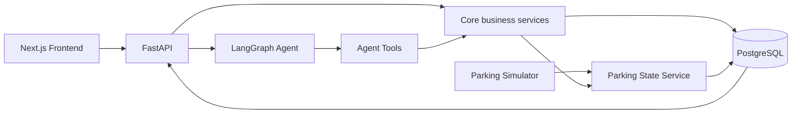
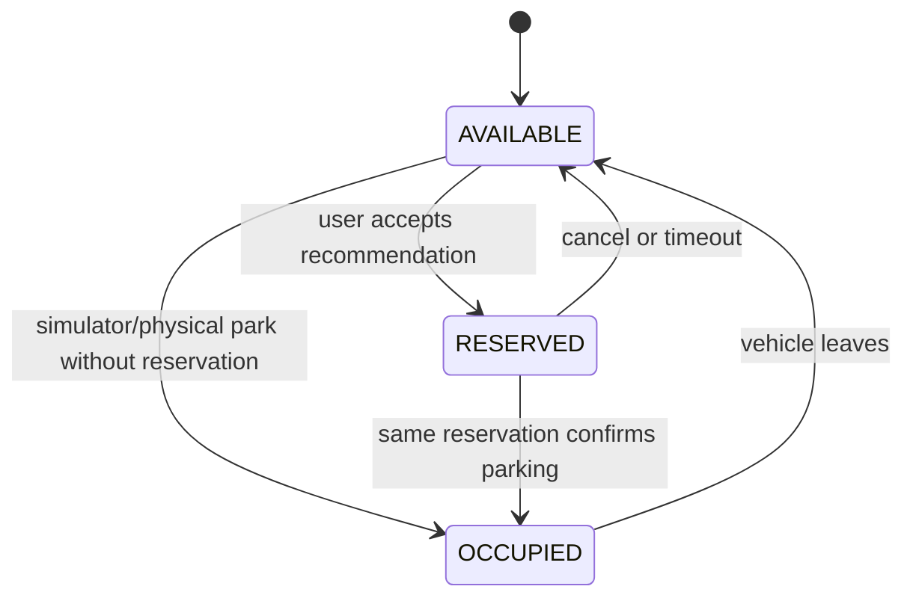
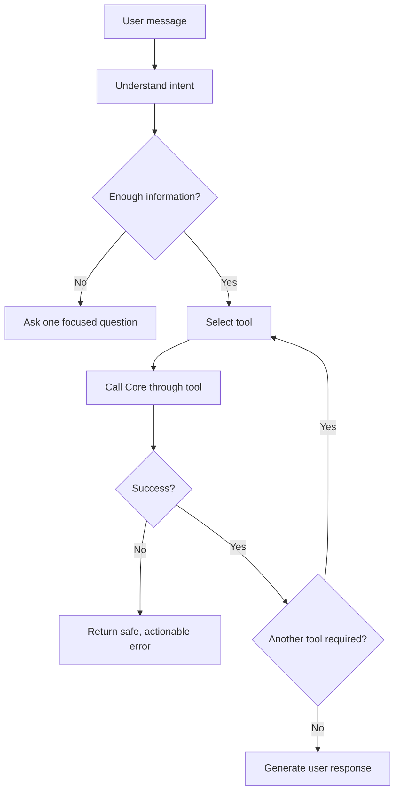

# ParkSmart AI — Hướng dẫn triển khai MVP trong 2 tuần

> Phiên bản: 1.0  
> Phạm vi: bãi đỗ xe một tầng, 40 chỗ, AI Agent, bản đồ và chỉ đường, mô phỏng trạng thái, giao diện Next.js  
> Mốc bắt buộc: có Basic MVP chạy end-to-end vào cuối Ngày 7; hoàn thiện và đóng băng sản phẩm vào cuối Ngày 14

---

## 1. Mục tiêu và nguyên tắc phạm vi

ParkSmart AI giúp người dùng:

1. Xem trạng thái bãi đỗ theo thời gian gần thực.
2. Tìm chỗ đỗ phù hợp theo vị trí và nhu cầu sạc điện.
3. Giữ tạm một chỗ đỗ bằng trạng thái `RESERVED`.
4. Nhận đường đi từ vị trí hiện tại tới chỗ được chọn.
5. Xác nhận đã đỗ và lưu vị trí xe.
6. Tìm lại xe và nhận đường đi từ checkpoint hiện tại.
7. Dùng simulation để tạo dữ liệu và trình diễn toàn bộ luồng khi chưa có cảm biến thật.

Nguyên tắc kiểm soát phạm vi:

- Ngày 7 phải có một luồng hoàn chỉnh chạy từ UI tới database và quay lại UI.
- Ngày 8–14 chỉ hoàn thiện trên kiến trúc đã chạy; không viết lại nền tảng.
- `RESERVED` chỉ là giữ chỗ tạm thời sau khi người dùng chấp nhận đề xuất, không phải hệ thống đặt chỗ từ xa hoặc thanh toán online.
- Bãi xe chỉ có một tầng (`F1`). Không triển khai điều hướng liên tầng.
- Simulator thay cho cảm biến trong MVP; không mô phỏng vật lý hoặc chuyển động 3D.
- Voice và giao diện quản trị simulator là phần hoàn thiện tuần 2, không được làm chậm luồng MVP tuần 1.

### Tiêu chí thành công cuối Ngày 7

Một người dùng phải hoàn thành được kịch bản sau trên giao diện Next.js:

```text
Reset demo
→ xác nhận đang ở Entrance
→ yêu cầu chỗ có sạc
→ nhận một slot AVAILABLE tại C hoặc D
→ chấp nhận đề xuất
→ slot chuyển AVAILABLE → RESERVED
→ nhận đường đi tới slot
→ xác nhận đã đỗ
→ slot chuyển RESERVED → OCCUPIED
→ tạo Parking Session ACTIVE
→ chuyển vị trí người dùng tới một checkpoint
→ hỏi vị trí xe
→ nhận đường đi từ checkpoint tới xe
```

---

## 2. Kiến trúc nguồn phải được giữ nguyên

### 2.1 Luồng phụ thuộc chính



### 2.2 Các nguyên tắc không được phá vỡ

1. **Parking State Service là nguồn sự thật duy nhất** cho trạng thái slot.
2. **Agent không chứa business logic.** Agent chỉ hiểu ý định, thu thập dữ liệu còn thiếu, gọi tool và diễn đạt kết quả.
3. **Agent Tool chỉ là adapter** gọi các hàm trong `src/core/*`; tool không tự truy vấn hoặc sửa database.
4. **Recommendation là thuật toán xác định**, gồm hard filter và scoring. LLM không tự chọn slot.
5. **Routing dùng graph algorithm** như Dijkstra. LLM không tự tạo đường đi.
6. **Simulator không cập nhật database trực tiếp.** Mọi sự kiện park/leave phải đi qua Parking State Service.
7. **Parking Session** là nguồn dữ liệu để trả lời “xe của tôi ở đâu?”. Không suy đoán từ hội thoại.
8. API, Agent và UI cùng dùng một schema và một bộ ID chuẩn.
9. Mọi state transition quan trọng phải chạy trong transaction và tạo `ParkingEvent`.
10. Khi tool hoặc service thất bại, Agent trả lỗi an toàn; không bịa kết quả thay thế.

### 2.3 Ranh giới trách nhiệm

| Thành phần | Được làm | Không được làm |
|---|---|---|
| Next.js | Hiển thị map, slot, route, chat, voice và form chọn ID vị trí; gọi API | Tự quyết định slot hoặc tự sửa trạng thái |
| FastAPI | Xác thực input, dependency, gọi Agent/Core, trả response | Chứa thuật toán recommendation/routing |
| LangGraph Agent | Nhận diện intent, hỏi bổ sung, gọi tool | Chọn slot, tính đường, sửa DB |
| Agent Tools | Chuyển schema Agent sang lời gọi Core | Chứa business rule |
| Core services | State, recommendation, routing, reservation, session, location | Phụ thuộc vào giao diện hoặc prompt |
| Simulator | Tạo sự kiện mô phỏng hợp lệ | Ghi thẳng vào bảng `parking_slots` |
| PostgreSQL | Lưu trạng thái, graph, session, event | Trở thành nơi chứa logic hội thoại |

---

## 3. Công nghệ cố định

| Hạng mục | Công nghệ |
|---|---|
| Frontend | Next.js, TypeScript |
| Backend API | FastAPI, Pydantic |
| AI orchestration | LangGraph |
| LLM | Provider hỗ trợ tool calling |
| Database | PostgreSQL |
| ORM | SQLAlchemy hoặc SQLModel; chọn một và dùng nhất quán |
| Routing | Dijkstra cho MVP |
| Simulation | Python simulation engine trong Core |
| Cập nhật UI | Polling 2 giây cho tuần 1; SSE/WebSocket chỉ khi còn thời gian |
| Voice | Browser Speech API hoặc STT/TTS provider |
| Backend test | pytest |
| Frontend test | Vitest/Jest và Testing Library; Playwright cho smoke flow nếu kịp |
| Đóng gói | Docker, Docker Compose |

Không thêm Kubernetes, message broker, computer vision, indoor positioning thật hoặc microservice phức tạp trong hai tuần.

---

## 4. Cấu trúc repository cố định

Giữ nguyên cấu trúc đã chốt. Có thể bổ sung file trong các thư mục có sẵn nhưng không tạo một kiến trúc top-level khác.

```text
team-YOUR_TEAM_NAME/
├── src/
│   ├── agent/
│   │   ├── graph.py
│   │   ├── state.py
│   │   ├── nodes.py
│   │   └── tools.py
│   │
│   ├── api/
│   │   ├── main.py
│   │   ├── deps.py
│   │   └── routes/
│   │       ├── parking.py
│   │       ├── recommendations.py
│   │       ├── routing.py
│   │       ├── reservations.py
│   │       ├── sessions.py
│   │       ├── locations.py
│   │       ├── simulator.py
│   │       └── agent.py
│   │
│   ├── core/
│   │   ├── config.py
│   │   ├── logging.py
│   │   ├── database.py
│   │   ├── parking_state.py
│   │   ├── recommendation.py
│   │   ├── routing.py
│   │   ├── reservation.py
│   │   ├── parking_session.py
│   │   ├── location.py
│   │   ├── parking_map.py
│   │   ├── simulator.py
│   │   └── seed.py
│   │
│   └── models/
│       └── schemas.py
│
├── frontend/
├── tests/
├── docs/
├── eval/
├── presentation/
└── ...
```

Luồng gọi chuẩn:

```text
Next.js → FastAPI → Agent hoặc API nghiệp vụ → src/core/* → PostgreSQL
```

Ví dụ đúng:

```text
Agent → recommend_parking_slot tool → core/recommendation.py
```

Ví dụ sai:

```text
Agent → câu SQL → parking_slots
```

### 4.1 Gợi ý cấu trúc trong `frontend/`

```text
frontend/
├── app/
│   ├── page.tsx
│   ├── layout.tsx
│   └── simulator/page.tsx
├── components/
│   ├── ParkingMap.tsx
│   ├── ParkingSlot.tsx
│   ├── RouteOverlay.tsx
│   ├── ChatPanel.tsx
│   ├── StatusLegend.tsx
│   ├── SimulatorPanel.tsx
│   └── VoiceButton.tsx
├── lib/
│   ├── api.ts
│   ├── types.ts
│   └── map-config.ts
└── ...
```

`frontend/lib/map-config.ts` có thể chứa dữ liệu tọa độ hiển thị, nhưng backend vẫn là nguồn dữ liệu chuẩn. Tốt hơn là UI lấy map từ API và chỉ ánh xạ tọa độ sang SVG.

---

## 5. Đặc tả bãi đỗ xe một tầng

### 5.1 Tổng quan bắt buộc

| Thuộc tính | Giá trị |
|---|---|
| Tầng | `F1`, chỉ một tầng |
| Khu | A, B, C, D |
| Slot mỗi khu | 10 |
| Tổng slot | 40 |
| Slot sạc điện | 10 |
| Phân bổ EV | `F1-C01`–`F1-C05` và `F1-D01`–`F1-D05` |
| Lối vào | `F1-ENTRANCE` |
| Lối ra | `F1-EXIT` |
| Checkpoint | `F1-CP1`, `F1-CP2`, `F1-CP3` |
| Thang máy | `F1-ELEVATOR`, ở góc dưới trung tâm giữa khu C và D |
| Đường đi | Trục chính CP1–CP2–CP3 và các nhánh vào bốn khu |

Quy ước ID luôn có tiền tố tầng để tránh phải đổi schema khi mở rộng sau MVP.

### 5.2 Sơ đồ bố trí logic

Sơ đồ không thể hiện tỷ lệ vật lý chính xác; tọa độ và trọng số graph ở các mục tiếp theo mới là dữ liệu dùng cho routing.

```text
                                  BẮC

        KHU A                                             KHU B
  A01 A02 A03 A04 A05                               B01 B02 B03 B04 B05
  A06 A07 A08 A09 A10                               B06 B07 B08 B09 B10
            │ A-W ───── A-E ───────┐       ┌────── B-W ───── B-E │
            │                      │       │                       │
ENTRANCE ─ CP1 ══════════════════ CP2 ═════════════════════════ CP3 ─ EXIT
            │                      │       │                       │
            │ C-W ───── C-E ──────┘       └────── D-W ───── D-E │
  C01⚡ C02⚡ C03⚡ C04⚡ C05⚡                         D01⚡ D02⚡ D03⚡ D04⚡ D05⚡
  C06  C07  C08  C09  C10                          D06  D07  D08  D09  D10
        KHU C              ╲                       ╱      KHU D
                             └── ELEVATOR ──┘

                                  NAM
```

Ký hiệu:

- `═`: trục đường chính có thể định tuyến hai chiều.
- `─` và `│`: đường nhánh vào khu.
- `⚡`: slot có bộ sạc EV.
- `CP1`, `CP2`, `CP3`: các điểm xác nhận vị trí bằng ID qua text, voice hoặc nút UI.
- Elevator nằm ở góc dưới trung tâm giữa khu C và D, tách khỏi trục đường chính CP1–CP2–CP3. Lối đi bộ nối Elevator với hai aisle phía trong là `F1-C-E` và `F1-D-W`; vì chỉ có một tầng nên không tạo cạnh dọc sang tầng khác.

### 5.3 Danh mục slot

| Khu | Slot | Sạc EV | Ghi chú |
|---|---|---|---|
| A | `F1-A01`–`F1-A10` | Không | Slot thường |
| B | `F1-B01`–`F1-B10` | Không | Slot thường |
| C | `F1-C01`–`F1-C05` | Có | 5 slot EV |
| C | `F1-C06`–`F1-C10` | Không | 5 slot thường |
| D | `F1-D01`–`F1-D05` | Có | 5 slot EV |
| D | `F1-D06`–`F1-D10` | Không | 5 slot thường |

Mỗi slot tối thiểu có:

```json
{
  "id": "F1-C03",
  "floor_id": "F1",
  "zone_id": "C",
  "node_id": "F1-C-W",
  "status": "AVAILABLE",
  "has_charger": true,
  "is_accessible": false
}
```

Quy tắc gắn slot vào graph theo lối vào gần nhất của từng hàng:

- Slot `01`–`03` và `06`–`08` của mỗi khu nối với node phía tây (`*-W`).
- Slot `04`–`05` và `09`–`10` của mỗi khu nối với node phía đông (`*-E`).
- Slot ở giữa hàng (`03`, `08`) ưu tiên phía tây khi khoảng cách hiển thị bằng nhau.
- Mỗi cạnh từ aisle node tới slot dài 4 m.
- Slot là điểm đích; không dùng slot làm đường đi xuyên qua khu.

### 5.4 Map nodes và tọa độ chuẩn

Hệ tọa độ dùng cho SVG frontend và làm heuristic nếu sau này chuyển sang A*. Đơn vị hiển thị là mét logic; trục `y` tăng dần từ Bắc xuống Nam. Vì vậy `F1-ELEVATOR` tại `y=92` nằm thấp hơn các aisle khu C/D tại `y=70`, đúng vị trí góc dưới của mặt bằng.

| Node ID | Loại | x | y | Mô tả |
|---|---:|---:|---:|---|
| `F1-ENTRANCE` | ENTRANCE | 0 | 50 | Lối xe vào |
| `F1-CP1` | CHECKPOINT | 15 | 50 | Giao lộ phía tây |
| `F1-CP2` | CHECKPOINT | 50 | 50 | Giao lộ trung tâm |
| `F1-CP3` | CHECKPOINT | 85 | 50 | Giao lộ phía đông |
| `F1-EXIT` | EXIT | 100 | 50 | Lối xe ra |
| `F1-ELEVATOR` | ELEVATOR | 50 | 92 | Thang máy/lobby ở góc dưới giữa khu C và D |
| `F1-A-W` | AISLE | 25 | 30 | Làn phía tây khu A |
| `F1-A-E` | AISLE | 42 | 30 | Làn phía đông khu A |
| `F1-B-W` | AISLE | 58 | 30 | Làn phía tây khu B |
| `F1-B-E` | AISLE | 75 | 30 | Làn phía đông khu B |
| `F1-C-W` | AISLE | 25 | 70 | Làn phía tây khu C |
| `F1-C-E` | AISLE | 42 | 70 | Làn phía đông khu C |
| `F1-D-W` | AISLE | 58 | 70 | Làn phía tây khu D |
| `F1-D-E` | AISLE | 75 | 70 | Làn phía đông khu D |

### 5.5 Map edges chuẩn

Mọi cạnh dưới đây là hai chiều cho MVP. `distance_m` là trọng số Dijkstra.

| From | To | distance_m |
|---|---|---:|
| `F1-ENTRANCE` | `F1-CP1` | 15 |
| `F1-CP1` | `F1-CP2` | 35 |
| `F1-CP2` | `F1-CP3` | 35 |
| `F1-CP3` | `F1-EXIT` | 15 |
| `F1-CP1` | `F1-A-W` | 22 |
| `F1-A-W` | `F1-A-E` | 17 |
| `F1-A-E` | `F1-CP2` | 22 |
| `F1-CP2` | `F1-B-W` | 22 |
| `F1-B-W` | `F1-B-E` | 17 |
| `F1-B-E` | `F1-CP3` | 22 |
| `F1-CP1` | `F1-C-W` | 22 |
| `F1-C-W` | `F1-C-E` | 17 |
| `F1-C-E` | `F1-CP2` | 22 |
| `F1-CP2` | `F1-D-W` | 22 |
| `F1-D-W` | `F1-D-E` | 17 |
| `F1-D-E` | `F1-CP3` | 22 |
| `F1-C-E` | `F1-ELEVATOR` | 23 |
| `F1-D-W` | `F1-ELEVATOR` | 23 |

Không tạo cạnh trực tiếp `F1-CP2 ↔ F1-ELEVATOR`, vì thang máy không nằm ở giao lộ trung tâm. Người đi bộ phải đi qua nhánh phía trong của khu C hoặc D để tới lobby thang máy.

Ngoài các cạnh trên, seed thêm cạnh `aisle node ↔ slot node` dài 4 m theo quy tắc ở mục 5.3. Như vậy graph có thể định tuyến tới toàn bộ 40 slot, Entrance, Exit, 3 checkpoint và Elevator.

### 5.6 Kiểm tra tính đầy đủ của map

Seed script phải kiểm tra và dừng nếu một điều kiện không đúng:

```text
floor_count == 1
zone_count == 4
slot_count == 40
zone A/B/C/D đều có 10 slot
charger_count == 10
charger slots chính xác là C01–C05 và D01–D05
checkpoint_count == 3
entrance_count == 1
exit_count == 1
elevator_count == 1
F1-ELEVATOR có tọa độ (50, 92)
F1-ELEVATOR chỉ nối trực tiếp với F1-C-E và F1-D-W
không tồn tại cạnh trực tiếp F1-CP2 ↔ F1-ELEVATOR
mọi slot có node_id tồn tại
mọi node có đường tới F1-CP2
```

---

## 6. Mô hình dữ liệu và state machine

### 6.1 Entity tối thiểu

```text
User
Vehicle
ParkingSlot
ParkingReservation
ParkingSession
MapNode
MapEdge
ParkingEvent
```

Các field tối thiểu:

| Entity | Field quan trọng |
|---|---|
| `ParkingSlot` | id, floor_id, zone_id, node_id, status, has_charger, is_accessible, version |
| `ParkingReservation` | id, user_id, vehicle_id, slot_id, status, expires_at, created_at |
| `ParkingSession` | id, user_id, vehicle_id, slot_id, status, parked_at, completed_at |
| `MapNode` | id, floor_id, type, x, y |
| `MapEdge` | from_node, to_node, distance_m, bidirectional, enabled |
| `ParkingEvent` | id, event_type, slot_id, actor_type, actor_id, old_status, new_status, created_at, metadata |
| `User` | id, display_name, current_node_id |
| `Vehicle` | id, user_id, plate_number, requires_charging |

`version` trên `ParkingSlot` dùng cho optimistic locking hoặc kiểm tra cạnh tranh. Có thể thay bằng row lock của PostgreSQL, nhưng phải có ít nhất một cơ chế chống hai thao tác giữ cùng slot.

### 6.2 Trạng thái slot



Không cho phép:

- `OCCUPIED → RESERVED`
- `RESERVED → RESERVED` bởi một reservation khác
- `AVAILABLE → AVAILABLE` như một event nghiệp vụ
- Simulator chiếm một slot đang `RESERVED`
- User xác nhận đỗ vào reservation của người khác

### 6.3 Trạng thái reservation và session

```text
Reservation: ACTIVE → CONFIRMED
             ACTIVE → EXPIRED
             ACTIVE → CANCELLED

ParkingSession: ACTIVE → COMPLETED
                ACTIVE → CANCELLED
```

Quy tắc MVP:

- Reservation có TTL mặc định 5 phút; cho phép cấu hình bằng biến môi trường.
- Khi hết TTL, transaction đổi reservation sang `EXPIRED` và slot từ `RESERVED` về `AVAILABLE` nếu reservation vẫn là chủ sở hữu.
- Một user chỉ có tối đa một reservation `ACTIVE` và một parking session `ACTIVE`.
- Khi xác nhận đỗ, cùng một transaction phải: kiểm tra reservation, chuyển slot sang `OCCUPIED`, chuyển reservation sang `CONFIRMED`, tạo session `ACTIVE` và ghi event.
- Khi xe rời bãi, cùng một transaction phải hoàn tất session và trả slot về `AVAILABLE`.

### 6.4 Mã lỗi ổn định

| HTTP | Code | Ý nghĩa |
|---:|---|---|
| 400 | `INVALID_TRANSITION` | Chuyển trạng thái không hợp lệ |
| 404 | `SLOT_NOT_FOUND` | Slot không tồn tại |
| 404 | `ROUTE_NODE_NOT_FOUND` | Node không tồn tại |
| 404 | `ACTIVE_SESSION_NOT_FOUND` | Không có phiên đỗ xe đang hoạt động |
| 409 | `SLOT_NOT_AVAILABLE` | Slot vừa bị giữ hoặc bị chiếm |
| 409 | `ACTIVE_RESERVATION_EXISTS` | User đã có reservation active |
| 503 | `AGENT_TOOL_UNAVAILABLE` | Tool/service tạm thời không dùng được |

---

## 7. API contract tối thiểu

Tất cả endpoint nên đặt dưới `/api/v1`. Response lỗi dùng cùng một envelope:

```json
{
  "error": {
    "code": "SLOT_NOT_AVAILABLE",
    "message": "Slot F1-C03 is no longer available",
    "request_id": "..."
  }
}
```

### 7.1 Parking và map

| Method | Endpoint | Chức năng |
|---|---|---|
| GET | `/health` | Health check |
| GET | `/api/v1/parking/status` | Tổng hợp số slot theo trạng thái/khu |
| GET | `/api/v1/parking/slots` | Danh sách slot; filter zone/status/charger |
| GET | `/api/v1/parking/slots/{slot_id}` | Chi tiết slot |
| GET | `/api/v1/parking/map` | Nodes, edges, slots và tọa độ của F1 |

### 7.2 Recommendation và routing

| Method | Endpoint | Chức năng |
|---|---|---|
| POST | `/api/v1/recommendations` | Lọc và xếp hạng slot |
| POST | `/api/v1/routes` | Tính đường ngắn nhất |

Request recommendation:

```json
{
  "user_id": "USER-001",
  "start_node_id": "F1-ENTRANCE",
  "charging_required": true,
  "near_elevator": true,
  "limit": 3
}
```

Response phải trả danh sách ứng viên, không chỉ một slot, để UI cho phép người dùng lựa chọn:

```json
{
  "recommendations": [
    {
      "slot_id": "F1-D01",
      "score": 91.4,
      "distance_m": 76,
      "reasons": ["Có sạc EV", "Đang trống", "Gần thang máy"]
    }
  ],
  "parking_state_version": 42
}
```

Request route:

```json
{
  "start_node_id": "F1-ENTRANCE",
  "destination_node_id": "F1-D01"
}
```

Response:

```json
{
  "path": ["F1-ENTRANCE", "F1-CP1", "F1-CP2", "F1-D-W", "F1-D01"],
  "distance_m": 76,
  "polyline": [[0, 50], [15, 50], [50, 50], [58, 70], [58, 74]]
}
```

### 7.3 Reservation, session và location

| Method | Endpoint | Chức năng |
|---|---|---|
| POST | `/api/v1/reservations` | Giữ tạm slot |
| GET | `/api/v1/reservations/active?user_id=...` | Lấy reservation hiện tại |
| DELETE | `/api/v1/reservations/{id}` | Hủy reservation |
| POST | `/api/v1/sessions/confirm-parking` | Xác nhận đã đỗ và tạo session |
| GET | `/api/v1/sessions/active?user_id=...` | Tìm xe đang đỗ |
| POST | `/api/v1/sessions/{id}/complete` | Xác nhận rời bãi |
| POST | `/api/v1/locations/confirm` | Cập nhật current node |
| GET | `/api/v1/locations/current?user_id=...` | Lấy vị trí hiện tại |

### 7.4 Simulator và Agent

| Method | Endpoint | Chức năng |
|---|---|---|
| POST | `/api/v1/simulator/park` | Mô phỏng xe vào một slot |
| POST | `/api/v1/simulator/leave` | Mô phỏng xe rời slot |
| POST | `/api/v1/simulator/reset` | Trả dữ liệu về seed chuẩn |
| POST | `/api/v1/simulator/run-scenario` | Chạy kịch bản demo cố định |
| POST | `/api/v1/agent/chat` | Gửi câu tự nhiên tới Agent |

Các endpoint simulator chỉ được bật trong môi trường development/demo hoặc phải được bảo vệ bằng quyền admin.

---

## 8. Thiết kế từng service

### 8.1 Parking State Service

File: `src/core/parking_state.py`

Interface tối thiểu:

```python
get_slot(slot_id)
list_slots(filters)
list_available_slots(filters)
reserve_slot(slot_id, reservation_id, expected_version=None)
occupy_slot(slot_id, actor, reservation_id=None)
release_slot(slot_id, actor)
expire_reservation(slot_id, reservation_id)
```

Mỗi hàm thay đổi trạng thái phải:

1. Mở transaction.
2. Lock hoặc kiểm tra version của slot.
3. Xác minh transition và quyền sở hữu reservation.
4. Cập nhật state.
5. Ghi `ParkingEvent`.
6. Commit; rollback toàn bộ nếu có lỗi.

### 8.2 Recommendation Service

File: `src/core/recommendation.py`

Hard constraints:

```text
status == AVAILABLE
charging_required == true → has_charger == true
accessible_required == true → is_accessible == true
slot và start node phải cùng floor trong MVP
```

Không đưa `RESERVED` hoặc `OCCUPIED` vào danh sách ứng viên.

Scoring đề xuất:

```text
distance_score  = 1 - min(distance / MAX_DISTANCE, 1)
elevator_score  = 1 - min(distance_to_elevator / MAX_DISTANCE, 1)
exit_score      = 1 - min(distance_to_exit / MAX_DISTANCE, 1)

total = 0.50 * distance_score
      + 0.30 * elevator_score, nếu near_elevator
      + 0.20 * exit_score
```

Nếu `near_elevator == false`, phân bổ lại trọng số thành 0.75 distance và 0.25 exit. Sạc EV là hard constraint, không phải bonus mềm khi người dùng bắt buộc sạc.

Tie-break ổn định:

```text
score giảm dần → distance tăng dần → slot_id theo alphabet
```

Vì vậy cùng input và cùng parking state luôn cho cùng kết quả.

Hiệu năng và chuẩn hóa khoảng cách:

1. Mỗi recommendation load đúng một graph snapshot gồm toàn bộ `MapNode` và
   `MapEdge.enabled == true`.
2. Chạy SSSP Dijkstra tối đa ba lần: từ start trên graph thuận, từ Exit trên
   graph đảo chiều, và từ Elevator trên graph đảo chiều khi
   `near_elevator == true`.
3. Tra khoảng cách cho từng slot từ các bảng SSSP; không gọi Dijkstra riêng cho
   từng candidate.
4. `MAX_DISTANCE` là khoảng cách hữu hạn lớn nhất thực sự dùng để chấm các
   candidate đã qua hard filter và reachable. Không dùng tổng trọng số edge,
   magic number, hoặc edge thuộc component rời rạc không liên quan.

Cách này giữ scoring deterministic, giảm recommendation từ `2N`/`3N` lần tìm
đường xuống còn hai hoặc ba lần, và tránh việc graph rời rạc làm score co cụm.

### 8.3 Routing Service

Files: `src/core/parking_map.py`, `src/core/routing.py`

Quy trình:

1. Load graph snapshot từ `MapNode` và `MapEdge` đang enabled; dựng cả adjacency
   thuận và đảo chiều, đồng thời tôn trọng `bidirectional`.
2. Validate start và destination.
3. Chạy Dijkstra với `distance_m`.
4. Trả node path, tổng khoảng cách và tọa độ polyline.
5. Cho phép tái sử dụng graph snapshot và kết quả SSSP trong phạm vi một request.
6. Chỉ cache graph xuyên request khi đã có topology version hoặc cơ chế
   invalidation đáng tin cậy. Nếu chưa có, mỗi request phải load snapshot mới để
   edge vừa enable/disable có hiệu lực ngay.

Test quan trọng nhất là route không đi xuyên qua slot khác và không trả node không tồn tại.

### 8.4 Reservation Service

File: `src/core/reservation.py`

```text
accept recommendation
→ kiểm tra slot vẫn AVAILABLE
→ tạo reservation ACTIVE với expires_at
→ Parking State Service chuyển AVAILABLE → RESERVED
```

Recommendation không tự động giữ slot. Chỉ hành động chấp nhận rõ ràng của user mới tạo reservation.

### 8.5 Parking Session Service

File: `src/core/parking_session.py`

```text
confirm parking
→ validate user, vehicle và reservation
→ RESERVED → OCCUPIED
→ reservation ACTIVE → CONFIRMED
→ ParkingSession ACTIVE
```

`find_parked_vehicle(user_id)` chỉ đọc session `ACTIVE`, join vehicle và slot, rồi trả node đích cho Routing Service.

### 8.6 Location Service

File: `src/core/location.py`

Xác nhận vị trí bằng `node_id` hoặc `slot_id` do người dùng chọn/nhập qua UI, text hoặc voice. Backend phải truy vấn `MapNode` hoặc `ParkingSlot` để kiểm tra ID tồn tại và đúng loại trước khi cập nhật `current_node_id`; không tin ID chỉ vì đúng format.

### 8.7 Simulator Service

File: `src/core/simulator.py`

Ba chế độ:

1. **Manual:** park/leave một xe cụ thể để phát triển và kiểm thử.
2. **Random:** định kỳ chọn transition hợp lệ; dùng để quan sát UI động.
3. **Fixed demo scenario:** chuỗi event xác định, có thể reset và chạy lặp lại.

Kịch bản demo chuẩn nên seed một số slot occupied nhưng giữ ít nhất hai EV slot ở C và D available. Ví dụ:

```text
T+0s   reset seed
T+3s   SIM-CAR-01 parks F1-A04
T+6s   SIM-CAR-02 leaves F1-B03
T+9s   SIM-CAR-03 parks F1-D07
```

Random mode không được:

- Chiếm slot `RESERVED`.
- Làm xe rời một slot `AVAILABLE`.
- Tạo hai xe trong cùng slot.
- Can thiệp vào slot thuộc active reservation/session của luồng demo chính.

---

## 9. AI Agent và tool contract

### 9.1 Agent state

File: `src/agent/state.py`

```text
messages
user_id
vehicle_id
current_location
intent
selected_slot
active_reservation_id
missing_fields
tool_result
error
```

Agent state chỉ là trạng thái hội thoại. Không lưu bản sao Parking State trong Agent state.

### 9.2 Intent MVP

```text
GET_PARKING_STATUS
RECOMMEND_SLOT
RESERVE_SLOT
GET_ROUTE_TO_SLOT
CONFIRM_USER_LOCATION
CONFIRM_PARKING
FIND_MY_CAR
GET_ROUTE_TO_CAR
CANCEL_RESERVATION
```

### 9.3 Tools tuần 1

```text
get_parking_status
recommend_parking_slot
reserve_parking_slot
get_route
set_user_location
confirm_parking
find_parked_vehicle
```

Tuần 2 bổ sung nếu cần:

```text
cancel_reservation
complete_parking_session
```

### 9.4 LangGraph flow



Ví dụ:

```text
User: “Tìm cho tôi chỗ có sạc gần thang máy.”
Agent: kiểm tra current_location
→ nếu thiếu: hỏi vị trí
→ nếu đủ: gọi recommend_parking_slot
→ trình bày 1–3 kết quả từ tool
→ chỉ reserve sau khi user chấp nhận một slot
```

Agent không được biến “tìm chỗ” thành “giữ chỗ” trong cùng bước nếu chưa có xác nhận.

---

## 10. Giao diện Next.js

### 10.1 Màn hình MVP Ngày 6–7

```text
┌────────────────────────────────────────────────────────────┐
│ ParkSmart AI     Vị trí: F1-ENTRANCE      [Reset Demo]     │
├─────────────────────────────────────┬──────────────────────┤
│                                     │ Chat                 │
│  Bản đồ F1                          │                      │
│  - 4 khu A/B/C/D                    │ User: ...            │
│  - màu trạng thái 40 slot           │ AI: ...              │
│  - Entrance/Exit/CP/Elevator        │                      │
│  - slot đề xuất                     │ [Nhập yêu cầu...]     │
│  - route overlay                    │ [Gửi]                 │
│                                     │                      │
├─────────────────────────────────────┴──────────────────────┤
│ AVAILABLE | RESERVED | OCCUPIED | EV | Route              │
└────────────────────────────────────────────────────────────┘
```

Mã màu không được là tín hiệu duy nhất; luôn có icon hoặc label:

| Trạng thái | Màu gợi ý | Nhãn |
|---|---|---|
| AVAILABLE | Xanh lá | `A` / Available |
| RESERVED | Vàng/cam | `R` / Reserved |
| OCCUPIED | Đỏ | `O` / Occupied |
| EV | Icon xanh lam | `⚡` |
| Recommended | Viền tím | `Recommended` |

### 10.2 Data flow frontend

- Khi load: gọi `/parking/map`, `/parking/status`, location và session hiện tại.
- Tuần 1: polling trạng thái slot mỗi 2 giây.
- Sau recommendation: highlight các ứng viên nhưng không đổi trạng thái.
- Sau reservation thành công: cập nhật slot thành `RESERVED` từ response server.
- Sau route: render `polyline` theo tọa độ API.
- Sau xác nhận đỗ: refresh session và trạng thái slot.
- Không optimistic-update state quan trọng trước khi backend xác nhận.

### 10.3 Tuần 2

- Trang `/simulator` cho reset, park, leave và chạy fixed scenario.
- Form chọn ID cập nhật location hoặc xác nhận slot sau validation server.
- Voice chỉ chuyển speech ↔ text; vẫn đi qua endpoint Agent như chat text.
- Thêm loading, empty state, retry và thông báo lỗi có thể hành động.

---

## 11. Roadmap triển khai 14 ngày

### Giai đoạn 0 — Chốt contract và phạm vi

**Thời gian:** Ngày 1, buổi sáng

Việc cần làm:

- Chốt ID convention, enum, API envelope và ownership module.
- Chốt đặc tả map tại Mục 5 làm nguồn duy nhất.
- Tạo `docs/adr/001-reserved-slot-state.md` ghi rõ ý nghĩa `RESERVED`.
- Chốt reservation TTL và cơ chế concurrency.
- Tạo `.env.example`, health check và logging request ID.

Definition of Done:

- Mọi thành viên dùng cùng schema.
- Không còn câu hỏi ai có quyền đổi trạng thái slot.
- Map có đủ 40 slot, 10 EV, 3 checkpoint và các node đặc biệt.

### Giai đoạn 1 — Data, map và Parking State

**Thời gian:** Ngày 1 chiều đến Ngày 2 sáng

Files chính:

```text
src/models/schemas.py
src/core/database.py
src/core/parking_map.py
src/core/parking_state.py
src/core/seed.py
src/api/routes/parking.py
```

Việc cần làm:

- Tạo model/migration tối thiểu.
- Seed map đúng đặc tả và seed user/vehicle demo.
- Implement đọc trạng thái và state transition có transaction.
- Tạo map/status/slot API.
- Viết validation cho seed và transition.

Definition of Done:

- API trả đúng 40 slot.
- Chính xác 10 slot có `has_charger=true`.
- Map graph connected và định danh nhất quán.
- Transition không hợp lệ trả mã lỗi ổn định.

### Giai đoạn 2 — Parking Simulation

**Thời gian:** Ngày 2 chiều

Files chính:

```text
src/core/simulator.py
src/api/routes/simulator.py
```

Việc cần làm:

- Manual park/leave/reset.
- Fixed scenario có seed ổn định.
- Random mode có thể để sau fixed mode.
- Ghi event và bảo vệ reservation/session.

Definition of Done:

- `reset → park → leave` phản ánh đúng qua parking API.
- Không có thao tác simulator nào ghi thẳng DB.
- Chạy lại scenario cho cùng trạng thái kết thúc.

### Giai đoạn 3 — Recommendation và Routing

**Thời gian:** Ngày 3

Files chính:

```text
src/core/recommendation.py
src/core/routing.py
src/api/routes/recommendations.py
src/api/routes/routing.py
```

Việc cần làm:

- Implement hard filters và deterministic scoring.
- Implement Dijkstra trên graph seed.
- Trả route polyline cho frontend.
- Test EV filter, tie-break và shortest path.

Definition of Done:

- Yêu cầu EV chỉ trả C01–C05 hoặc D01–D05 đang `AVAILABLE`.
- Cùng input/state trả cùng thứ tự kết quả.
- Route từ Entrance tới mọi slot tồn tại.

### Giai đoạn 4 — Reservation, Session và Location

**Thời gian:** Ngày 4

Files chính:

```text
src/core/reservation.py
src/core/parking_session.py
src/core/location.py
src/api/routes/reservations.py
src/api/routes/sessions.py
src/api/routes/locations.py
```

Việc cần làm:

- Accept/cancel/expire reservation.
- Confirm parking và tạo active session atomically.
- Lưu/lấy current location.
- Tìm active vehicle session.
- Test hai user cùng reserve một slot.

Definition of Done:

- Chạy được qua API: `recommend → reserve → route → confirm → find car`.
- Chỉ một request thắng khi hai request reserve đồng thời.

### Giai đoạn 5 — LangGraph Agent

**Thời gian:** Ngày 5

Files chính:

```text
src/agent/state.py
src/agent/tools.py
src/agent/nodes.py
src/agent/graph.py
src/api/routes/agent.py
```

Việc cần làm:

- Implement các intent và tool tuần 1.
- Hỏi lại khi thiếu `user_id`, vehicle hoặc location.
- Tách bước recommendation khỏi reservation.
- Chuẩn hóa safe error khi tool lỗi.
- Tạo eval cases cho câu tiếng Việt chính.

Definition of Done:

- Agent gọi đúng tool; không hard-code slot hoặc route trong prompt.
- Tool output có thể truy vết bằng log nhưng không lộ dữ liệu nhạy cảm.

### Giai đoạn 6 — Next.js Basic Product

**Thời gian:** Ngày 6

Việc cần làm:

- Dựng layout map + chat.
- Render 40 slot, map node và đường.
- Poll parking state.
- Highlight recommendation/reservation.
- Vẽ route polyline.
- Nối đầy đủ Agent API và Core API cần thiết.

Definition of Done:

- Người dùng thực hiện luồng chính mà không cần mở Swagger.
- UI thể hiện rõ `AVAILABLE`, `RESERVED`, `OCCUPIED` và EV.

### Giai đoạn 7 — Tích hợp và Basic MVP Release

**Thời gian:** Ngày 7

Không thêm feature mới khi happy path chưa ổn.

Thực hiện:

- Chạy kịch bản E2E ở Mục 13 ít nhất ba lần từ trạng thái reset.
- Sửa lỗi contract, race condition và UI state.
- Tạo script/lệnh reset demo một bước.
- Gắn version `mvp-week-1` khi toàn bộ gate đạt.

Definition of Done:

- Luồng chính chạy hoàn toàn trên Next.js.
- Không sửa DB thủ công trong lúc demo.
- Có log đủ để tìm nguyên nhân nếu một bước thất bại.

### Ngày 8 — Location confirmation bằng ID

- Tạo form chọn/nhập ID cho Entrance, CP1–CP3, Elevator và các slot cần demo.
- Validate ID trên server bằng dữ liệu `MapNode`/`ParkingSlot`.
- Cập nhật vị trí hiện tại sau khi người dùng xác nhận.
- Khi chọn ID slot, chỉ gợi ý xác nhận đỗ; không tự động đổi trạng thái khi chưa có xác nhận.

### Ngày 9 — Voice

- Dùng pipeline `Speech → STT → Agent → Tools → response → TTS`.
- Voice và text dùng cùng Agent endpoint.
- Có fallback sang text khi trình duyệt từ chối microphone hoặc STT lỗi.

### Ngày 10 — Simulator dashboard

- Tạo trang điều khiển manual và fixed scenario.
- Hiển thị event gần nhất.
- Chứng minh UI và recommendation thay đổi khi simulator đổi state.

### Ngày 11 — Error handling và độ bền

Hoàn thiện các tình huống:

- Hết slot thường hoặc hết slot EV.
- Slot được đề xuất vừa bị user khác giữ.
- Reservation hết hạn.
- Slot/node ID không hợp lệ.
- Chưa xác nhận location.
- Không có active session.
- Không tìm được route.
- LLM hoặc tool timeout.

### Ngày 12 — Test, eval và logging

- Hoàn thiện unit/integration tests ở Mục 12.
- Chạy Agent eval tiếng Việt.
- Thêm structured log: request ID, user ID đã mask, tool name, latency, outcome.
- Không log raw API key hoặc token.

### Ngày 13 — Docker Compose và deployment

- Container hóa frontend, backend và PostgreSQL.
- Agent chạy trong backend process cho MVP; simulator có thể là module/job, không bắt buộc thành service riêng.
- Migration và seed có bước rõ ràng, idempotent.
- Thêm health checks và hướng dẫn khởi động.
- Chạy smoke test trên môi trường đóng gói.

### Ngày 14 — Feature freeze và diễn tập

- Không thêm tính năng.
- Fix lỗi chặn demo, hoàn thiện README và slide.
- Diễn tập cold start, reset, happy path và một error path.
- Chuẩn bị video hoặc ảnh dự phòng.
- Gắn version final khi acceptance gate đạt.

### Bảng tóm tắt

| Ngày | Trọng tâm | Kết quả bắt buộc |
|---:|---|---|
| 1 | Contract, data, map | Schema và map thống nhất |
| 2 | State + simulator | State thay đổi hợp lệ |
| 3 | Recommendation + routing | Slot và shortest path |
| 4 | Reservation + session + location | Business flow hoàn chỉnh |
| 5 | Agent + tools | Chat gọi đúng service |
| 6 | Next.js | Sản phẩm dùng được |
| **7** | **Integration** | **Basic MVP end-to-end** |
| 8 | Location | Xác nhận vị trí bằng ID |
| 9 | Voice | STT/TTS dùng cùng Agent |
| 10 | Simulator UI | Demo trạng thái động |
| 11 | Error handling | Các nhánh lỗi an toàn |
| 12 | Test + eval + log | Hệ thống ổn định |
| 13 | Docker deployment | Chạy được bằng Compose |
| **14** | **Freeze + rehearsal** | **Final MVP** |

---

## 12. Kế hoạch kiểm thử

### 12.1 Unit tests bắt buộc

Parking State:

```text
test_reserve_available_slot
test_cannot_reserve_reserved_slot
test_cannot_reserve_occupied_slot
test_confirm_own_reservation
test_cannot_confirm_other_users_reservation
test_expire_reservation_releases_slot
test_release_occupied_slot
```

Map và Routing:

```text
test_map_has_exactly_40_slots
test_map_has_exactly_10_ev_slots
test_map_has_three_checkpoints
test_elevator_is_below_and_between_zones_c_d
test_elevator_connects_to_c_e_and_d_w_not_cp2
test_all_nodes_connected_to_cp2
test_shortest_path_entrance_to_c01
test_route_to_every_slot
test_invalid_start_or_destination
test_no_route_when_edges_disabled
```

Recommendation:

```text
test_recommendation_returns_only_available
test_ev_required_returns_only_charger_slots
test_reserved_never_recommended
test_result_is_deterministic
test_tie_breaks_by_distance_then_slot_id
test_no_matching_slot_returns_empty_result
```

Session và Location:

```text
test_confirm_parking_creates_active_session
test_user_has_at_most_one_active_session
test_find_vehicle_uses_active_session
test_complete_session_releases_slot
test_confirm_known_location_id
test_reject_unknown_location_id
```

Simulator:

```text
test_simulator_uses_state_service
test_simulator_cannot_take_reserved_slot
test_cannot_leave_available_slot
test_reset_is_idempotent
test_fixed_scenario_is_repeatable
```

### 12.2 Integration tests bắt buộc

1. `recommend → reserve → route`.
2. `reserve → confirm parking → active session`.
3. `confirm parking → change location → find car → route to car`.
4. Hai request đồng thời reserve cùng slot: đúng một request thành công.
5. Simulator event → parking API → frontend state refresh.
6. Reservation timeout → slot được recommendation lại.
7. Agent tool failure → response an toàn, không có slot/route giả.

### 12.3 Agent eval tối thiểu

| Câu người dùng | Hành vi mong đợi |
|---|---|
| “Còn bao nhiêu chỗ trống?” | `get_parking_status` |
| “Tìm chỗ có sạc gần thang máy.” | Hỏi location nếu thiếu, sau đó `recommend_parking_slot` |
| “Tôi chọn C03.” | `reserve_parking_slot` sau khi xác minh C03 thuộc đề xuất/đang available |
| “Chỉ đường tới đó.” | `get_route` với location và selected slot |
| “Tôi đã đỗ ở C03.” | `confirm_parking` |
| “Xe của tôi ở đâu?” | `find_parked_vehicle` |
| “Tôi ở CP3, chỉ đường tới xe.” | set/confirm location rồi `find_parked_vehicle` + `get_route` |
| “Chọn đại một chỗ dù đã occupied.” | Từ chối transition, không bịa thành công |

---

## 13. Kịch bản demo chuẩn

### 13.1 Chuẩn bị

- Dùng `USER-001`, `VEHICLE-001` có nhu cầu sạc.
- Reset seed.
- Đảm bảo `F1-D01` và ít nhất một EV slot khác đang `AVAILABLE`.
- Mở Next.js ở bản đồ F1.

### 13.2 Happy path

1. Nhấn **Reset Demo**; UI hiển thị đủ 40 slot.
2. Người dùng: “Tôi đang ở lối vào.”
3. Agent gọi location tool và UI đánh dấu `F1-ENTRANCE`.
4. Người dùng: “Tìm cho tôi chỗ có sạc gần thang máy.”
5. Agent gọi recommendation tool; service chỉ trả slot EV tại C/D đang trống.
6. UI highlight `F1-D01` hoặc kết quả xác định từ seed. Với map chuẩn, D01 nằm ở nhánh trong của khu D nên gần Elevator hơn các EV slot phía ngoài khu C.
7. Người dùng: “Tôi chọn D01.”
8. Reservation được tạo; `F1-D01: AVAILABLE → RESERVED`.
9. Người dùng: “Chỉ đường cho tôi.”
10. Routing trả `ENTRANCE → CP1 → CP2 → D-W → D01`; UI vẽ route.
11. Người dùng: “Tôi đã đỗ ở D01.”
12. Reservation `CONFIRMED`, slot `OCCUPIED`, Parking Session `ACTIVE`.
13. Xác nhận người dùng đang ở `F1-CP3` bằng ID trên UI, text hoặc voice.
14. Người dùng: “Xe của tôi ở đâu và chỉ đường tới xe.”
15. Agent tìm active session, lấy `F1-D01`, gọi routing từ `F1-CP3` và UI vẽ đường.

Không hard-code `D01` trong Agent. Nếu seed hoặc state khiến service chọn slot EV khác, demo phải tiếp tục bằng slot service trả về.

### 13.3 Error path ngắn

1. Reset demo và tạo recommendation cho một slot.
2. Trước khi user chấp nhận, dùng simulator làm slot đó `OCCUPIED`.
3. User chấp nhận slot cũ.
4. Backend trả `409 SLOT_NOT_AVAILABLE`.
5. Agent giải thích slot vừa không còn trống và đề nghị chạy recommendation lại.

Nhánh này chứng minh hệ thống không tin dữ liệu hội thoại cũ và xử lý cạnh tranh đúng.

---

## 14. Deployment và cấu hình

### 14.1 Docker Compose tối thiểu

```text
frontend  → Next.js
backend   → FastAPI + LangGraph + Core + Simulator API
postgres  → PostgreSQL
```

Không cần tách Agent và Simulator thành container riêng trong MVP nếu chúng dùng cùng codebase và database. Nếu tài liệu triển khai của nhóm yêu cầu hiển thị chúng như thành phần logic riêng, giữ ranh giới module nhưng tránh tăng vận hành không cần thiết.

### 14.2 Biến môi trường

```text
DATABASE_URL
LLM_API_KEY
LLM_MODEL
RESERVATION_TTL_SECONDS=300
SIMULATOR_ENABLED=true
DEMO_MODE=true
NEXT_PUBLIC_API_BASE_URL
LOG_LEVEL=INFO
```

Không commit secret. `.env.example` chỉ chứa tên biến và giá trị mẫu không nhạy cảm.

### 14.3 Trình tự khởi động

```text
1. PostgreSQL healthy
2. chạy migration
3. validate/seed map nếu chưa có
4. FastAPI healthy
5. Next.js kết nối backend
6. smoke test health + map + slots
```

Seed phải idempotent: chạy lại không tạo trùng node, edge hoặc slot.

---

## 15. Phân chia workstream

| Workstream | Ownership |
|---|---|
| Core Backend | DB, state machine, reservation, session, simulator |
| Algorithm/Map | Seed map, recommendation, routing |
| AI | LangGraph, tools, intent eval |
| Product | Next.js, map SVG, form chọn ID vị trí, voice, simulator dashboard |
| Integration/Lead | Contract, review, tests, deployment, demo |

Nếu nhóm ít người, một người có thể giữ hai workstream. Tuy nhiên mỗi module chỉ nên có một owner cuối cùng và mọi thay đổi contract phải được integration lead duyệt trước khi merge.

Thứ tự phụ thuộc:

```text
Data + Map
    ↓
Parking State
    ├── Simulator
    ├── Reservation/Session
    └── Recommendation
             ↓
          Routing
             ↓
         Agent Tools
             ↓
           Agent
             ↓
        FastAPI + Next.js
```

UI và Agent có thể dựng skeleton sớm, nhưng tích hợp thật phải dựa trên contract và Core services đã chạy.

---

## 16. Acceptance checklist

### Cuối tuần 1 — Basic MVP

- [ ] Repository giữ đúng cấu trúc cố định.
- [ ] PostgreSQL có migration và seed idempotent.
- [ ] Bản đồ chỉ có `F1`, đủ A/B/C/D và 40 slot.
- [ ] Chính xác 10 EV slot: C01–C05, D01–D05.
- [ ] Có Entrance, Exit, CP1–CP3, Elevator và graph connected.
- [ ] `AVAILABLE`, `RESERVED`, `OCCUPIED` hoạt động đúng.
- [ ] Simulator đi qua Parking State Service.
- [ ] Recommendation deterministic và không trả reserved/occupied slot.
- [ ] Dijkstra trả route tới toàn bộ slot.
- [ ] Reservation chống double booking.
- [ ] Parking Session tìm lại đúng xe.
- [ ] Agent gọi tool, không chứa business logic.
- [ ] Next.js hiển thị map, trạng thái, recommendation, route và chat.
- [ ] Happy path chạy ba lần liên tiếp sau reset.

### Cuối tuần 2 — Final MVP

- [ ] ID vị trí được validate ở backend trước khi cập nhật.
- [ ] Voice dùng cùng Agent flow với text và có fallback.
- [ ] Simulator dashboard chạy fixed scenario.
- [ ] Các error case chính có thông báo an toàn.
- [ ] Unit và integration test quan trọng đều pass.
- [ ] Log có request ID và tool outcome.
- [ ] Docker Compose cold start thành công.
- [ ] README có hướng dẫn setup, seed, reset, test và demo.
- [ ] Không còn feature mới sau freeze.
- [ ] Có phương án demo dự phòng.

---

## 17. Những việc chủ động không làm trong MVP

- Đặt chỗ trước nhiều giờ/ngày hoặc thanh toán.
- Điều hướng nhiều tầng.
- Nhận diện biển số/camera thật.
- Đồng bộ cảm biến IoT thật.
- Tối ưu luồng xe theo traffic thời gian thực.
- Định vị trong nhà chính xác liên tục.
- A* hoặc thuật toán phức tạp nếu Dijkstra đã đáp ứng.
- Microservice, queue, Kubernetes hoặc event platform riêng.
- Cho LLM quyền quyết định state transition, recommendation hoặc route.

Những hạng mục này có thể đưa vào backlog sau khi Final MVP ổn định, không được dùng làm lý do trì hoãn mốc Ngày 7.

---

## 18. Kết luận triển khai

Trục kỹ thuật của dự án là:

```text
Map/Data → Parking State → Simulation/Services → Agent Tools → Agent/API → Next.js
```

Nếu nhóm giữ đúng thứ tự này, ParkSmart AI có thể đạt một Basic MVP thật sự vào cuối tuần 1: có dữ liệu động, đề xuất có thể giải thích, giữ chỗ an toàn, chỉ đường trên graph và tìm lại xe. Tuần 2 dành cho xác nhận vị trí bằng ID, voice, simulator dashboard, độ bền, kiểm thử và đóng gói—không thay đổi kiến trúc cốt lõi đã được chứng minh ở Ngày 7.
