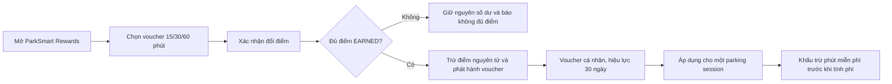
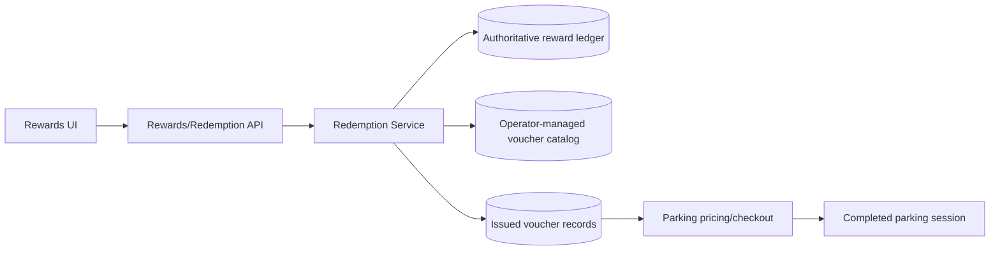

# ParkSmart Points và voucher đỗ xe

> Trạng thái: định hướng cho sản phẩm thật, **chưa được triển khai trong public beta**.
> Public beta hiện chỉ ghi nhận contribution, xác minh và cộng điểm `EARNED`; chưa có
> catalog voucher, giao dịch trừ điểm, voucher điện tử hoặc tích hợp tính phí đỗ xe.

## 1. Mục tiêu sản phẩm

ParkSmart Points khuyến khích người dùng cung cấp dữ liệu hữu ích cho cộng đồng, như xác
nhận trạng thái ô bên cạnh hoặc báo cáo xe đỗ sai. Sau khi contribution được admin xác minh,
điểm `EARNED` có thể được đổi thành voucher miễn phí thời gian đỗ xe.

Cơ chế này biến đóng góp đã xác minh thành lợi ích thực tế, nhưng không được thay đổi thứ tự
ưu tiên, quyền tiếp cận hoặc kết quả recommendation/reservation của hệ thống.

## 2. Mức quy đổi đề xuất

| Điểm cần đổi | Voucher nhận được |
|---:|---:|
| 100 ParkSmart Points | Miễn phí 15 phút đỗ xe |
| 200 ParkSmart Points | Miễn phí 30 phút đỗ xe |
| 400 ParkSmart Points | Miễn phí 60 phút đỗ xe |

Các mức trên là chính sách sản phẩm đề xuất. Khi triển khai, operator phải cấu hình catalog
ở backend; frontend và AI Agent không được hard-code hoặc tự suy đoán tỷ lệ quy đổi.

Theo cấu hình tích điểm hiện tại, một adjacent observation được xác minh nhận 10 điểm, một
wrong-parking report được xác nhận nhận 20 điểm và tổng điểm contribution bị giới hạn 100
điểm/người/ngày. Vì vậy, ở tỷ lệ cơ sở, một người dùng chỉ có thể tích lũy tối đa tương
đương voucher 15 phút trong một ngày.

## 3. Quy tắc sử dụng voucher

- Chỉ điểm `EARNED` mới được đổi; điểm `PENDING` không khả dụng.
- Voucher gắn với tài khoản đã đổi, không chuyển nhượng và không quy đổi thành tiền mặt.
- Voucher có hiệu lực 30 ngày kể từ lúc phát hành và chỉ sử dụng một lần.
- Mỗi parking session áp dụng tối đa một voucher, với mức miễn phí tối đa 60 phút.
- Phút chưa dùng hết không được bảo lưu sang phiên khác.
- Voucher chỉ giảm thời gian tính phí sau khi parking session hoàn tất; không bảo đảm còn
  chỗ, không giữ ô và không thay đổi quyền dùng ô tiếp cận hoặc ô sạc.
- Voucher hết hạn mà chưa dùng không tự động hoàn điểm.

Ví dụ: phiên đỗ kéo dài 75 phút và áp dụng voucher 30 phút thì hệ thống tính phí 45 phút.
Nếu phiên đỗ chỉ kéo dài 20 phút, voucher 30 phút được dùng hết cho phiên đó và 10 phút còn
lại không được chuyển sang lần sau.

## 4. Workflow mục tiêu



Request đổi điểm phải có idempotency key. Kiểm tra số dư, ghi giao dịch trừ điểm và phát
hành voucher phải nằm trong cùng một transaction hoặc một workflow có cơ chế bù trừ rõ
ràng, để retry hay request đồng thời không tạo hai voucher hoặc làm số dư âm.

## 5. Kiến trúc mục tiêu



| Thành phần | Trách nhiệm |
|---|---|
| Rewards UI | Hiển thị số dư, catalog, điều khoản, bước xác nhận và lịch sử voucher |
| Redemption API | Auth, ownership, idempotency và contract lỗi chuẩn |
| Redemption Service | Kiểm tra số dư, trừ điểm, phát hành/hoàn voucher và audit |
| Reward ledger | Nguồn sự thật cho điểm cộng, điểm trừ và số dư; không cho số dư âm |
| Voucher catalog | Mức điểm, số phút, thời hạn và trạng thái do operator quản lý |
| Voucher records | Owner, thời điểm phát hành/hết hạn, trạng thái và parking session đã áp dụng |
| Pricing/checkout | Tính thời lượng miễn phí sau khi kết thúc phiên, trước khi tính tiền |

Schema Alembic hiện tại `20260824_0012` chỉ hỗ trợ contribution reward không âm và không có
redemption. Trước khi code cần có ADR, migration mới và API contract được review. Thiết kế
phải hỗ trợ debit rõ ràng hoặc ledger signed amount, catalog versioning và voucher lifecycle
như sau:

```text
ISSUED -> APPLIED
ISSUED -> EXPIRED
ISSUED -> CANCELLED -> REFUNDED   # chỉ cho lỗi hệ thống/operator được phê duyệt
```

Nếu phát hành voucher thất bại thì giao dịch trừ điểm phải rollback. Việc hoàn điểm không
được dùng như luồng thông thường; chỉ operator có thẩm quyền được xử lý lỗi hệ thống và mọi
thao tác phải lưu audit trail.

## 6. An toàn, chống gian lận và đo lường

- Giữ lifecycle xác minh hiện tại để contribution giả không tạo điểm khả dụng.
- Rate limit redemption và theo dõi request trùng, nhiều tài khoản hoặc mẫu đóng góp bất
  thường; không đưa quyết định chống gian lận cho LLM.
- Admin và support chỉ thao tác qua API có RBAC; không sửa trực tiếp số dư thiếu audit.
- Không đưa token, email hoặc dữ liệu nhận dạng nhạy cảm vào metadata/log voucher.
- Theo dõi: tỷ lệ điểm được đổi, voucher được áp dụng/hết hạn, phút miễn phí phát hành và sử
  dụng, chi phí ưu đãi, tỷ lệ contribution được xác minh và số case hoàn điểm do lỗi.

## 7. Ranh giới với public beta hiện tại

Public beta chưa có màn hình đổi điểm, endpoint redemption, giao dịch debit, voucher record,
pricing/checkout hay thanh toán. AI Agent chỉ được giải thích rằng ParkSmart Points hiện dùng
để ghi nhận đóng góp đã xác minh và chức năng đổi voucher đang nằm trong lộ trình; Agent
không được tuyên bố voucher đã được phát hành hoặc có thể sử dụng.

Khi bắt đầu triển khai, cập nhật đồng thời ADR, schema/migration, API contract, privacy terms,
UI điều khoản đổi điểm, admin operations và test concurrency/idempotency trước khi bật flag
cho người dùng thật.
