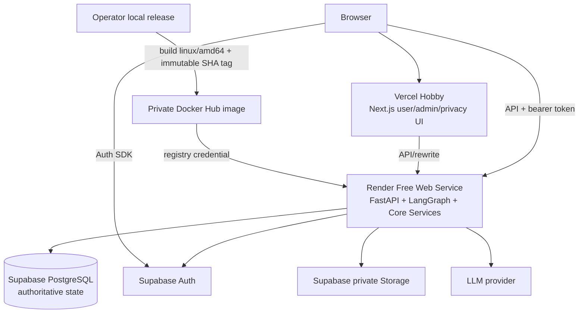

# ParkSmart AI — Public Beta Overview

> Trạng thái: public beta miễn phí  
> Cập nhật: 2026-08-24  
> Nguồn chi tiết: [Architecture](architecture.md), [API contract](api/api-contract.md),
> [Deployment runbook](DEPLOYMENT.md), [Database ERD](database/P152_DB_ERD.md)

## 1. Mục tiêu

ParkSmart AI public beta chứng minh một luồng đỗ xe nhiều tầng end-to-end với chi phí
vận hành thấp và ranh giới nghiệp vụ rõ ràng. Bản beta tập trung vào:

- giúp người dùng tìm, giữ và đi tới một ô đỗ phù hợp trên F1/F2/F3;
- lưu phiên đỗ để người dùng tìm lại xe;
- tiếp nhận quan sát cộng đồng và báo cáo đỗ sai có admin xác minh;
- dùng AI Agent như lớp hội thoại, không giao quyền quyết định nghiệp vụ cho LLM;
- bảo vệ dữ liệu, giới hạn chi phí LLM/upload và vận hành an toàn trên free tiers.

Đây là môi trường thử nghiệm công khai, không phải hệ thống điều hành bãi xe 24/7. Không có
cam kết chỗ đỗ, thanh toán, vé tháng, camera thật hay indoor positioning thật.

## 2. Chức năng hiện hành

### Người dùng

- Đăng ký/đăng nhập bằng Supabase Auth và onboarding ParkSmart profile.
- Quản lý phương tiện mặc định.
- Xem trạng thái authoritative của 120 ô trên F1/F2/F3 bằng bản đồ phẳng/isometric.
- Tìm ô theo tầng, khu vực, nhu cầu sạc/tiếp cận và nhận recommendation deterministic.
- Giữ ô tạm thời (`RESERVED`), nhận route graph và xác nhận đã đỗ.
- Duy trì parking session, cập nhật checkpoint và tìm đường quay lại xe.
- Dùng chat Agent để gọi cùng Core Services với REST API.
- Gửi quan sát hai ô kề và báo cáo xe đỗ sai; ảnh bằng chứng là tùy chọn.
- Xem ParkSmart Points chỉ sau lifecycle xác minh có thẩm quyền.
- Xem disclosure tại `/privacy` và gửi yêu cầu dữ liệu qua email công khai đã cấu hình.

### Quản trị viên

- Đăng nhập bằng tài khoản admin chuyên dụng; role lấy từ `profiles.app_role` trong DB.
- Xem bản đồ F1/F2/F3, mật độ hiện tại, chi tiết slot và parking events.
- Xem/xác minh/từ chối adjacent observations.
- Xem report, yêu cầu signed URL ảnh, resolve/reopen và hard-delete.
- Thay đổi trạng thái slot qua API/Core Service có RBAC, validation và audit event.

### Giới hạn chủ động

| Hạng mục | Public beta |
|---|---|
| Agent | Bật; tối đa 5 request/user/ngày UTC, tối đa 4 bước/request |
| Voice/Speech | Tắt ở cả frontend và backend |
| Wrong-parking reports | Tối đa 5 submission/user/ngày UTC |
| Evidence | Một ảnh, tối đa 5.000.000 byte, private Storage, MIME/signature allowlist |
| Demo/Simulator | Tắt trong production; module chỉ dùng development/test hoặc admin API được bảo vệ |
| Availability | Best-effort trên free tiers; có cold start và có thể bị platform pause |

## 3. Kiến trúc production

### Ranh giới trách nhiệm

| Thành phần | Trách nhiệm |
|---|---|
| Vercel/Next.js | UI, build-time public config, session theo tab, readiness gate và API client |
| Render/FastAPI | Auth/RBAC, validation, quotas, REST/Agent boundary, request ID và orchestration |
| LangGraph | Hiểu intent và chọn tool trong step budget; không chứa business rules |
| Core Services | State transition, recommendation, routing, reservation, session, report/reward rules |
| Supabase PostgreSQL | Nguồn sự thật cho identity bridge và toàn bộ trạng thái nghiệp vụ |
| Supabase Storage | Ảnh evidence private; backend cấp signed URL ngắn hạn cho admin |
| Docker Hub | Lưu image backend private để Render deploy mà không cần GitHub Organization App |

## 4. Data và an toàn

- Alembic head production là `20260824_0012`.
- Canonical map có 120 slots (40 mỗi tầng) và 161 nodes (55/53/53).
- `agent_daily_usage` và `report_daily_usage` lưu quota bền vững, reset theo UTC.
- Quota tables bật RLS và thu hồi quyền Data API của `anon`/`authenticated`.
- Report evidence không lưu bytes trong PostgreSQL; DB chỉ giữ private object path/metadata.
- Test database guard chặn `pytest` nếu effective `DATABASE_URL` không phải loopback hoặc
  Docker Compose service `database`.
- Backend image dùng dependency lock, chạy non-root và không chứa `.env`, test, docs,
  frontend hoặc Git metadata.
- Secrets chỉ nằm ở Render/Supabase; frontend chỉ nhận `NEXT_PUBLIC_*` publishable values.

## 5. Reliability và release model

- `GET /health` chỉ kiểm tra process liveness.
- `GET /api/v1/health/database` là database readiness và Render Health Check Path.
- `BackendReadinessGate` đánh thức Render, retry tuần tự và chỉ mount `AuthProvider` khi DB
  ready; gate không phải keep-alive.
- Render image-backed service không auto-deploy từ Git. Mỗi release phải build/push tag SHA
  mới và deploy thủ công; giữ image cũ để rollback.
- `NEXT_PUBLIC_*` được đóng vào bundle lúc `next build`; thay cờ hoặc URL phải redeploy
  frontend.
- Render Free có thể cold start; Supabase Free có thể pause khi ít hoạt động. Public beta
  phải hiển thị thông tin này thay vì hứa uptime 24/7.

## 6. Chức năng chưa triển khai

- Voice STT/TTS trong public beta.
- Camera/Computer Vision và sensor ingestion thực tế.
- Theo dõi vị trí indoor tự động/GPS trong bãi.
- Thanh toán, đặt chỗ thương mại hoặc đảm bảo ô đỗ.
- Catalog và chức năng đổi ParkSmart Points thành voucher đỗ xe; public beta hiện chỉ tích
  lũy/xác minh điểm. Xem [định hướng voucher](PARKSMART_POINTS_VOUCHERS.md).
- Dự báo mật độ theo thời gian, multi-site/tenant và analytics lịch sử.
- Auto-deploy từ GitHub Organization; backend/frontend hiện phát hành thủ công từ local.
