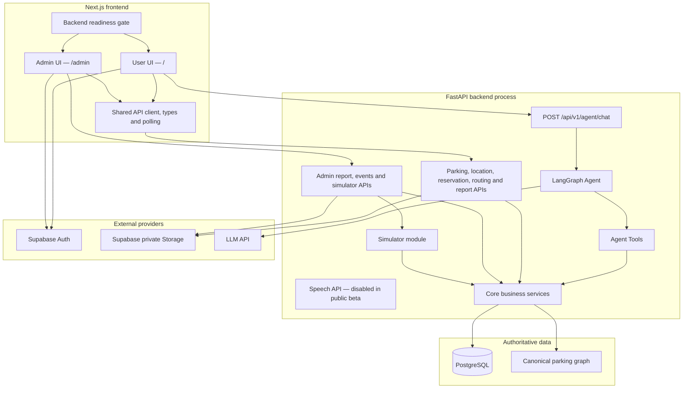
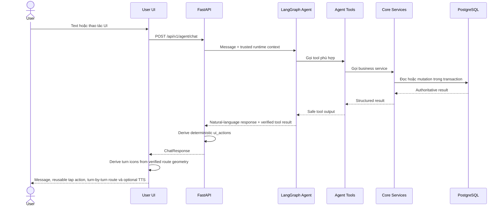
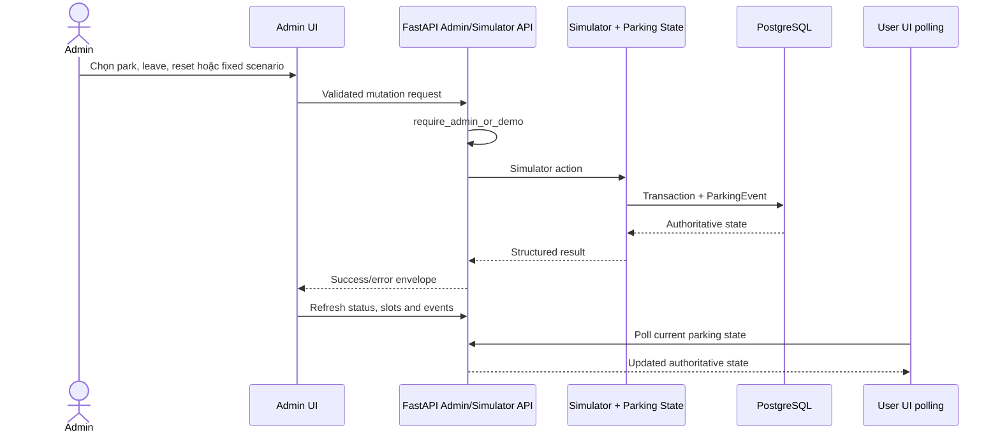
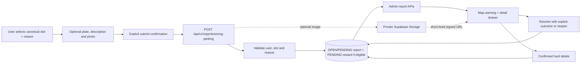
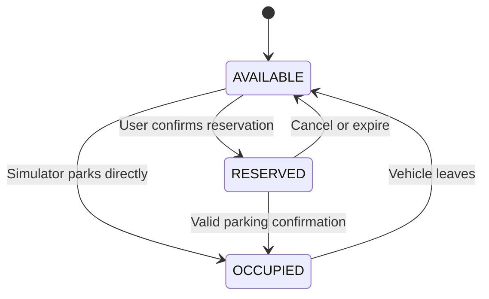
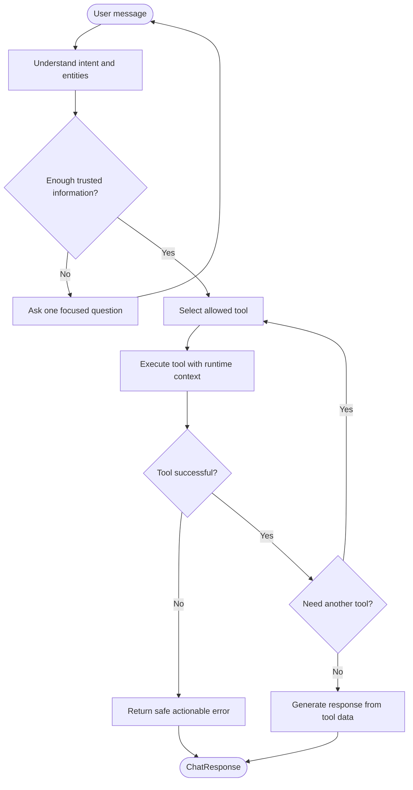
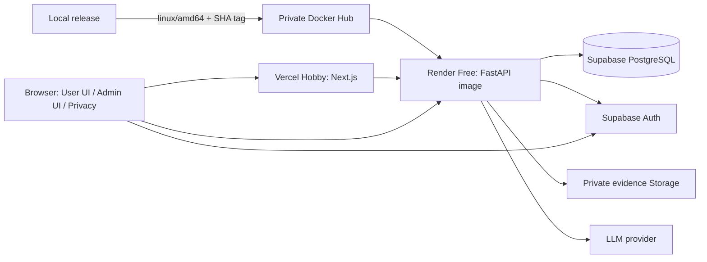
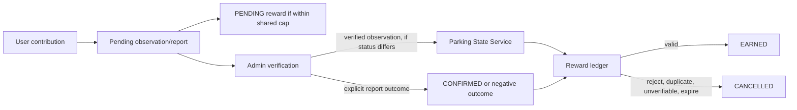
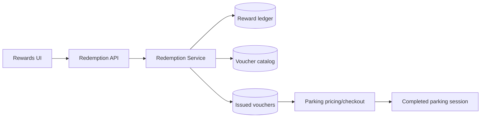

# ParkSmart AI — Architecture

Tài liệu này mô tả kiến trúc public beta đang vận hành của ParkSmart AI: hai giao
diện Next.js cho người dùng và quản trị viên, FastAPI chứa Agent cùng các dịch
vụ nghiệp vụ, PostgreSQL là nơi lưu trạng thái authoritative, và LLM chỉ được
gọi qua backend. Xem [PUBLIC_BETA.md](PUBLIC_BETA.md) cho mục tiêu, feature matrix và
giới hạn phát hành.

## Nguyên tắc chính

- `Parking State Service` là source of truth cho trạng thái ô đỗ.
- Trạng thái ô đỗ gồm `AVAILABLE`, `RESERVED` và `OCCUPIED`.
- Agent hiểu yêu cầu và gọi tools; Agent không sửa database trực tiếp.
- Recommendation dùng deterministic filtering/scoring, không để LLM tự chọn ô.
- Routing dùng parking graph; frontend chỉ vẽ route backend trả về.
- User UI và Admin UI dùng chung API contract và Core Services.
- Simulator mutation chỉ hoạt động trong demo mode hoặc với quyền admin.
- Voice/Speech có feature flag nhưng đang tắt ở cả frontend và backend public beta.
- Agent và report dùng persistent daily quota theo user/ngày UTC để giới hạn chi phí.
- Frontend chỉ mount AuthProvider sau khi database readiness thành công.
- Không có QR trong MVP.

---

## 1. System Overview và component boundaries



### Trách nhiệm của hai giao diện

| Giao diện | Trách nhiệm | Không được làm |
|---|---|---|
| User UI `/` | Chat mobile-first, lựa chọn vị trí bằng thao tác chạm, tìm/giữ ô, route dạng turn-by-turn, phiên đỗ xe, quan sát cộng đồng và báo cáo đỗ sai | Hiển thị dữ liệu vận hành admin, dùng GPS, reset demo, tự sửa trạng thái hoặc giả lập Voice đang bật |
| Admin UI `/admin` | KPI mật độ, filter map F1/F2/F3, chi tiết slot có thể đóng, cảnh báo report/observation, resolve/reopen/hard-delete và parking events | Tự ghi database, hiển thị simulator controls, dùng browser storage làm source of truth hoặc tính business transition ở frontend |

`/admin` dùng `CurrentUser.app_role` khi authentication được bật. Trong demo
mode, backend có thể cho phép trang vận hành mà không cần bearer token; giao
diện phải ghi rõ đây là `Admin Demo`, không phải bảo mật production.

### Trách nhiệm backend

- `src/api`: validation, authentication/authorization dependency, REST adapter,
  response envelope và request ID.
- `src/agents`: LangGraph orchestration và tool adapters.
- `src/core`: state transitions, recommendation, routing, reservation, parking
  session, location, simulator và wrong-parking report rules.
- PostgreSQL: slot state, reservations, sessions, users, vehicles, events và
  wrong-parking reports.

---

## 2. Data flow

### 2.1 User parking flow



`/api/v1/speech/transcriptions` vẫn có contract để phát triển tương lai nhưng public beta
trả `SPEECH_DISABLED` và frontend không khởi tạo Web Speech/audio upload.

### 2.2 Admin operations flow



Admin density is a current snapshot, calculated from `ParkingStatus.by_zone`:

```text
utilization = (RESERVED + OCCUPIED) / total * 100
```

Hệ thống chưa lưu occupancy snapshots theo thời gian, vì vậy không hiển thị
biểu đồ lịch sử hoặc dự đoán giả.

### 2.3 Wrong-parking report flow



Report state is independent from parking occupancy state. Creating, resolving, reopening or
deleting a report does not change `AVAILABLE`, `RESERVED` or `OCCUPIED`. The admin map keeps
the slot's status color and overlays a red warning whose badge is the authoritative count of
OPEN reports. Polling and post-mutation refetches read PostgreSQL through the API;
`BroadcastChannel` only requests an earlier refresh.

---

## 3. Slot state machine

`RESERVED` là giữ ô có thời hạn, không phải booking/thanh toán thương mại.



Mọi transition quan trọng chạy trong transaction và tạo `ParkingEvent`. UI chỉ
cập nhật sau khi backend thành công rồi refresh authoritative state.

---

## 4. Agent flow



Agent không được:

- tự chọn slot ngoài kết quả Recommendation Service;
- tự tạo route;
- truyền `user_id`, `vehicle_id` hoặc `request_id` do model sinh;
- sửa database trực tiếp;
- bịa dữ liệu khi tool thất bại.
- sinh hoặc thực thi frontend action tùy ý từ prose.

`ChatResponse.ui_actions` là presentation metadata do backend tạo bằng allowlist từ current
location, canonical recommendation/selection và tool result đã xác minh. Helper này không
chứa reservation/routing business logic; khi người dùng chạm action, frontend vẫn gọi Core
API tương ứng và chỉ cập nhật state sau response thành công.

Frontend chỉ giữ trạng thái consumed vĩnh viễn cho action mutation một lần. Action đọc/chọn
được dùng lại sau khi request trước hoàn tất; khóa in-flight vẫn ngăn double-click. Nút
“Tôi đã đến nơi” là confirmation rõ ràng gồm hai bước tuần tự: cập nhật location tới slot đã
reserve, refetch snapshot, rồi confirm parking với version mới nhất. LocationPicker độc lập
không tự tạo parking session.

Turn-by-turn presentation không thay đổi Routing Service. UI lấy ba điểm liên tiếp trong
`route.polyline` (fallback sang tọa độ canonical map), tính tích có hướng để phân loại đi
thẳng/rẽ trái/rẽ phải/quay lại và hiển thị icon. Nếu thiếu hình học, UI chỉ nói “Tiếp tục”;
LLM không được phát minh hướng rẽ. Checkpoint vẫn là node định tuyến nội bộ nhưng bị loại
khỏi LocationPicker, nhãn vị trí, marker bản đồ và nội dung hướng dẫn. UI mô tả điểm rẽ bằng
ngôn ngữ đời thường như “Ở ngã tư phía trước, rẽ phải”.

Reservation/session card, mutation notice và lỗi quan trọng nằm trong priority dock sticky
ngay dưới header. Message history tiếp tục cuộn phía sau; các thao tác “Tôi đã đến nơi”, tìm
xe và kết thúc phiên không bị đẩy khỏi tầm nhìn khi hội thoại dài.

Sau khi user có active parking session, UI có thể đề nghị báo trạng thái hai slot trái/phải
cùng hàng. Frontend chỉ gửi canonical slot ID, `AVAILABLE`/`OCCUPIED` và expected version.
Backend tự xác minh active session và adjacency trước khi gọi Parking State Service. User
observation không được ghi đè reservation, active session khác hoặc vehicle occupancy đã
xác minh; mọi transition hợp lệ tạo ParkingEvent và chỉ hiển thị sau authoritative refetch.

---

## 5. Deployment architecture hiện tại

Production public beta dùng Vercel Hobby cho Next.js, Render Free cho backend image-backed,
private Docker Hub làm registry, và Supabase cho PostgreSQL/Auth/Storage. Cách này không cần
Render/Vercel GitHub App đọc private repository của Organization. Agent và Simulator vẫn là
module backend, nhưng `DEMO_MODE=false`, `SIMULATOR_ENABLED=false` và Speech bị tắt.



| Runtime | Nội dung |
|---|---|
| Browser | `/`, `/admin`, `/privacy`, Supabase session theo tab và API bearer token |
| Vercel/Next.js | User/Admin rendering, API client, polling và database readiness gate |
| Render backend | FastAPI, LangGraph Agent, quotas, tools, Core Services và simulator module bị tắt production |
| Docker Hub | Private immutable backend images; Render pull bằng registry credential |
| Supabase | PostgreSQL authoritative, Auth và private report-evidence Storage |
| External provider | LLM server-side; Speech provider không được gọi trong public beta |

`/health` là liveness. `/api/v1/health/database` là Render health check và điều kiện để
frontend readiness gate mount AuthProvider. Render Free có thể spin down; gate retry tuần tự
nhưng không gửi keep-alive. Image-backed deploy là thủ công và dùng tag SHA bất biến.

Production tương lai có thể thay Simulator bằng:

```text
Camera → Computer Vision → validated event → Parking State Service
```

Agent, recommendation, routing và parking-session boundaries không thay đổi khi
nguồn sự kiện được thay thế.

---

## 6. Architecture summary

```text
User UI / Admin UI
        ↓
FastAPI boundary
        ↓
Agent Tools hoặc REST adapters
        ↓
Core business services
        ↓
PostgreSQL + canonical parking graph
```

Frontend quyết định cách trình bày. Agent quyết định tool nào cần gọi. Chỉ Core
Services quyết định nghiệp vụ và chỉ PostgreSQL lưu trạng thái authoritative.
## Verified community contributions and ParkSmart Points



`RewardService` là nơi duy nhất reserve/settle/cancel điểm. Nó khóa `ParkingUser` trước
khi tính tổng `PENDING + EARNED` trong ngày, nên observation và report đồng thời không thể
vượt cap chung. `RewardSummary` luôn được tính từ ledger; frontend chỉ refetch dữ liệu có
thẩm quyền. Observation hết hạn được lazy-expire trước list/get/verify, không cần worker.

Map vận hành không có renderer mới: contribution chọn floor F1/F2/F3 trên `ParkingMap`
và overlay icon/outline lên `IsometricMap` hiện hữu mà không đổi màu status của slot.
Nếu payload map chỉ có hình học F1, frontend tái sử dụng cùng hình học chuẩn với ID theo tầng
để vẫn render đủ ô F2/F3 trong cả 2D và isometric. Admin có thể chọn trực tiếp slot, mở
report/observation gắn với slot và yêu cầu đổi trạng thái. Phối cảnh giữ góc isometric cố
định; hình học ramp phân biệt lối lên/lối xuống, đặt vạch trắng dọc hướng chạy và thêm miệng
hầm cùng tường chắn cho đầu thấp. Ramp dùng cùng bảng màu với road surface và được đặt
ngoài mép làn; xe đang đỗ là khối hộp chữ nhật isometric ba mặt;
API vẫn đưa thay đổi qua Parking State Service, optimistic version và parking event ledger.
User UI polling cả reward summary/contribution ledger cùng parking state nên settlement của
admin xuất hiện tự động mà không cần reload và không optimistic cộng điểm.

### Target product: voucher redemption (chưa triển khai)

Public beta dừng ở ledger `PENDING`/`EARNED`/`CANCELLED`; chưa có debit, voucher hoặc
pricing/checkout. Sản phẩm thật dự kiến cho phép đổi 100/200/400 điểm `EARNED` thành voucher
15/30/60 phút đỗ xe miễn phí:



Redemption Service phải giữ ownership, idempotency và atomic balance/debit/issuance; LLM
không quyết định tỷ lệ, số dư hoặc phát hành voucher. Voucher chỉ tác động bước tính phí sau
parking session, không tác động recommendation, reservation, slot state hay quyền tiếp cận.
Schema hiện tại chưa hỗ trợ luồng này; cần ADR, Alembic migration và API contract riêng trước
khi triển khai. Xem [đặc tả ParkSmart Points voucher](PARKSMART_POINTS_VOUCHERS.md).

Canonical seed tạo 120 slot và graph cho cả F1/F2/F3. Seed là idempotent: chỉ thêm
node/edge/slot còn thiếu, vì vậy database Supabase từng chỉ có F1 có thể được bổ sung F2/F3
mà không reset trạng thái mutable của F1. `RecommendationRequest.floor_id` và Agent tool
`recommend_parking_slot` giữ hard constraint tầng; zone vẫn là filter tùy chọn.

Browser Auth không dùng một cookie/session chung cho mọi tab. Supabase client lưu session
trong `sessionStorage` với storage key riêng của browsing tab, nên user và admin có thể hoạt
động đồng thời trên cùng origin. Đây chỉ là nơi lưu credential phiên; profile, role và quyền
vẫn được backend đọc từ Supabase/PostgreSQL cho mỗi request.

Report dialog là progressive form: chọn reason không tạo mutation; plate, description và
evidence đều có thể được thêm trước một explicit submit. Modal giới hạn theo `100dvh`, cuộn
nội bộ và giữ submit dock sticky để thao tác được trên màn hình thấp.
