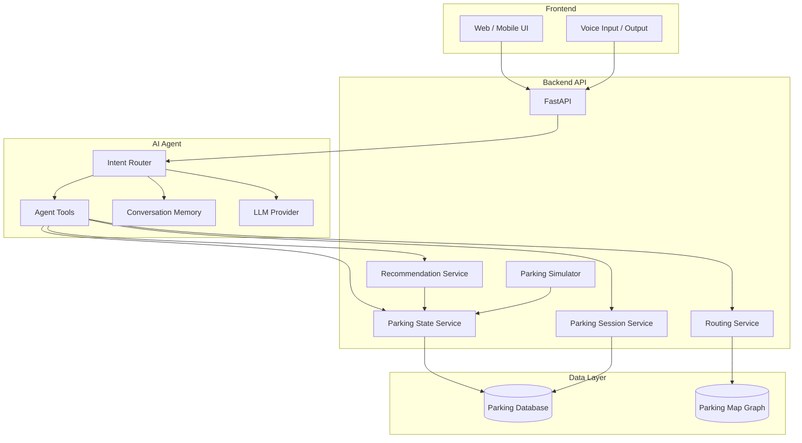
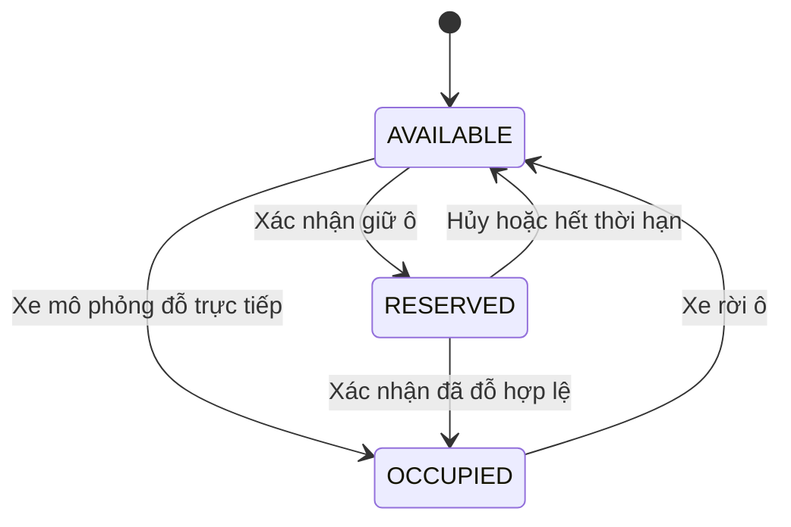
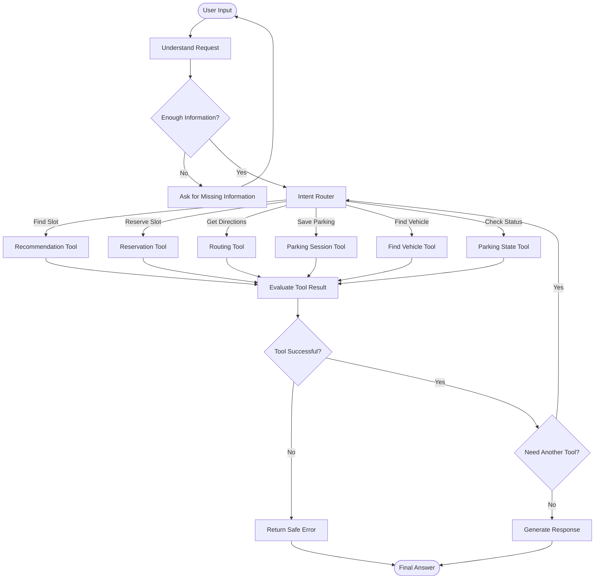
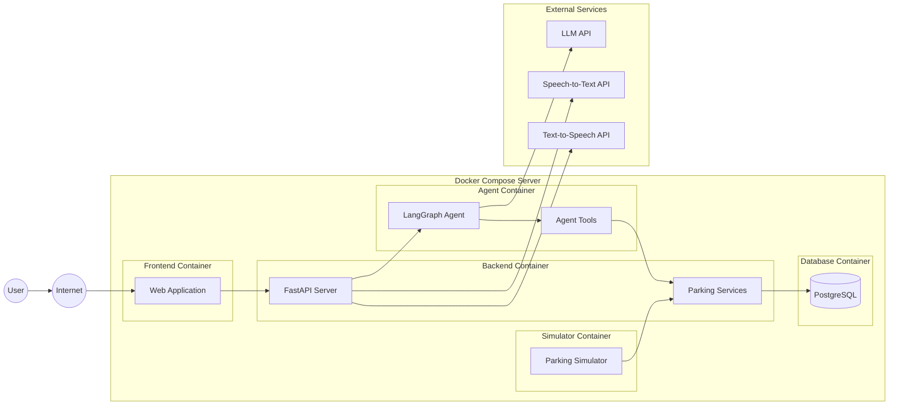

# ParkSmart AI — Architecture

Tài liệu này mô tả ba góc nhìn kiến trúc chính của hệ thống ParkSmart AI:

1. **System Overview Diagram** — Bức tranh tổng thể của hệ thống.
2. **Agent Flow Diagram** — Luồng xử lý bên trong AI Agent.
3. **Deployment Diagram** — Cách các thành phần được triển khai.

## Nguyên tắc chính

- `Parking State Service` là source of truth cho trạng thái ô đỗ.
- Trạng thái ô đỗ trong MVP gồm `AVAILABLE`, `RESERVED` và `OCCUPIED`.
- Agent chỉ hiểu yêu cầu và gọi tools, không trực tiếp sửa database.
- Recommendation chọn ô bằng deterministic scoring, không để LLM tự chọn.
- Routing sử dụng parking graph với A* hoặc Dijkstra.
- Parking Simulator mô phỏng xe khác trong MVP.

---

## 1. System Overview Diagram

Sơ đồ tổng quan cho thấy cách người dùng, Backend, AI Agent, các dịch vụ nghiệp vụ và database kết nối với nhau.



### Vai trò các tầng

**Frontend** nhận text hoặc voice từ người dùng, cho phép chọn ID vị trí và hiển thị kết quả.

**Backend API** xử lý business logic, quản lý trạng thái bãi xe, recommendation, routing và parking session.

**AI Agent** hiểu yêu cầu, xác định intent và gọi Agent Tools phù hợp.

**Data Layer** lưu trạng thái ô đỗ, thông tin phiên đỗ xe và parking map graph.

### Trạng thái ô đỗ

- `AVAILABLE`: ô đang trống và có thể được đề xuất hoặc giữ chỗ.
- `RESERVED`: ô đang được giữ tạm thời cho một yêu cầu đã xác nhận; ô này không được đề xuất cho người khác.
- `OCCUPIED`: xe đã đỗ thực tế tại ô.

`RESERVED` trong MVP là cơ chế giữ ô có thời hạn, không phải chức năng đặt chỗ và thanh toán online hoàn chỉnh. Parking State Service chịu trách nhiệm kiểm tra chủ thể giữ chỗ, thời hạn và mọi chuyển trạng thái.



---

## 2. Agent Flow Diagram

Sơ đồ mô tả các node, điều kiện rẽ nhánh và vòng lặp chính trong quá trình Agent xử lý yêu cầu.



### Ví dụ các vòng lặp

- Nếu thiếu vị trí, mã ô hoặc thông tin xe, Agent hỏi lại người dùng rồi xử lý lại input.
- Nếu cần nhiều tool, Agent quay lại `Intent Router` để chọn bước tiếp theo.
- Nếu tool thất bại, Agent trả lỗi an toàn và không tự tạo dữ liệu thay thế.

### Ví dụ luồng tìm ô

```text
User Input
→ Intent Router
→ Recommendation Tool
→ Parking State Service
→ Deterministic Scoring
→ Final Answer
```

### Ví dụ luồng tìm lại xe

```text
User Input
→ Intent Router
→ Parking Session Tool
→ Routing Tool
→ Final Answer
```

---

## 3. Deployment Diagram

Sơ đồ minh họa cách triển khai MVP bằng Docker Compose trên một server.



### Thành phần triển khai

| Container | Chức năng |
|---|---|
| Frontend Container | Chạy giao diện web hoặc mobile web |
| Backend Container | Chạy FastAPI và các parking services |
| Agent Container | Chạy LangGraph Agent và Agent Tools |
| Simulator Container | Mô phỏng xe vào, đỗ và rời bãi |
| Database Container | Lưu dữ liệu bằng PostgreSQL |

### External dependencies

- **LLM API** dùng để Agent hiểu ngôn ngữ và lựa chọn tool.
- **Speech-to-Text API** chuyển giọng nói thành văn bản.
- **Text-to-Speech API** chuyển câu trả lời thành giọng nói.

Trong production, `Parking Simulator` có thể được thay bằng luồng:

```text
Camera → Computer Vision → Parking State Service
```

Các thành phần Agent, Recommendation, Routing và Parking Session không cần thay đổi lớn khi thay nguồn dữ liệu này.

---

## Architecture Summary

```text
Frontend
→ Backend API
→ AI Agent
→ Agent Tools
→ Parking Services
→ Database
```

AI Agent chịu trách nhiệm xử lý ngôn ngữ và điều phối. Các business services chịu trách nhiệm kiểm tra, quyết định và cập nhật dữ liệu nghiệp vụ.
