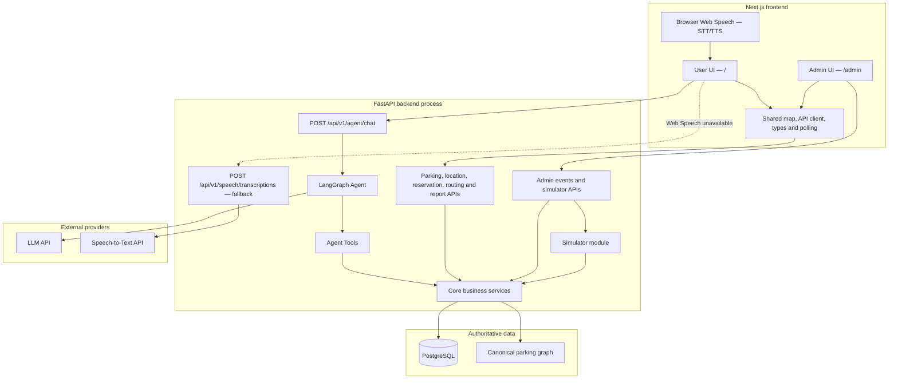
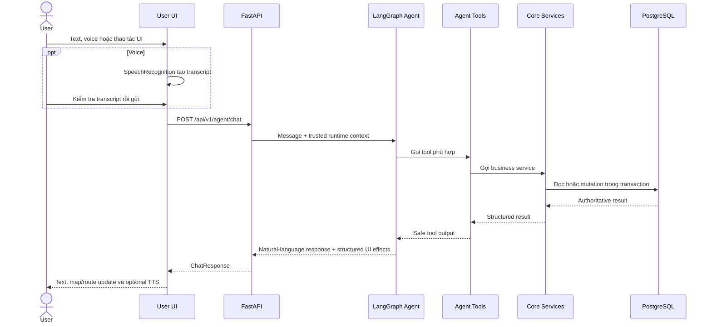
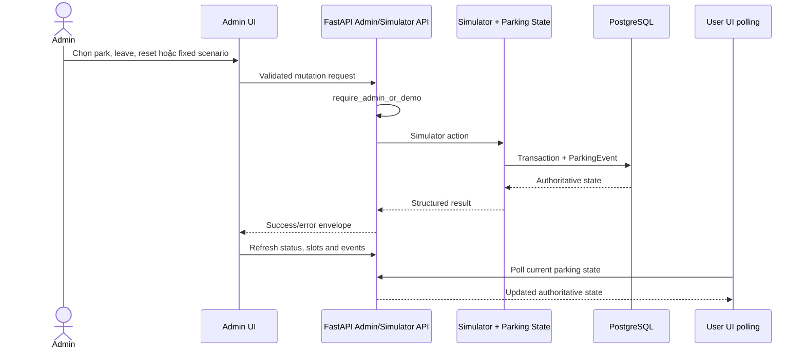
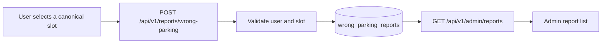
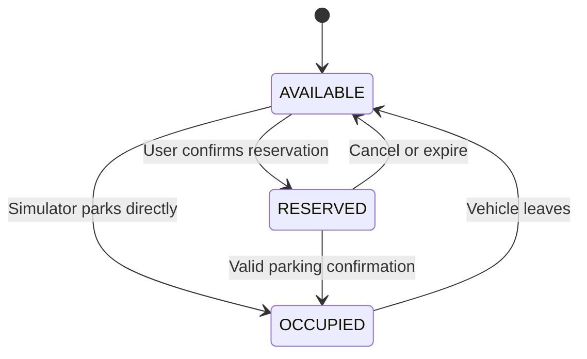
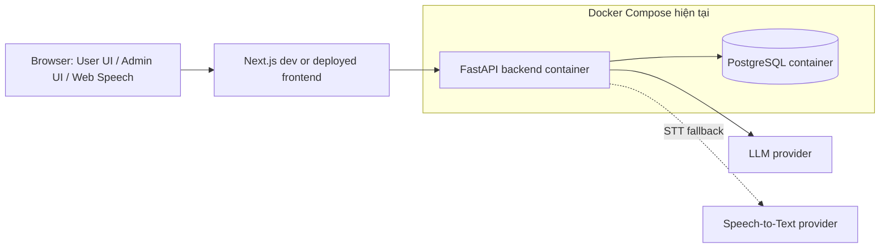

# ParkSmart AI — Architecture

Tài liệu này mô tả kiến trúc đang được triển khai của ParkSmart AI: hai giao
diện Next.js cho người dùng và quản trị viên, FastAPI chứa Agent cùng các dịch
vụ nghiệp vụ, PostgreSQL là nơi lưu trạng thái authoritative, và các dịch vụ
LLM/STT bên ngoài chỉ được gọi qua backend khi cần.

## Nguyên tắc chính

- `Parking State Service` là source of truth cho trạng thái ô đỗ.
- Trạng thái ô đỗ gồm `AVAILABLE`, `RESERVED` và `OCCUPIED`.
- Agent hiểu yêu cầu và gọi tools; Agent không sửa database trực tiếp.
- Recommendation dùng deterministic filtering/scoring, không để LLM tự chọn ô.
- Routing dùng parking graph; frontend chỉ vẽ route backend trả về.
- User UI và Admin UI dùng chung API contract và Core Services.
- Simulator mutation chỉ hoạt động trong demo mode hoặc với quyền admin.
- Voice là một kênh nhập/xuất; text cuối cùng vẫn đi qua Agent endpoint như chat.
- Không có QR trong MVP.

---

## 1. System Overview và component boundaries



### Trách nhiệm của hai giao diện

| Giao diện | Trách nhiệm | Không được làm |
|---|---|---|
| User UI `/` | Xem bản đồ, xác nhận vị trí bằng ID, tìm/giữ ô, route, phiên đỗ xe, báo cáo xe đỗ sai, chat và voice | Reset demo, điều khiển simulator, hiển thị tool/thread hoặc tự sửa trạng thái |
| Admin UI `/admin` | KPI mật độ, mật độ theo khu, filter map, simulator controls, reports và parking events | Tự ghi database hoặc tính lại business transition ở frontend |

`/admin` dùng `CurrentUser.app_role` khi authentication được bật. Trong demo
mode, backend có thể cho phép trang vận hành mà không cần bearer token; giao
diện phải ghi rõ đây là `Admin Demo`, không phải bảo mật production.

### Trách nhiệm backend

- `src/api`: validation, authentication/authorization dependency, REST adapter,
  response envelope và request ID.
- `src/agents`: LangGraph orchestration và tool adapters.
- `src/core`: state transitions, recommendation, routing, reservation, parking
  session, location, simulator và wrong-parking report rules.
- PostgreSQL: slot state, reservations, sessions, users, vehicles, events và
  wrong-parking reports.

---

## 2. Data flow

### 2.1 User parking flow



Nếu Browser Speech Recognition không khả dụng, frontend có thể ghi âm và gửi
audio tới `/api/v1/speech/transcriptions`. Backend giữ API key STT; frontend
không gọi provider trực tiếp và không lưu raw audio sau request.

### 2.2 Admin operations flow



Admin density is a current snapshot, calculated from `ParkingStatus.by_zone`:

```text
utilization = (RESERVED + OCCUPIED) / total * 100
```

Hệ thống chưa lưu occupancy snapshots theo thời gian, vì vậy không hiển thị
biểu đồ lịch sử hoặc dự đoán giả.

### 2.3 Wrong-parking report flow



---

## 3. Slot state machine

`RESERVED` là giữ ô có thời hạn, không phải booking/thanh toán thương mại.



Mọi transition quan trọng chạy trong transaction và tạo `ParkingEvent`. UI chỉ
cập nhật sau khi backend thành công rồi refresh authoritative state.

---

## 4. Agent flow


Agent không được:

- tự chọn slot ngoài kết quả Recommendation Service;
- tự tạo route;
- truyền `user_id`, `vehicle_id` hoặc `request_id` do model sinh;
- sửa database trực tiếp;
- bịa dữ liệu khi tool thất bại.

---

## 5. Deployment architecture hiện tại

`docker-compose.yml` hiện container hóa PostgreSQL và FastAPI backend. Agent và
Simulator chạy như module trong backend process. Frontend Next.js hiện được
chạy riêng bằng npm trong development; container frontend là bước deployment
chưa hoàn tất.



| Runtime | Nội dung |
|---|---|
| Browser | `/`, `/admin`, Browser Speech Recognition và `speechSynthesis` |
| Next.js | User/Admin rendering, API client và polling |
| Backend container | FastAPI, LangGraph Agent, tools, Core Services và Simulator module |
| Database container | PostgreSQL authoritative state và events/reports |
| External provider | LLM; STT chỉ khi browser fallback được dùng |

Production tương lai có thể thay Simulator bằng:

```text
Camera → Computer Vision → validated event → Parking State Service
```

Agent, recommendation, routing và parking-session boundaries không thay đổi khi
nguồn sự kiện được thay thế.

---

## 6. Architecture summary

```text
User UI / Admin UI
        ↓
FastAPI boundary
        ↓
Agent Tools hoặc REST adapters
        ↓
Core business services
        ↓
PostgreSQL + canonical parking graph
```

Frontend quyết định cách trình bày. Agent quyết định tool nào cần gọi. Chỉ Core
Services quyết định nghiệp vụ và chỉ PostgreSQL lưu trạng thái authoritative.
