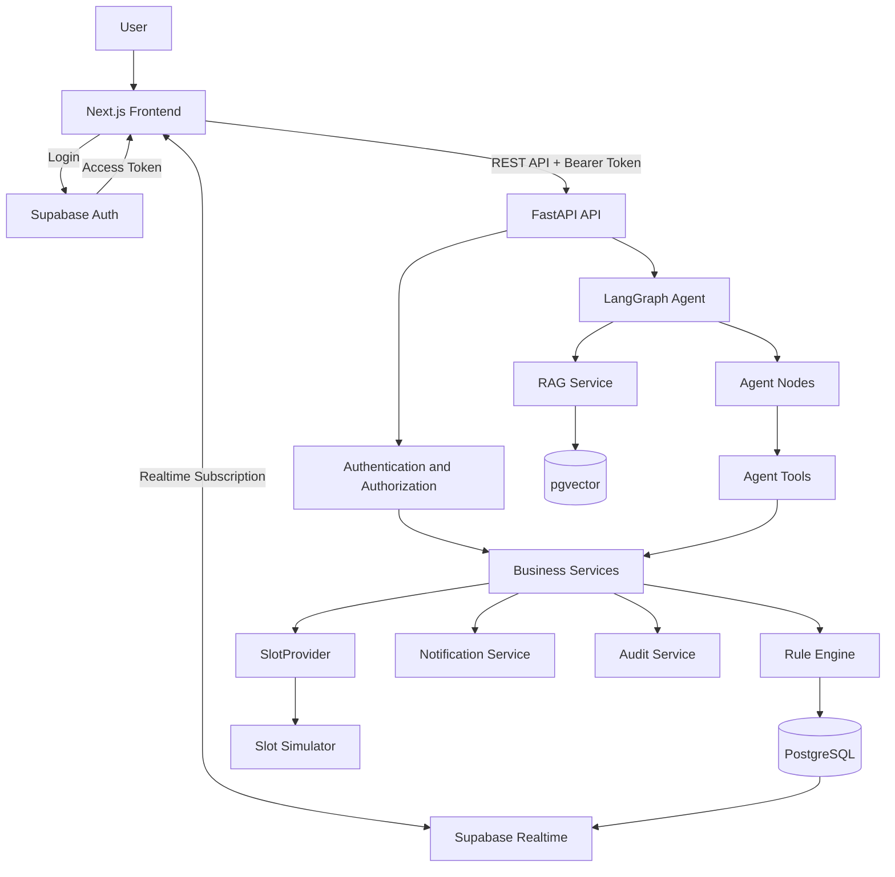
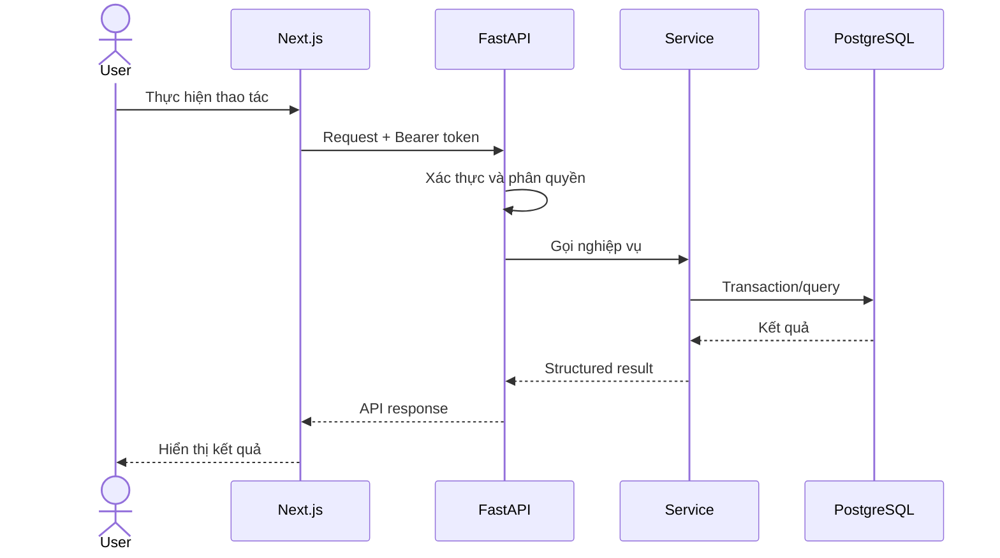
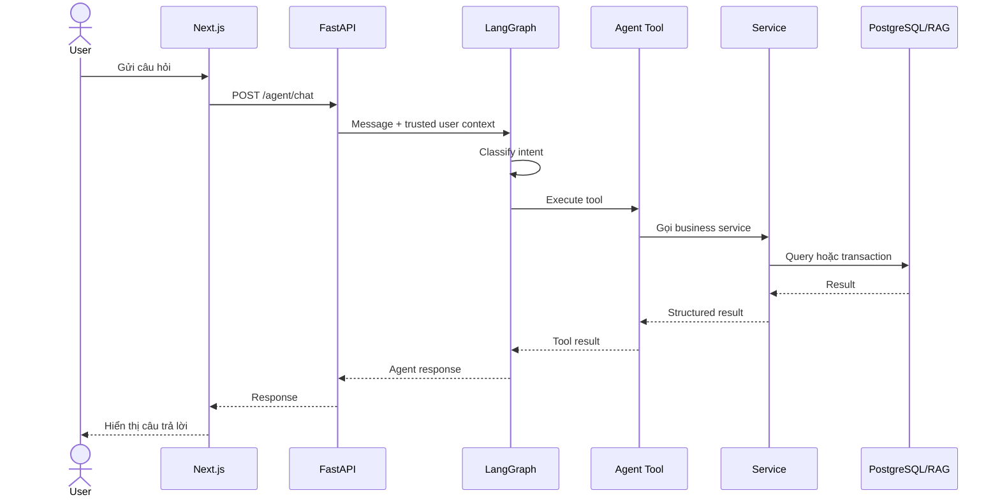

# ParkSmart AI Architecture Diagram



## Luồng API



## Luồng Agent


## Deployment Diagram chi tiết hơn

```mermaid
flowchart TB
    subgraph Internet
        USER[User Browser]
    end

    subgraph Vercel["Vercel Hosting"]
        FE["Next.js App"]
    end

    subgraph Railway["Railway Deployment"]
        API["FastAPI Container"]
    end

    subgraph Supabase["Supabase Platform"]
        AUTH["Auth Service"]
        DB["PostgreSQL Database"]
        VEC["pgvector Extension"]
        REALTIME["Realtime Service"]
    end

    subgraph External["External Dependencies"]
        OPENAI["OpenAI API"]
    end

    subgraph DemoTools["Demo/Internal Services"]
        SIM["Slot Simulator"]
    end

    USER -->|HTTPS| FE
    FE -->|Bearer Token + REST| API
    FE -->|Auth UI / Session| AUTH
    FE <-->|Realtime WebSocket / Subscription| REALTIME

    API -->|JWT verification / user info| AUTH
    API -->|SQL queries| DB
    DB --> VEC
    API -->|Embedding / Chat completion| OPENAI
    API -->|Slot status sync| SIM

    REALTIME --> DB