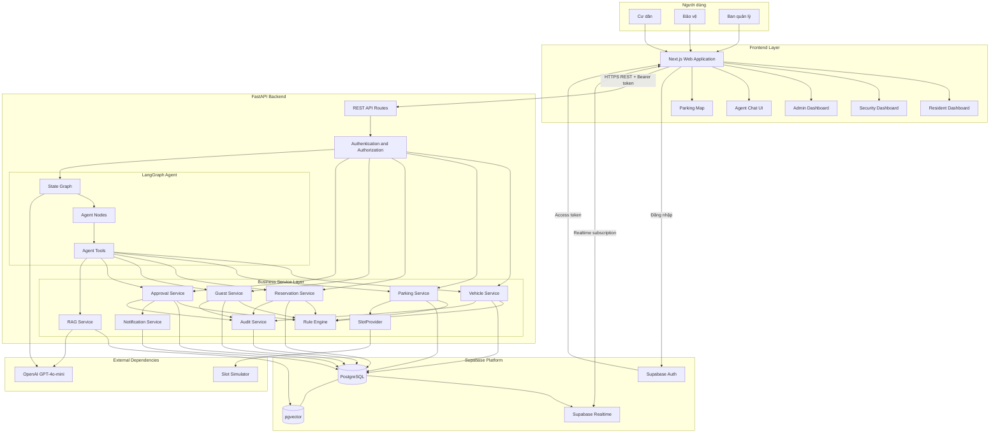
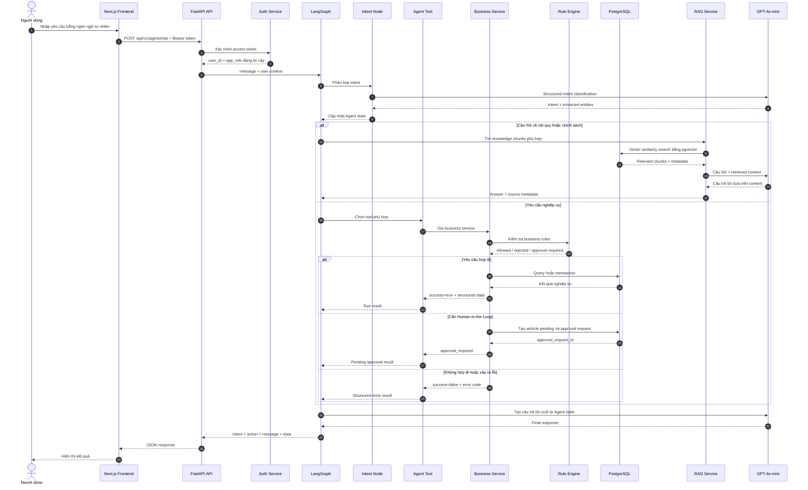
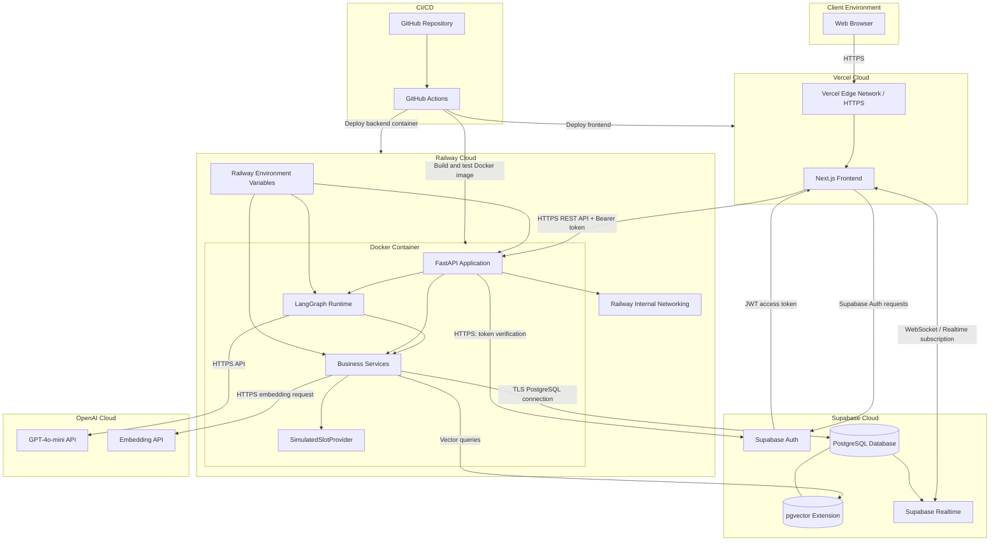
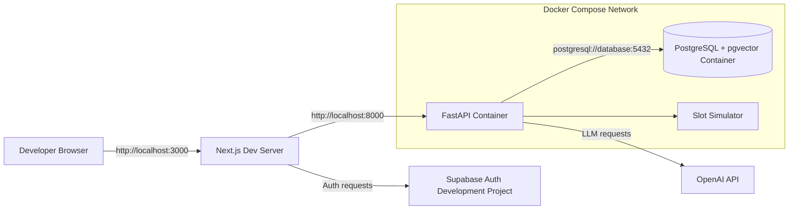

# ParkSmart AI Architecture Diagrams

- **Project:** ParkSmart AI – Agent Quản lý và Điều phối Gửi xe Thông minh
- **Architecture style:** Modular Monolith
- **Backend:** FastAPI + LangGraph
- **Frontend:** Next.js
- **Database and Auth:** Supabase PostgreSQL, pgvector, Auth, Realtime
- **Deployment:** Vercel + Railway + Supabase Cloud

Tài liệu này mô tả ba góc nhìn kiến trúc chính của hệ thống:

1. **System Overview Diagram** – Tổng quan các thành phần và quan hệ giữa chúng.
2. **Agent Flow Diagram** – Luồng xử lý một yêu cầu gửi tới AI Agent.
3. **Deployment Diagram** – Cách hệ thống được triển khai, kết nối mạng và sử dụng dịch vụ bên ngoài.

---

## 1. System Overview Diagram

Sơ đồ này thể hiện các actor, frontend, backend, Agent, business services, database, realtime và các dịch vụ bên ngoài của ParkSmart AI.



### Nguyên tắc kiến trúc

- Frontend không truy cập trực tiếp dữ liệu nghiệp vụ để thực hiện thao tác ghi.
- FastAPI chịu trách nhiệm xác thực, phân quyền và điều phối request.
- Business logic nằm trong service layer, không nằm trong route hoặc Agent tool.
- Agent tool gọi service thay vì truy cập database trực tiếp.
- PostgreSQL là nguồn sự thật cho dữ liệu nghiệp vụ.
- pgvector chỉ lưu embedding của tài liệu nội quy và kiến thức chung.
- Dữ liệu slot thời gian thực được lấy qua `SlotProvider`, không lấy từ RAG.
- Agent không tự phê duyệt yêu cầu vượt định mức.

---

## 2. Agent Flow Diagram

Sơ đồ này mô tả luồng xử lý khi người dùng gửi yêu cầu bằng ngôn ngữ tự nhiên tới ParkSmart AI Agent.



### Quy tắc Agent

- `user_id` và `app_role` phải được lấy từ backend sau khi xác minh token.
- LLM không được tự cung cấp hoặc thay đổi danh tính người dùng.
- Agent chỉ xác nhận thao tác thành công khi tool trả `success=true`.
- Agent không được biến lỗi tool thành thông báo thành công.
- Agent không truy vấn trực tiếp PostgreSQL.
- Agent không sử dụng RAG để trả lời trạng thái slot, reservation hoặc approval hiện tại.
- Yêu cầu đăng ký xe vượt định mức phải chuyển sang quy trình HITL.

---

## 3. Deployment Diagram

Sơ đồ này thể hiện cách ParkSmart AI được triển khai trên môi trường production, bao gồm client, hosting, container backend, database, networking và external dependencies.



### Thành phần triển khai

| Thành phần | Nơi triển khai | Vai trò |
|---|---|---|
| Next.js Frontend | Vercel | Giao diện cho resident, security và admin |
| FastAPI Backend | Railway Docker container | REST API, Auth, services và Agent entry point |
| LangGraph Runtime | Cùng container FastAPI | Điều phối Agent nodes và tools |
| PostgreSQL | Supabase Cloud | Lưu dữ liệu nghiệp vụ |
| pgvector | Extension trong Supabase PostgreSQL | Lưu và truy vấn embedding tài liệu |
| Supabase Auth | Supabase Cloud | Đăng nhập và phát hành access token |
| Supabase Realtime | Supabase Cloud | Cập nhật slot, approval và notification |
| GPT-4o-mini | OpenAI Cloud | Intent classification và response generation |
| Embedding API | OpenAI Cloud | Sinh embedding cho dữ liệu RAG |
| GitHub Actions | GitHub Cloud | Lint, test, Docker build và hỗ trợ deployment |

### Networking và bảo mật

- Mọi kết nối từ browser tới Vercel, Railway, Supabase và OpenAI phải sử dụng HTTPS hoặc TLS.
- Frontend gửi Supabase access token trong `Authorization: Bearer <token>` khi gọi FastAPI.
- Secret như `OPENAI_API_KEY`, `DATABASE_URL` và `SUPABASE_SERVICE_ROLE_KEY` chỉ nằm trong Railway Environment Variables.
- Frontend chỉ được sử dụng public configuration như `NEXT_PUBLIC_SUPABASE_URL` và `NEXT_PUBLIC_SUPABASE_ANON_KEY`.
- Backend container không expose trực tiếp PostgreSQL ra Internet.
- CORS của FastAPI chỉ cho phép domain frontend đã cấu hình.
- Slot Simulator được chạy bên trong backend container trong môi trường MVP.

---

## 4. Local Development Deployment

Trong môi trường local, nhóm sử dụng Docker Compose để chạy backend và PostgreSQL/pgvector.



Lệnh chạy dự kiến:

```bash
docker compose up --build
```

Các cổng local:

| Service | URL/Port |
|---|---|
| Next.js | `http://localhost:3000` |
| FastAPI | `http://localhost:8000` |
| Swagger UI | `http://localhost:8000/docs` |
| PostgreSQL | `localhost:5432` |

---

## 5. Nguồn sự thật kiến trúc

Khi có xung đột giữa sơ đồ và implementation, thứ tự ưu tiên là:

1. Quyết định mới nhất của Leader đã được ghi trong issue hoặc tài liệu.
2. `docs/AI_PROJECT_CONTEXT.md`.
3. `docs/guide/02_system_architecture.md`.
4. `docs/guide/04_api_contract.md`.
5. File này.
6. Code đã merge vào nhánh `develop`.

Mọi thay đổi quan trọng về deployment, networking, external dependency hoặc luồng Agent phải cập nhật lại tài liệu này.
