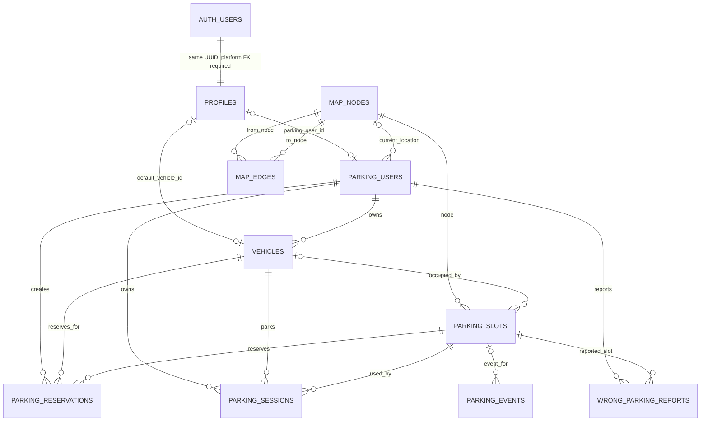

# ParkSmart AI — Authoritative Database ERD

Source of truth:
- `src/core/db_models.py`
- Alembic revisions `20260804_0001` through `20260819_0007`

This document describes the schema after Alembic revision `20260819_0007`.

## Identity boundary

Supabase Auth owns authentication identities in `auth.users`.
ParkSmart owns authorization and parking-domain identity in `public`.



## Table inventory

| Table | Responsibility | Primary key | Important foreign keys |
|---|---|---|---|
| `profiles` | App role + bridge from Supabase Auth to parking identity | `id uuid` | `parking_user_id -> parking_users.id`; `default_vehicle_id -> vehicles.id`; planned `id -> auth.users.id` |
| `parking_users` | Parking-domain user | `id varchar(64)` | `current_node_id -> map_nodes.id` |
| `vehicles` | Vehicles owned by a parking user | `id varchar(64)` | `user_id -> parking_users.id` |
| `map_nodes` | Canonical F1 routing graph nodes | `id varchar(64)` | — |
| `map_edges` | Routing graph edges | `(from_node, to_node)` | both endpoints -> `map_nodes.id` |
| `parking_slots` | Slot inventory + authoritative occupancy state | `id varchar(64)` | `node_id -> map_nodes.id`; `occupied_by_vehicle_id -> vehicles.id` |
| `parking_reservations` | Temporary reservation state | `id varchar(64)` | user, vehicle, slot |
| `parking_sessions` | Active/completed parking sessions | `id varchar(64)` | user, vehicle, slot |
| `parking_events` | Audit/event history | `id varchar(64)` | `slot_id -> parking_slots.id` |
| `wrong_parking_reports` | Wrong-parking report lifecycle | `id varchar(64)` | reporter user, slot |

`location_checkpoints` is historical only. It was created in `0002` and removed by `0003`.

## Important integrity

- `profiles.parking_user_id` is unique and nullable.
- Admin profiles do not require a parking identity.
- Backend validates `default_vehicle_id` belongs to `parking_user_id`.
- Active reservation uniqueness is enforced for user, vehicle and slot by partial unique indexes.
- Active parking-session uniqueness is enforced for user, vehicle and slot by partial unique indexes.
- `parking_slots.version` and `wrong_parking_reports.version` are optimistic-concurrency counters.

## Missing Supabase identity constraint

The backend already assumes:

```text
auth.users.id == public.profiles.id
```

The Supabase deployment should enforce:

```text
public.profiles.id
    -> auth.users.id
       ON DELETE CASCADE
```

## Ownership model

```text
Supabase JWT
    |
    v
auth.users.id
    |
    v
profiles.id
    |
    +--> profiles.app_role        -> application authorization
    |
    +--> profiles.parking_user_id -> parking-domain ownership
                                      |
                                      v
                                  vehicles.user_id
```

The frontend must never choose or mutate `app_role`.
The frontend uses Supabase for authentication only; ParkSmart business operations remain authoritative through FastAPI.
