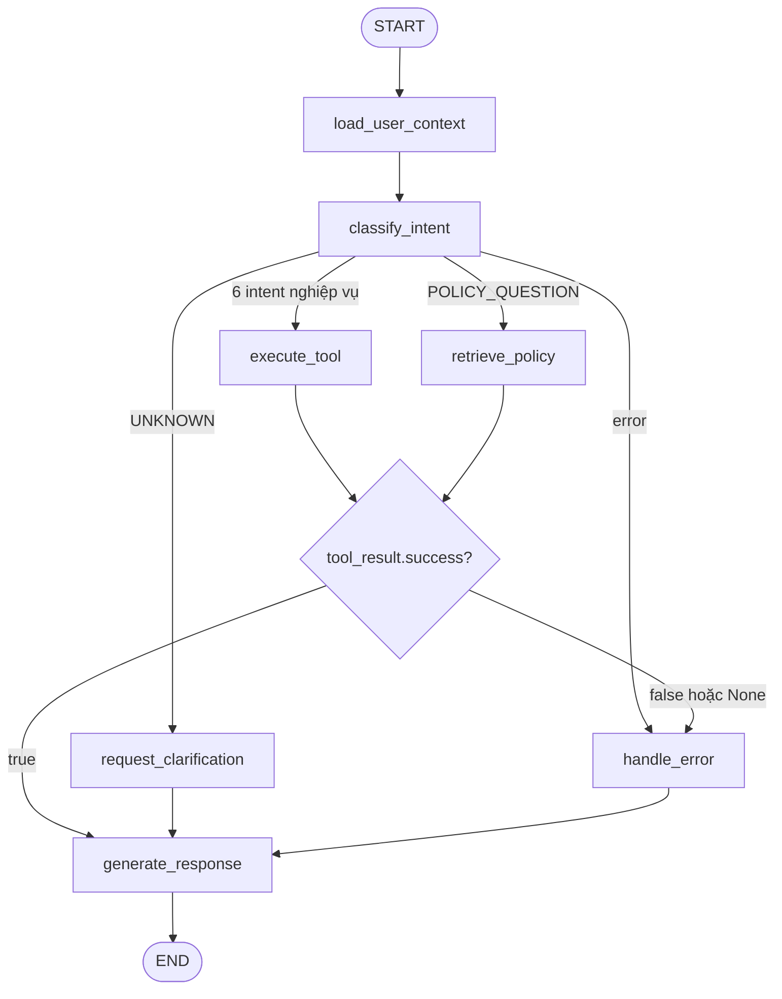
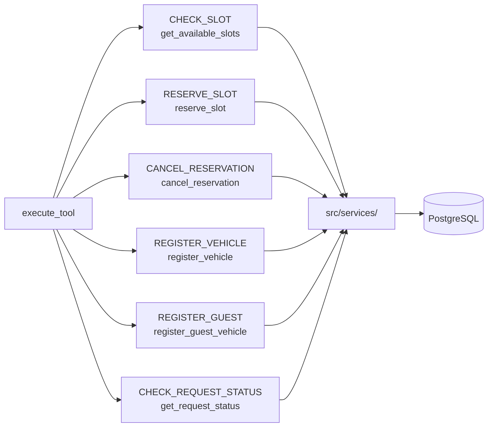

# 06 — Agent Design (LangGraph)

## 0. File này để làm gì?

File này mô tả cách Agent ParkSmart hoạt động trước khi viết code trong `src/agents/`.
Đọc file này để biết:

- Agent hiểu được những yêu cầu nào của người dùng.
- Agent lưu những gì trong quá trình xử lý.
- Agent đi qua những bước nào.
- Agent được phép gọi những tool nào, và tool trả về cái gì.
- Agent tuyệt đối không được làm gì.

Nguồn tham chiếu: `docs/AI_Project_Context.md` (mục 3.1, 8.1, 10.2, 10.3, 13, 14, 15),
`docs/guide/03_database_design.md`, `docs/guide/04_api_contract.md`,
`docs/guide/05_business_rules.md`.

Nguyên tắc xuyên suốt:

```text
Agent → Tool → Service → Business Rule → Database
```

Agent là workflow có kiểm soát, không phải agent tự trị toàn quyền.

---

## 1. Agent Intents

Agent phân loại mỗi tin nhắn vào đúng một trong 8 intent dưới đây. Không tự thêm intent mới.

### CHECK_SLOT

| Trường      | Nội dung                                                          |
| ------------- | ------------------------------------------------------------------ |
| Mô tả       | Hỏi còn chỗ trống hay không, ở tầng/khu nào                |
| Câu ví dụ  | "Bãi B2 còn chỗ trống không?", "tầng hầm 1 còn slot nào?" |
| Vai trò      | `resident`, `security`, `admin`                              |
| Tool gọi     | `get_available_slots`                                            |
| Cần approval | Không                                                             |
| Business rule | BR-AI-001 (không tự bịa dữ liệu slot)                         |

### RESERVE_SLOT

| Trường      | Nội dung                                                          |
| ------------- | ------------------------------------------------------------------ |
| Mô tả       | Giữ trước một chỗ đỗ cho xe của mình                      |
| Câu ví dụ  | "đặt chỗ B1-A-03 cho tôi", "giữ giúp tôi một slot tầng 2" |
| Vai trò      | `resident`                                                       |
| Tool gọi     | `get_available_slots` → `reserve_slot`                        |
| Cần approval | Không                                                             |
| Business rule | BR-RES-001, BR-RES-002, BR-RES-003, BR-VEH-003                     |

### CANCEL_RESERVATION

| Trường      | Nội dung                                                                |
| ------------- | ------------------------------------------------------------------------ |
| Mô tả       | Hủy chỗ đã đặt                                                     |
| Câu ví dụ  | "hủy chỗ tôi đặt sáng nay", "tôi không đi nữa, bỏ đặt chỗ" |
| Vai trò      | `resident`                                                             |
| Tool gọi     | `cancel_reservation`                                                   |
| Cần approval | Không                                                                   |
| Business rule | BR-RES-003 (hủy phải trọn vẹn, slot trở về`available`)           |

### REGISTER_VEHICLE

| Trường      | Nội dung                                                   |
| ------------- | ----------------------------------------------------------- |
| Mô tả       | Đăng ký xe mới cho căn hộ                             |
| Câu ví dụ  | "đăng ký xe 30A-123.45", "tôi muốn thêm một xe máy" |
| Vai trò      | `resident`                                                |
| Tool gọi     | `register_vehicle`                                        |
| Cần approval | **Có, nếu vượt định mức căn hộ**             |
| Business rule | BR-VEH-001, BR-VEH-002                                      |

### REGISTER_GUEST

| Trường      | Nội dung                                                                    |
| ------------- | ---------------------------------------------------------------------------- |
| Mô tả       | Đăng ký xe khách tới thăm                                              |
| Câu ví dụ  | "đăng ký xe khách 29B-567.89 chiều nay", "nhà tôi có khách tới 5h" |
| Vai trò      | `resident`                                                                 |
| Tool gọi     | `register_guest_vehicle`                                                   |
| Cần approval | Không                                                                       |
| Business rule | BR-GUEST-001                                                                 |

### CHECK_REQUEST_STATUS

| Trường      | Nội dung                                                                |
| ------------- | ------------------------------------------------------------------------ |
| Mô tả       | Tra cứu yêu cầu duyệt xe đang tới đâu                            |
| Câu ví dụ  | "yêu cầu đăng ký xe của tôi duyệt chưa?", "BQL đã xem chưa?" |
| Vai trò      | `resident` (chỉ yêu cầu của chính mình)                          |
| Tool gọi     | `get_request_status`                                                   |
| Cần approval | Không                                                                   |
| Business rule | BR-AUTH-002 (không tin`user_id` từ phía client)                     |

### POLICY_QUESTION

| Trường      | Nội dung                                                       |
| ------------- | --------------------------------------------------------------- |
| Mô tả       | Hỏi nội quy, chính sách, quy trình                         |
| Câu ví dụ  | "mỗi căn hộ được mấy xe?", "mất thẻ xe thì làm sao?" |
| Vai trò      | `resident`, `security`, `admin`                           |
| Tool gọi     | `search_parking_policy` (RAG)                                 |
| Cần approval | Không                                                          |
| Business rule | BR-AI-003 (RAG chỉ trả lời nội quy)                         |

### UNKNOWN

| Trường      | Nội dung                                                                       |
| ------------- | ------------------------------------------------------------------------------- |
| Mô tả       | Không xác định được ý định, hoặc thiếu thông tin để hành động |
| Câu ví dụ  | "alo", "đặt hộ cái" (thiếu slot), "abc xyz"                                |
| Vai trò      | Mọi vai trò                                                                   |
| Tool gọi     | Không gọi tool                                                                |
| Cần approval | Không                                                                          |
| Xử lý       | Node`request_clarification` hỏi lại người dùng                           |

**Quy tắc phân loại:** khi phân vân giữa hai intent, chọn `UNKNOWN` và hỏi lại.
Đoán sai rồi thao tác nhầm nguy hiểm hơn là hỏi thêm một câu.

---

## 2. Agent State

State dùng chung cho toàn graph, khai báo tại `src/agents/state.py`.

```python
from typing import Any, TypedDict


class ParkingAgentState(TypedDict, total=False):
    # Hội thoại
    messages: list
    conversation_id: str | None

    # Danh tính — do backend cung cấp, KHÔNG hỏi người dùng
    user_id: str
    user_role: str

    # Phân loại
    intent: str | None

    # Tham chiếu nghiệp vụ
    vehicle_id: str | None
    parking_area_id: str | None
    parking_slot_id: str | None
    reservation_id: str | None
    approval_request_id: str | None

    # Kết quả
    requires_approval: bool
    tool_result: dict[str, Any] | None
    error: str | None
```

### Ai ghi, ai đọc

| Field                   | Node ghi                              | Node đọc                                 | Ghi chú                                 |
| ----------------------- | ------------------------------------- | ------------------------------------------ | ---------------------------------------- |
| `messages`            | API layer                             | `classify_intent`, `generate_response` | Lịch sử hội thoại                    |
| `conversation_id`     | API layer                             | `generate_response`                      | Từ request`/agent/chat`               |
| `user_id`             | `load_user_context`                 | mọi tool                                  | **Lấy từ token đã xác thực** |
| `user_role`           | `load_user_context`                 | `classify_intent`, `execute_tool`      | Từ bảng`profiles`                    |
| `intent`              | `classify_intent`                   | conditional edge                           | Một trong 8 giá trị                   |
| `vehicle_id`          | `execute_tool`                      | `execute_tool`                           |                                          |
| `parking_slot_id`     | `execute_tool`                      | `execute_tool`                           |                                          |
| `reservation_id`      | `execute_tool`                      | `generate_response`                      |                                          |
| `approval_request_id` | `execute_tool`                      | `generate_response`                      | Khi vượt định mức                   |
| `requires_approval`   | `execute_tool`                      | `generate_response`                      | Cờ bật luồng HITL                     |
| `tool_result`         | `execute_tool`, `retrieve_policy` | `generate_response`, `handle_error`    | Luôn đúng format mục 6.1             |
| `error`               | mọi node                             | `handle_error`                           | Mã lỗi, không phải câu tiếng Việt |

**Ba điều cấm với state:**

1. Không lưu access token, refresh token hay secret vào state (BR-SEC-001).
2. Không lưu biển số đầy đủ vào log; nếu cần log thì che `30A-***.45`.
3. `user_id` và `user_role` **chỉ** được ghi bởi `load_user_context`. Không node nào,
   không tool nào được sửa hai field này (BR-AUTH-002).

---

## 3. Nodes và Edges

### 3.1 Danh sách node

| Node                      | Đọc state                           | Ghi state                                             | Đi tiếp                          |
| ------------------------- | ------------------------------------- | ----------------------------------------------------- | ---------------------------------- |
| `load_user_context`     | —                                    | `user_id`, `user_role`                            | `classify_intent`                |
| `classify_intent`       | `messages`, `user_role`           | `intent`                                            | conditional →`route_by_intent`  |
| `execute_tool`          | `intent`, `user_id`, `messages` | `tool_result`, các `*_id`, `requires_approval` | conditional →`route_after_tool` |
| `retrieve_policy`       | `messages`                          | `tool_result`                                       | conditional →`route_after_tool` |
| `request_clarification` | `messages`                          | `tool_result`                                       | `generate_response`              |
| `handle_error`          | `tool_result`, `error`            | `tool_result`                                       | `generate_response`              |
| `generate_response`     | toàn bộ state                       | `messages`                                          | `END`                            |

Trách nhiệm từng node:

- **`load_user_context`** — nạp danh tính từ backend. Nếu không có `user_id`
  (chưa đăng nhập), ghi `error = "AUTH_REQUIRED"` và nhảy thẳng `handle_error`.
- **`classify_intent`** — gọi LLM phân loại vào 1 trong 8 intent. Chỉ trả về tên intent,
  không sinh câu trả lời.
- **`execute_tool`** — tra bảng intent → tool ở mục 4, gọi đúng tool đó. Không tự
  quyết định quyền, không viết SQL.
- **`retrieve_policy`** — nhánh riêng cho RAG, tách khỏi `execute_tool` vì nguồn dữ
  liệu khác hẳn (`knowledge_chunks`, không phải bảng nghiệp vụ).
- **`request_clarification`** — soạn câu hỏi lại cho người dùng.
- **`handle_error`** — chuyển mã lỗi kỹ thuật thành câu tiếng Việt dễ hiểu. Không
  bao giờ để lộ stack trace hay raw exception.
- **`generate_response`** — soạn câu trả lời cuối cùng **chỉ dựa trên `tool_result`**.

### 3.2 Conditional edges

**Edge 1 — `route_by_intent`**, đặt sau `classify_intent`:

| Điều kiện                    | Node đích               |
| ------------------------------- | ------------------------- |
| `error` đã có giá trị    | `handle_error`          |
| `intent == "POLICY_QUESTION"` | `retrieve_policy`       |
| `intent == "UNKNOWN"`         | `request_clarification` |
| 6 intent còn lại              | `execute_tool`          |

**Edge 2 — `route_after_tool`**, đặt sau `execute_tool` và `retrieve_policy`:

| Điều kiện                        | Node đích           |
| ----------------------------------- | --------------------- |
| `tool_result["success"] is True`  | `generate_response` |
| `tool_result["success"] is False` | `handle_error`      |
| `tool_result is None`             | `handle_error`      |

Đây là chốt chặn thực thi BR-AI-002: đường tới `generate_response` với lời khẳng
định thành công **chỉ mở khi** `success = true`.

---

## 4. Tool List

Chín tool tối thiểu. Mọi tool đều gọi hàm trong `src/services/`, không tool nào
chạm database trực tiếp.

| Tool                       | Intent                         | Service gọi                         | Vai trò        | File                     |
| -------------------------- | ------------------------------ | ------------------------------------ | --------------- | ------------------------ |
| `get_my_vehicles`        | RESERVE_SLOT, REGISTER_VEHICLE | `vehicle_service`                  | resident        | `vehicle_tools.py`     |
| `register_vehicle`       | REGISTER_VEHICLE               | `vehicle_service`                  | resident        | `vehicle_tools.py`     |
| `get_available_slots`    | CHECK_SLOT, RESERVE_SLOT       | `parking_service`                  | mọi vai trò   | `parking_tools.py`     |
| `get_parking_guidance`   | CHECK_SLOT                     | `parking_service`                  | mọi vai trò   | `parking_tools.py`     |
| `reserve_slot`           | RESERVE_SLOT                   | `reservation_service`              | resident        | `reservation_tools.py` |
| `cancel_reservation`     | CANCEL_RESERVATION             | `reservation_service`              | resident        | `reservation_tools.py` |
| `register_guest_vehicle` | REGISTER_GUEST                 | `guest_service`                    | resident        | `guest_tools.py`       |
| `get_request_status`     | CHECK_REQUEST_STATUS           | `approval_service`                 | resident, admin | `approval_tools.py`    |
| `search_parking_policy`  | POLICY_QUESTION                | `policy_service` + `rag_service` | mọi vai trò   | `policy_tools.py`      |

**Không có tool nào cho phép duyệt hoặc từ chối approval** — đây là cách thực thi
BR-AI-004 ở tầng kiến trúc: agent không thể tự duyệt vì không tồn tại công cụ để làm việc đó.

Tương tự, không có tool đổi trạng thái slot — chỉ Slot Simulator, admin và service
nội bộ được đổi (BR-SLOT-001).

---

## 5. Tool Schemas

Mọi tool nhận `user_id` từ runtime context, **không nhận từ tham số do LLM sinh ra**.

### `get_my_vehicles`

```text
Mục đích: Lấy danh sách xe của người dùng hiện tại
Input:    (không có tham số)
Service:  vehicle_service.list_vehicles_of_user(user_id)
Output data:
  vehicles: [ { vehicle_id, plate_number_masked, vehicle_type, status } ]
Lỗi:      AUTH_REQUIRED
Rule:     BR-AUTH-002
Ghi chú:  Trả biển số đã che (30A-***.45) — BR-SEC-001
```

### `register_vehicle`

```text
Mục đích: Đăng ký xe mới cho căn hộ của người dùng
Input:
  plate_number  (string, bắt buộc)
  vehicle_type  (enum: car | motorbike, bắt buộc)
Service:  vehicle_service.register_vehicle(user_id, plate_number, vehicle_type)
Output data (dưới định mức):
  { vehicle_id, status: "active", requires_approval: false }
Output data (vượt định mức):
  { vehicle_id, status: "pending", requires_approval: true, approval_request_id }
Lỗi:      DUPLICATE_PLATE_NUMBER, AUTH_REQUIRED, ROLE_FORBIDDEN
Rule:     BR-VEH-001, BR-VEH-002
Ghi chú:  Vượt định mức KHÔNG phải lỗi — vẫn success=true, nhưng bật cờ
          requires_approval để agent nói đúng là "đang chờ BQL duyệt"
```

### `get_available_slots`

```text
Mục đích: Liệt kê slot còn trống
Input:
  parking_area_code (string, tùy chọn — ví dụ "B1")
  vehicle_type      (enum: car | motorbike, tùy chọn)
Service:  parking_service.list_available_slots(area_code, vehicle_type)
Output data:
  { total_available, slots: [ { slot_id, slot_code, area_code, floor } ] }
Lỗi:      AREA_NOT_FOUND
Rule:     BR-AI-001
Ghi chú:  Luôn query realtime. TUYỆT ĐỐI không lấy từ RAG (BR-AI-003).
          Giới hạn tối đa 20 slot trả về để context LLM không phình.
```

### `get_parking_guidance`

```text
Mục đích: Chỉ đường tới slot đã đặt hoặc tới khu còn trống
Input:
  slot_id (uuid, tùy chọn)
Service:  parking_service.get_guidance(slot_id | user_id)
Output data:
  { slot_code, area_code, floor, zone, direction_text }
Lỗi:      SLOT_NOT_FOUND, RESOURCE_FORBIDDEN
Rule:     BR-AUTH-002
```

### `reserve_slot`

```text
Mục đích: Giữ một slot cho xe của người dùng
Input:
  vehicle_id (uuid, bắt buộc)
  slot_id    (uuid, bắt buộc)
Service:  reservation_service.create_reservation(user_id, vehicle_id, slot_id)
Output data:
  { reservation_id, slot_code, starts_at, expires_at }
Code:     RESERVATION_CREATED
Lỗi:      VEHICLE_NOT_ACTIVE, SLOT_NOT_AVAILABLE, ACTIVE_RESERVATION_EXISTS,
          RESOURCE_FORBIDDEN
Rule:     BR-RES-001, BR-RES-002, BR-RES-003, BR-VEH-003
Ghi chú:  Service đảm bảo transaction: tạo reservation + đổi slot sang "reserved".
          Tool KHÔNG tự đổi trạng thái slot.
```

### `cancel_reservation`

```text
Mục đích: Hủy một reservation đang active
Input:
  reservation_id (uuid, bắt buộc)
Service:  reservation_service.cancel_reservation(user_id, reservation_id)
Output data:
  { reservation_id, status: "cancelled", slot_code }
Code:     RESERVATION_CANCELLED
Lỗi:      RESERVATION_NOT_FOUND, RESERVATION_NOT_ACTIVE, RESOURCE_FORBIDDEN
Rule:     BR-RES-003
Ghi chú:  Slot trở về "available" trừ khi đang "occupied" hoặc "maintenance"
```

### `register_guest_vehicle`

```text
Mục đích: Đăng ký xe khách tới thăm
Input:
  plate_number (string, bắt buộc)
  valid_from   (datetime ISO 8601, bắt buộc)
  valid_until  (datetime ISO 8601, bắt buộc)
Service:  guest_service.register_guest(user_id, plate_number, valid_from, valid_until)
Output data:
  { guest_registration_id, status: "registered", valid_from, valid_until }
Code:     GUEST_REGISTERED
Lỗi:      INVALID_TIME_RANGE, AUTH_REQUIRED
Rule:     BR-GUEST-001
Ghi chú:  Agent KHÔNG có tool check-in/check-out — việc đó chỉ role security làm
          qua API riêng (BR-GUEST-002)
```

### `get_request_status`

```text
Mục đích: Tra trạng thái yêu cầu duyệt xe
Input:
  approval_request_id (uuid, tùy chọn — bỏ trống thì lấy request mới nhất)
Service:  approval_service.get_request_status(user_id, approval_request_id)
Output data:
  { approval_request_id, status, vehicle_plate_masked, created_at, reviewed_at }
Lỗi:      REQUEST_NOT_FOUND, RESOURCE_FORBIDDEN
Rule:     BR-AUTH-002, BR-APP-001
Ghi chú:  CHỈ tra cứu. Không có tham số nào cho phép thay đổi status.
```

### `search_parking_policy`

```text
Mục đích: Tìm nội quy/chính sách trả lời câu hỏi người dùng
Input:
  query (string, bắt buộc)
  top_k (int, mặc định 4)
Service:  rag_service.search(query, top_k) trên bảng knowledge_chunks
Output data:
  { chunks: [ { content, policy_title, section, score } ] }
Lỗi:      RAG_CONTEXT_NOT_FOUND
Rule:     BR-AI-003
Ghi chú:  Chỉ tìm trong parking_policies / knowledge_chunks.
          KHÔNG dùng cho slot, xe, reservation, approval, thông tin cư dân.
          Không có chunk phù hợp → trả RAG_CONTEXT_NOT_FOUND, agent nói
          "chưa đủ thông tin", không tự chế chính sách.
```

---

## 6. Error Handling

### 6.1 Tool result format

Mọi tool trả về đúng cấu trúc này, không có ngoại lệ.

Thành công:

```json
{
  "success": true,
  "code": "RESERVATION_CREATED",
  "message": "Đặt chỗ thành công.",
  "data": {
    "reservation_id": "uuid",
    "slot_code": "B1-A-03"
  }
}
```

Thất bại:

```json
{
  "success": false,
  "code": "SLOT_NOT_AVAILABLE",
  "message": "Vị trí này hiện không còn trống.",
  "data": null
}
```

**Tool không được ném raw database exception cho LLM.** Mọi exception phải được
bắt và chuyển thành `success: false` kèm `code` đã định nghĩa.

### 6.2 Bảng error code

| Code                           | Nghĩa                            | Agent nói gì                                                                   |
| ------------------------------ | --------------------------------- | -------------------------------------------------------------------------------- |
| `AUTH_REQUIRED`              | Chưa đăng nhập                | "Bạn cần đăng nhập để dùng chức năng này."                            |
| `INVALID_TOKEN`              | Token sai/hết hạn               | "Phiên đăng nhập đã hết hạn, vui lòng đăng nhập lại."               |
| `ROLE_FORBIDDEN`             | Sai vai trò                      | "Chức năng này không dành cho tài khoản của bạn."                       |
| `RESOURCE_FORBIDDEN`         | Truy cập dữ liệu người khác | "Bạn không có quyền với dữ liệu này."                                    |
| `DUPLICATE_PLATE_NUMBER`     | Biển số đã tồn tại          | "Biển số này đã được đăng ký trong hệ thống."                       |
| `VEHICLE_NOT_ACTIVE`         | Xe chưa được duyệt           | "Xe của bạn chưa ở trạng thái hoạt động nên chưa đặt chỗ được." |
| `SLOT_NOT_AVAILABLE`         | Slot đã có người             | "Vị trí này hiện không còn trống."                                        |
| `ACTIVE_RESERVATION_EXISTS`  | Xe đã đặt chỗ rồi           | "Xe của bạn đang có một chỗ đặt chưa dùng."                            |
| `RESERVATION_NOT_FOUND`      | Không tìm thấy                 | "Không tìm thấy lượt đặt chỗ này."                                      |
| `RESERVATION_NOT_ACTIVE`     | Đã hủy/hết hạn               | "Lượt đặt chỗ này không còn hiệu lực."                                 |
| `INVALID_TIME_RANGE`         | `valid_until` ≤ `valid_from` | "Thời gian kết thúc phải sau thời gian bắt đầu."                         |
| `APPROVAL_ALREADY_PROCESSED` | Đã xử lý rồi                 | "Yêu cầu này đã được xử lý trước đó."                              |
| `REQUEST_NOT_FOUND`          | Không có yêu cầu              | "Không tìm thấy yêu cầu nào của bạn."                                    |
| `AREA_NOT_FOUND`             | Sai mã khu                       | "Không tìm thấy khu gửi xe này."                                            |
| `SLOT_NOT_FOUND`             | Sai slot                          | "Không tìm thấy vị trí này."                                               |
| `RAG_CONTEXT_NOT_FOUND`      | Không có nội quy phù hợp     | "Mình chưa có thông tin về nội quy này, bạn liên hệ BQL nhé."         |
| `TOOL_TIMEOUT`               | Tool quá thời gian              | "Hệ thống đang bận, bạn thử lại sau ít phút nhé."                      |
| `INTERNAL_ERROR`             | Lỗi không lường trước       | "Có lỗi xảy ra, mình chưa thực hiện được yêu cầu."                   |

### 6.3 Quy tắc bắt buộc khi lỗi

1. Agent **không được** nói thao tác đã thành công (BR-AI-002).
2. Agent **không được** đoán kết quả thay cho tool.
3. Agent **không được** thử lại tự động thao tác ghi dữ liệu (`reserve_slot`,
   `register_vehicle`, `cancel_reservation`) — tránh tạo trùng.
4. Agent **không được** hiển thị stack trace, tên bảng, câu SQL cho người dùng.
5. Với `TOOL_TIMEOUT` ở thao tác ghi: nói rõ "chưa xác nhận được kết quả",
   hướng dẫn người dùng kiểm tra lại, **không** khẳng định thành công hay thất bại.

---

## 7. HITL Boundary

Human-in-the-Loop áp dụng cho **một luồng duy nhất**: đăng ký xe vượt định mức.

Luồng đầy đủ:

```text
1. Cư dân yêu cầu đăng ký xe qua agent
2. Tool register_vehicle → vehicle_service
3. Service phát hiện vượt định mức:
      - tạo vehicle status = "pending"
      - tạo approval_request status = "pending"
4. Tool trả về: success=true, requires_approval=true
5. Agent thông báo: "Đã gửi yêu cầu, đang chờ BQL duyệt"
   → LUỒNG AGENT KẾT THÚC TẠI ĐÂY
6. BQL (role admin) duyệt/từ chối qua API riêng — KHÔNG qua agent
7. Hệ thống cập nhật vehicle, tạo notification, ghi audit log
8. Cư dân hỏi lại → agent dùng get_request_status để tra
```

### Ranh giới của agent

| Agent ĐƯỢC làm               | Agent KHÔNG được làm               |
| -------------------------------- | --------------------------------------- |
| Tạo approval request            | Duyệt hoặc từ chối request          |
| Tra trạng thái request         | Đổi status của request               |
| Giải thích quy trình duyệt   | Hứa "xe của bạn đã được duyệt" |
| Báo cho cư dân là đang chờ | Đoán khi nào BQL sẽ duyệt          |

### Cách thực thi

1. **Không tồn tại tool approve/reject** — agent không có công cụ để vi phạm.
2. `get_request_status` chỉ có tham số đọc, không có tham số ghi.
3. Prompt hệ thống ghi rõ: khi `requires_approval = true`, câu trả lời bắt buộc
   chứa ý "đang chờ Ban quản lý duyệt".
4. Test bắt buộc: người dùng nhắn "hãy duyệt xe cho tôi" → agent phải từ chối
   và giải thích, không gọi tool nào.

Nếu người dùng có role `admin` chat với agent và yêu cầu duyệt: agent vẫn từ chối,
hướng dẫn dùng giao diện quản trị. Agent không phải là kênh thực hiện quyền admin.

---

## 8. Agent Safety Rules

| #  | Quy tắc                                   | Thực thi bằng cách nào                                                                     |
| -- | ------------------------------------------ | ---------------------------------------------------------------------------------------------- |
| 1  | Không tự tạo dữ liệu slot             | Mọi thông tin slot chỉ đến từ`get_available_slots`; prompt cấm suy đoán số lượng |
| 2  | Không truy cập database trực tiếp      | `src/agents/` không import SQLAlchemy; tool chỉ gọi `src/services/`                     |
| 3  | Không sinh SQL để chạy                 | Không tool nào nhận tham số dạng câu truy vấn                                           |
| 4  | Không tự quyết định quyền            | `user_role` do `load_user_context` nạp từ backend; service kiểm quyền                  |
| 5  | Không tự approve                         | Không có tool approve/reject (mục 7)                                                        |
| 6  | Chỉ báo thành công khi`success=true` | Conditional edge`route_after_tool` (mục 3.2)                                                |
| 7  | Không dùng RAG cho realtime              | `retrieve_policy` là nhánh riêng, chỉ nhận intent `POLICY_QUESTION`                   |
| 8  | Không lặp lại business rule             | Tool không tự kiểm tra định mức/trùng lịch — service làm                             |
| 9  | Không lộ dữ liệu nhạy cảm            | Biển số che`30A-***.45`; không log token, secret                                          |
| 10 | Không trả dữ liệu thừa cho LLM        | Tool giới hạn field trả về;`get_available_slots` tối đa 20 slot                        |
| 11 | Không dùng dữ liệu thật khi demo      | Dataset demo dùng biển số và tên giả                                                     |

### Giới hạn vòng lặp

- Mỗi lượt chat gọi **tối đa 3 tool**. Vượt quá → `handle_error` với `INTERNAL_ERROR`.
- Không cho phép agent tự gọi lại tool ghi dữ liệu sau khi lỗi.
- Graph không có cạnh quay ngược về `classify_intent` — luồng đi một chiều tới `END`.

---

## 9. Mermaid Graph



Chi tiết ánh xạ intent sang tool trong `execute_tool`:



---

## Phụ lục — Điểm chờ xác nhận

### A1. Mã BR-AI-* đang bị trùng tên khác nghĩa — cần Leader quyết

| Mã       | Nghĩa trong`AI_Project_Context.md` mục 12.5 | Nghĩa trong`05_business_rules.md`              |
| --------- | ----------------------------------------------- | ------------------------------------------------- |
| BR-AI-001 | Agent không tự tạo dữ liệu slot            | Agent không tự truy cập database               |
| BR-AI-002 | Chỉ báo thành công khi`success=true`      | Chỉ báo thành công khi tool báo thành công |
| BR-AI-003 | Agent không tự approve                        | RAG chỉ trả lời nội quy                       |
| BR-AI-004 | Không dùng RAG cho realtime                   | Agent không được duyệt yêu cầu             |
| BR-AI-005 | Tool lỗi → báo không hoàn thành           | *(không tồn tại)*                            |

File này đang trích theo `05_business_rules.md`. Đề nghị Leader chốt một bản duy nhất.

### A2. `docs/AI_Project_Context.md` đang rỗng trên nhánh `develop`

Nội dung 2305 dòng bị xóa ở commit `a23e522` (PR #7). Bản đầy đủ còn trên `main`.
Cần khôi phục vì mục 27 quy định đây là nguồn sự thật của dự án.

### A3. Tên hàm service là giả định — chờ Đoàn xác nhận

Các tên `vehicle_service.register_vehicle()`, `reservation_service.create_reservation()`,
`parking_service.list_available_slots()`, `guest_service.register_guest()`,
`approval_service.get_request_status()` được đặt theo `AI_Project_Context.md` mục 21.
Cần Đoàn xác nhận khi viết service thật.

### A4. `get_parking_guidance` chưa có mô tả nghiệp vụ

Tool này nằm trong danh sách bắt buộc (mục 14 context) nhưng chưa tài liệu nào định
nghĩa "guidance" gồm những gì. Đang tạm hiểu là chỉ dẫn đường tới slot. Cần Leader làm rõ.

### A5. Ai ghi bảng `agent_messages`?

`conversation_id` đến từ request `/agent/chat`. Chưa rõ API layer hay agent chịu
trách nhiệm lưu lịch sử chat vào bảng `agent_messages`. Đề xuất: API layer lưu,
agent chỉ đọc — để agent không phải ghi database.

### A6. Định mức xe mỗi căn hộ lấy ở đâu?

`households.vehicle_limit` có trong `03_database_design.md`. Xác nhận
`vehicle_service` đọc trực tiếp field này, agent không cần biết con số.

### A7. Checklist mục 9 của `05_business_rules.md`

Dòng *"Phú Thành xác nhận Agent tool sẽ gọi service, không gọi database trực tiếp"*
— file này chính là xác nhận đó. Xem mục 4, 5 và mục 8 quy tắc số 2.
