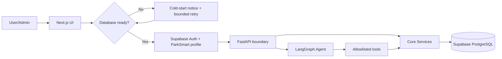
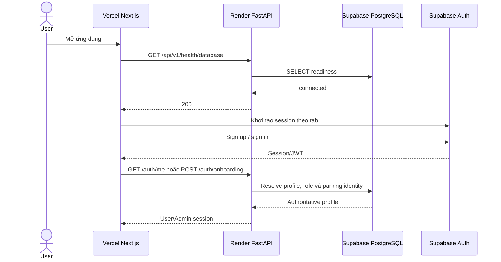
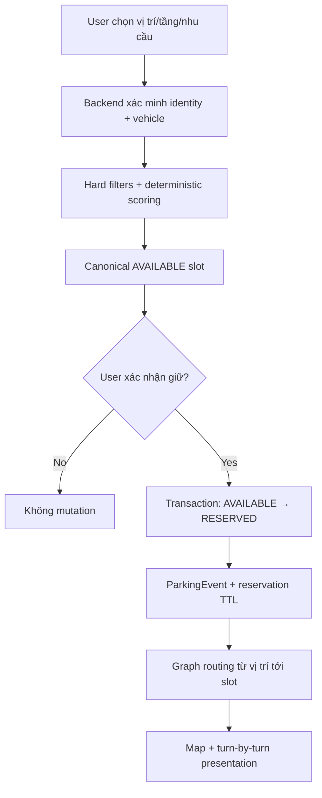
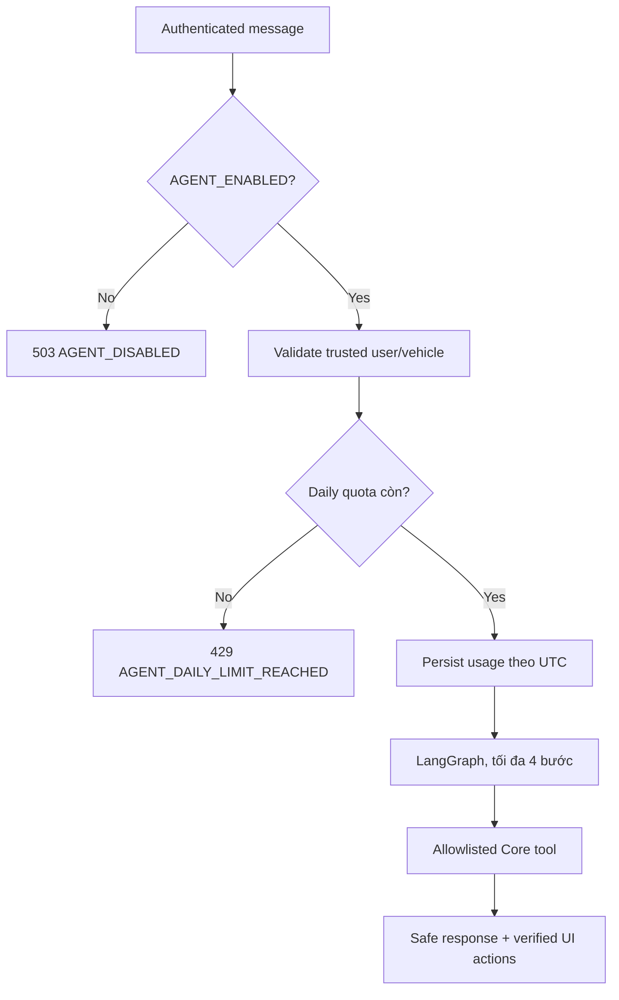
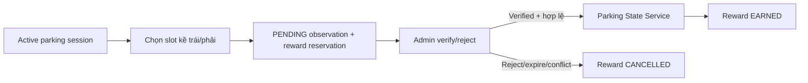
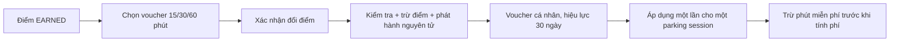
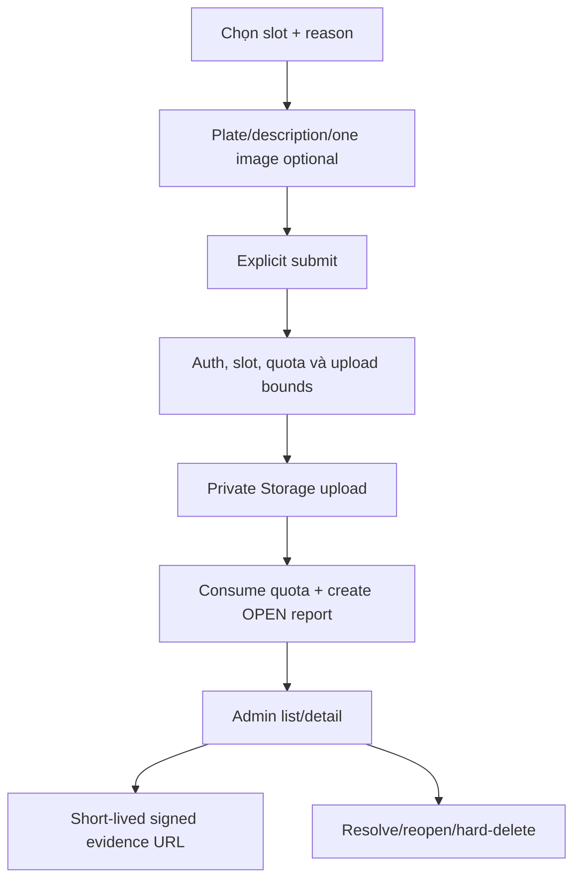
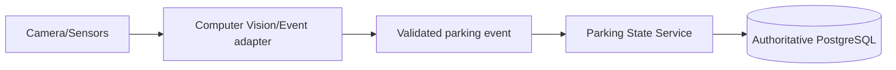

# ParkSmart AI — Các workflow public beta

Tài liệu này mô tả workflow đang bật trong public beta. Voice, Demo và Simulator bị tắt ở
production; các mô tả cũ về Voice/Simulator chỉ còn giá trị thiết kế tương lai. Xem
[PUBLIC_BETA.md](PUBLIC_BETA.md) cho feature matrix đầy đủ.

## 1. Mục tiêu hệ thống

ParkSmart AI hỗ trợ người dùng tìm và giữ ô đỗ, đi tới ô, lưu phiên đỗ, tìm lại xe và gửi
đóng góp cộng đồng trong bãi F1/F2/F3. AI Agent là một lớp hội thoại tùy chọn trên cùng Core
Services; recommendation, routing và state transition luôn deterministic/authoritative.

## 2. Khởi động và xác thực

Readiness gate dừng retry sau khi ready và không phải keep-alive. Role từ token metadata
không được tin cậy; backend luôn lấy `profiles.app_role` từ database.

## 3. Tìm, giữ và đi tới ô đỗ

LLM không chọn slot hoặc tạo polyline. Frontend có thể khởi phát cùng workflow bằng thao tác
UI hoặc Agent chat, nhưng mutation vẫn đi qua REST/Core API có version/ownership checks.

## 4. Xác nhận đỗ và tìm lại xe

```mermaid
flowchart LR
    Arrive["User xác nhận đã tới"] --> Location["Cập nhật canonical location"]
    Location --> Refresh["Refetch version mới nhất"]
    Refresh --> Park["RESERVED → OCCUPIED"]
    Park --> Session["Tạo ParkingSession ACTIVE"]
    Session --> Later["User cập nhật checkpoint"]
    Later --> Find["Tra active session"]
    Find --> Route["Graph route checkpoint → parked slot"]
    Route --> Display["Hiển thị đường tìm xe"]
```

Parking Session là nguồn sự thật cho vị trí xe. Hệ thống không suy đoán vị trí từ hội thoại,
GPS hoặc browser storage.

## 5. Agent chat có quota

Public beta cho tối đa 5 request Agent/user/ngày UTC. Request đã charge vẫn tính khi LLM,
provider hoặc tool lỗi sau đó; không có retry tự động từ frontend khi quota đã hết.

## 6. Adjacent observation và ParkSmart Points

Frontend chỉ gửi canonical slot/status/version. Backend xác minh adjacency, active session và
protected occupancy trước mutation. Ledger là nguồn authoritative cho Points.

## 7. Đổi điểm thành voucher — workflow mục tiêu, chưa triển khai

Mức đề xuất là 100/200/400 điểm đổi 15/30/60 phút. Public beta hiện chưa có các bước này;
Agent không được khẳng định voucher đã khả dụng. Quy tắc đầy đủ và kiến trúc mục tiêu nằm tại
[PARKSMART_POINTS_VOUCHERS.md](PARKSMART_POINTS_VOUCHERS.md).

## 8. Báo cáo xe đỗ sai và ảnh bằng chứng

Public beta giới hạn 5 report/user/ngày UTC. Ảnh tối đa 5.000.000 byte, MIME phải khớp
signature JPEG/PNG/WebP/HEIC/HEIF. Hard-delete xóa DB row và best-effort cleanup Storage;
cleanup failure được warning-log để operator theo dõi.

## 9. Workflow quản trị

Admin account chuyên dụng được provision theo
[ADMIN_PROVISIONING.md](ADMIN_PROVISIONING.md). Admin xem map/events, đổi slot status qua
Core Service, xác minh observations và xử lý report/evidence. Anonymous nhận 401, regular
user nhận 403; Demo/Simulator không tạo đường vòng quyền trong production.

## 10. Chức năng tương lai

Camera/Computer Vision có thể thay nguồn sự kiện mô phỏng mà không đổi Core/Agent boundary.
Voice có thể bật lại sau khi hoàn thiện privacy, browser compatibility, cost limits và
production validation; hiện không thuộc public beta.
