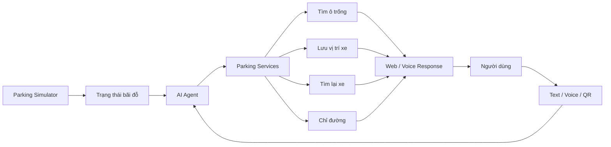
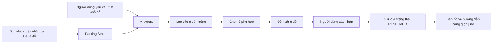
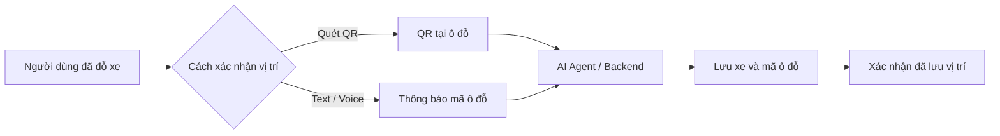
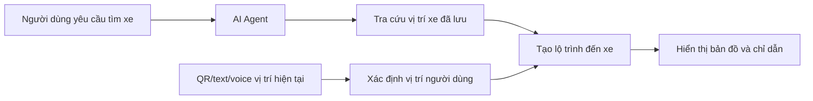
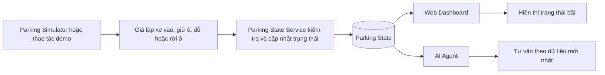
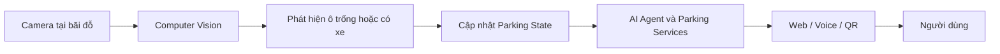

# ParkSmart AI — Các workflow chính

## 1. Mục tiêu hệ thống

ParkSmart AI hỗ trợ người dùng trong bãi đỗ xe thông qua ba hình thức tương tác: **văn bản, giọng nói và mã QR**. Hệ thống tập trung giải quyết các nhu cầu chính:

- Tìm ô đỗ còn trống.
- Lưu vị trí xe sau khi đỗ.
- Tìm lại xe và nhận chỉ đường.
- Cập nhật trạng thái các ô đỗ trong mô hình MVP.

Trong phiên bản MVP, **Parking Simulator** được dùng để mô phỏng dữ liệu bãi xe. Ở kiến trúc tương lai, thành phần này sẽ được thay bằng **Camera và Computer Vision**.

---

## 2. Workflow tổng quan hệ thống



**Ý nghĩa:**

- `Parking Simulator` cung cấp trạng thái bãi đỗ trong MVP.
- `AI Agent` hiểu yêu cầu của người dùng và chọn dịch vụ phù hợp.
- `Parking Services` xử lý dữ liệu và nghiệp vụ.
- Kết quả được trả về bằng giao diện web hoặc giọng nói.

---

## 3. Workflow tìm ô đỗ trống



**Kết quả:** Hệ thống đề xuất một ô còn trống, có thể ưu tiên theo yêu cầu như gần thang máy, gần lối ra hoặc gần vị trí hiện tại. Khi người dùng xác nhận, Parking State Service giữ ô trong thời hạn cấu hình (mặc định đề xuất 300 giây cho MVP) trước khi hệ thống hướng dẫn đến ô.

---

## 4. Workflow lưu vị trí xe



**Kết quả:** Vị trí xe được gắn với phiên đỗ xe hiện tại để người dùng có thể tìm lại sau đó.

---

## 5. Workflow tìm lại xe



**Kết quả:** Hệ thống xác định vị trí xe, kết hợp với vị trí hiện tại của người dùng và đưa ra lộ trình phù hợp.

---

## 6. Workflow cập nhật trạng thái bãi trong MVP



**Các trạng thái chính:**

- `AVAILABLE`: ô đỗ đang trống.
- `OCCUPIED`: ô đỗ đã có xe.
- `RESERVED`: ô được giữ tạm thời cho một yêu cầu đã xác nhận; nếu bị hủy hoặc quá thời hạn mà chưa xác nhận đỗ thì trở về `AVAILABLE`.

Các chuyển trạng thái hợp lệ trong MVP:

```text
AVAILABLE → RESERVED → OCCUPIED → AVAILABLE
AVAILABLE → RESERVED → AVAILABLE
AVAILABLE → OCCUPIED → AVAILABLE
```

- `AVAILABLE → RESERVED`: người dùng xác nhận giữ ô; hệ thống lưu mã tham chiếu và thời điểm hết hạn.
- `RESERVED → OCCUPIED`: người dùng hoặc xe có mã tham chiếu hợp lệ xác nhận đã đỗ.
- `RESERVED → AVAILABLE`: yêu cầu giữ ô bị hủy hoặc hết thời hạn.
- `AVAILABLE → OCCUPIED`: xe mô phỏng không đặt trước đỗ trực tiếp.
- Ô `RESERVED` không được đề xuất cho người khác; chỉ Parking State Service được phép xác nhận các chuyển trạng thái.
- `RESERVED` chỉ là giữ ô tạm thời trong luồng MVP, không bao gồm đặt chỗ và thanh toán online hoàn chỉnh.

**Vai trò của Simulator:** Tạo dữ liệu thay đổi trạng thái ô đỗ để kiểm thử toàn bộ hệ thống mà chưa cần lắp đặt camera thực tế.

---

## 7. Kiến trúc tương lai: Camera + Computer Vision



**Thay đổi chính:**

- `Camera + Computer Vision` thay thế `Parking Simulator` làm nguồn dữ liệu.
- Trạng thái ô đỗ được cập nhật tự động từ hình ảnh thực tế.
- AI Agent và các dịch vụ phía sau được giữ nguyên, chỉ thay đổi cách hệ thống thu thập dữ liệu đầu vào.

---
